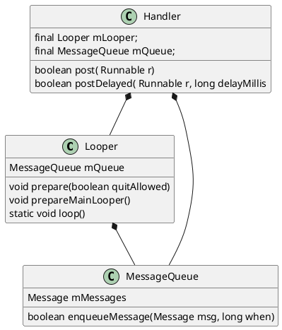

假定:`Handler` 线程是生产者线程,`Looper`机制发生在消费者线程. 那么Android中消息机制就是:将生产者线程发送的Message转为在消费者线程(`Looper`线程)执行/回调.

`Handler` 通过在创建时,传入`Looper`,进而获取到`Looper`线程的`MessageQueue`,向`MessageQueue`中插入消息.完成消息的生产.`Looper`通过取`MessageQueue`中的消息,并调用`Message`中`target`(`Handler`) `dispatchMessage`完成消息消费!

`Looper` :一种分发消息

- 循环处理消息(分发消息)
  `MessageQueue`
- `enqueueMessage` 接受消息, `synchronized` 同步.
- 待处理的消息队列(Looper线程)
  `Handler`
- 发送消息(生产者线程)
- 接受处理新消息(Looper线程)
  `Message`
  分类:普通消息,屏障消息,异步消息.
  



常见问题:

1. Looper.loop()和MessageQueue.next()取延时消息时，都在主线程中使用了死循环为什么不会卡死？

因为在MessageQueue在取消息时，如果是延时消息就会计算得到该延时消息还需要延时多久nextPollTimeoutMillis。然后再继续循环的时候，发现nextPollTimeoutMillis不等于0，就会执行nativePollOnce阻塞线程nextPollTimeoutMillis毫秒，而阻塞了之后被唤醒的时机就是阻塞的时间到了或者又有新的消息添加进来执行enqueueMessage方法调用nativeWake唤醒阻塞线程，再继续执行获取消息的代码，如果有消息就返回，如果还是需要延时就继续和上边一样阻塞。而Android所有的事件要在主线程中改变的都会通过主线程的Handler发送消息处理，所以就完全保证了不会卡死。

随时挂起, 随时被阻塞的 vsync
2\. MessageQueue是队列吗？它是什么数据结构？
MessageQueue不是队列，它内部使用一个Message链表实现消息的存和取。
3\. Handler的postDelay,时间准吗?为什么呢?它用的是system.currentTime吗？
不准，因为looper里边从MessageQueue里取出来的消息执行也是串行的，如果前一个消息是比较耗时的，那么等到执行之前延时的消息时时间难免可能会超过延时的时间。postDelay时用的是System.uptimeMillis，也就是开机时间。
4\. ThreadLocal是如何实现一个线程一个Looper的？为什么在子线程中执行 new Handler() 会抛出异常？

```java
//子线程中可能会空指针:因为 prepare 未被调用时,sThreadLocal拿不到值.
public static @Nullable Looper myLooper() {
	return sThreadLocal.get();
}
private static void prepare(boolean quitAllowed) {
	if (sThreadLocal.get() != null) {
		throw new RuntimeException("Only one Looper may be created per thread");
	}
	//只执行1次
	sThreadLocal.set(new Looper(quitAllowed));
}

/**
	ThreadLocal.java
 * Get the map associated with a ThreadLocal. Overridden in
 * InheritableThreadLocal.
 *
 * @param  t the current thread
 * @return the map
 */
ThreadLocalMap getMap(Thread t) {
	return t.threadLocals;
}
```

get, set 是通过 `ThreadLocalMap` 实现的.
ThreadLocalMap 是线程私有的.
5\. 假设先 postDelay 10ms, 再postDelay 1ms, 你简单描述一下, 怎么处理这2条消息?
先传入一个延时为10ms的消息进入MessageQueue中，因为该消息延时，假设当前消息队列中没有消息，则会直接将消息放入队列，因为loop一直在取消息，但是这里有延时就会阻塞10ms，当然这不考虑代码执行的时间；然后延时1ms的消息进入时，会和之前的10ms的消息进行比较，根据延时的大小进行排序插入，延时小的在前边，所以这时候就把1ms的消息放在10ms的前边，然后唤醒，不阻塞，继续执行取消息的操作，发现还是有延时1ms，所以也会继续阻塞1ms，直到阻塞1ms之后或者又有新的消息进入队列唤醒，直到获取到1ms延时消息，在loop中，通过调用handler的dispatchMessage方法，判断消息的callback或者Handler的callback不为null就回调对应的callback，否则就执行handler的handleMessage方法，我们就可以根据情况处理消息了；10ms的延时消息的处理也是一致，延时的时间到了就交给返回给looper，然后给handler处理。

```java
 public static void loop(){
	 final Looper me = myLooper();
	 ...
	 for (;;) {
		if (!loopOnce(me, ident, thresholdOverride)) {
			return;
		}
	}
	 private static boolean loopOnce(final Looper me,
            final long ident, final int thresholdOverride) {
		 ...
		  try {
		msg.target.dispatchMessage(msg);
		if (observer != null) {
			observer.messageDispatched(token, msg);
		}
		dispatchEnd = needEndTime ? SystemClock.uptimeMillis() : 0;
	} catch (Exception exception) {
		if (observer != null) {
			observer.dispatchingThrewException(token, msg, exception);
		}
		throw exception;
	} finally {
		ThreadLocalWorkSource.restore(origWorkSource);
		if (traceTag != 0) {
			Trace.traceEnd(traceTag);
		}
	}
			 ...
		 //标记为可被复用
		 msg.recycleUnchecked();
		 return true;
	 }
	 ...
 }
```

6. `IdleHandler`
   `MessageQueue.java`

```java
/**
 * Callback interface for discovering when a thread is going to block
 * waiting for more messages.
 */
public static interface IdleHandler {
	/**
	 * Called when the message queue has run out of messages and will now
	 * wait for more.  Return true to keep your idle handler active, false
	 * to have it removed.  This may be called if there are still messages
	 * pending in the queue, but they are all scheduled to be dispatched
	 * after the current time.
	 返回true:表示该回调一直存在,只要空闲就回调,返回false回调一次就移除.
	 */
	boolean queueIdle();
}
```

在MessageQueue的next方法没有获取到消息或者获取到延时消息时，就会执行IdleHandler的queueIdle方法进行回调: 监听View完全绘制完后
7.Message.obtain()
从缓冲的消息池中取出第一个消息来使用，避免消息对象的频繁创建和销毁；消息处理完后标记为可复用 :(复用链表结构)
8.试从源码角度分析Handler的post和sendMessage方法的区别和应用场景？
`Handle.java`

```java
/**
 * Handle system messages here.
 */
public void dispatchMessage(@NonNull Message msg) {
	//线判断 callback,不为Null,说明是post的消息
	if (msg.callback != null) {
		handleCallback(msg);
	} else {
		if (mCallback != null) {
			if (mCallback.handleMessage(msg)) {
				return;
			}
		}
		handleMessage(msg);
	}
}
private static void handleCallback(Message message) {
	message.callback.run();
}
public final boolean post(@NonNull Runnable r) {
   return  sendMessageDelayed(getPostMessage(r), 0);
}
public final boolean sendMessage(@NonNull Message msg) {
	return sendMessageDelayed(msg, 0);
}
public final boolean sendMessageDelayed(@NonNull Message msg, long delayMillis) {
	if (delayMillis < 0) {
		delayMillis = 0;
	}
	return sendMessageAtTime(msg, SystemClock.uptimeMillis() + delayMillis);
}
public boolean sendMessageAtTime(@NonNull Message msg, long uptimeMillis) {
	MessageQueue queue = mQueue;
	if (queue == null) {
		RuntimeException e = new RuntimeException(
				this + " sendMessageAtTime() called with no mQueue");
		Log.w("Looper", e.getMessage(), e);
		return false;
	}
	return enqueueMessage(queue, msg, uptimeMillis);
}
private static Message getPostMessage(Runnable r) {
	Message m = Message.obtain();
	m.callback = r;
	return m;
}
```

`post`方法与 `sendMessage`方法最终都调用了`sendMessageAtTime`进而将Message插入到消息队列中,`post`会创建一个`Message`并赋值为`callBack`,后续`looper`循环会调用Handler 的`dispatchMessage`进而运行`callback`

`MessageQuene`

```java
public int postSyncBarrier() {
	return postSyncBarrier(SystemClock.uptimeMillis());
}

private int postSyncBarrier(long when) {
	// Enqueue a new sync barrier token.
	// We don't need to wake the queue because the purpose of a barrier is to stall it.
	synchronized (this) {
		final int token = mNextBarrierToken++;
		//复用后未设置target
		final Message msg = Message.obtain();
		msg.markInUse();
		msg.when = when;
		msg.arg1 = token;

		Message prev = null;
		Message p = mMessages;
		if (when != 0) {
			while (p != null && p.when <= when) {
				prev = p;
				p = p.next;
			}
		}
		if (prev != null) { // invariant: p == prev.next
			msg.next = p;
			prev.next = msg;
		} else {
			msg.next = p;
			mMessages = msg;
		}
		return token;
	}
}

@UnsupportedAppUsage
Message next() {
	// Return here if the message loop has already quit and been disposed.
	// This can happen if the application tries to restart a looper after quit
	// which is not supported.
	final long ptr = mPtr;
	if (ptr == 0) {
		return null;
	}

	int pendingIdleHandlerCount = -1; // -1 only during first iteration
	int nextPollTimeoutMillis = 0;
	for (;;) {
		if (nextPollTimeoutMillis != 0) {
			Binder.flushPendingCommands();
		}

		nativePollOnce(ptr, nextPollTimeoutMillis);

		synchronized (this) {
			// Try to retrieve the next message.  Return if found.
			final long now = SystemClock.uptimeMillis();
			Message prevMsg = null;
			Message msg = mMessages;
			//同步屏障的消息 target 是空的, 遇到同步屏障后只关注异步消息.
			if (msg != null && msg.target == null) {
				// Stalled by a barrier.  Find the next asynchronous message in the queue.
				do {
					prevMsg = msg;
					msg = msg.next;
				} while (msg != null && !msg.isAsynchronous());
			}
			if (msg != null) {
				if (now < msg.when) {
					// Next message is not ready.  Set a timeout to wake up when it is ready.
					nextPollTimeoutMillis = (int) Math.min(msg.when - now, Integer.MAX_VALUE);
				} else {
					// Got a message.
					mBlocked = false;
					if (prevMsg != null) {
						prevMsg.next = msg.next;
					} else {
						mMessages = msg.next;
					}
					msg.next = null;
					if (DEBUG) Log.v(TAG, "Returning message: " + msg);
					msg.markInUse();
					return msg;
				}
			} else {
				// No more messages.
				nextPollTimeoutMillis = -1;
			}

			// Process the quit message now that all pending messages have been handled.
			if (mQuitting) {
				dispose();
				return null;
			}

			// If first time idle, then get the number of idlers to run.
			// Idle handles only run if the queue is empty or if the first message
			// in the queue (possibly a barrier) is due to be handled in the future.
			if (pendingIdleHandlerCount < 0
					&& (mMessages == null || now < mMessages.when)) {
				pendingIdleHandlerCount = mIdleHandlers.size();
			}
			if (pendingIdleHandlerCount <= 0) {
				// No idle handlers to run.  Loop and wait some more.
				mBlocked = true;
				continue;
			}

			if (mPendingIdleHandlers == null) {
				mPendingIdleHandlers = new IdleHandler[Math.max(pendingIdleHandlerCount, 4)];
			}
			mPendingIdleHandlers = mIdleHandlers.toArray(mPendingIdleHandlers);
		}

		// Run the idle handlers. 仅仅在消息队列为空时才会执行
		// We only ever reach this code block during the first iteration.
		for (int i = 0; i < pendingIdleHandlerCount; i++) {
			final IdleHandler idler = mPendingIdleHandlers[i];
			mPendingIdleHandlers[i] = null; // release the reference to the handler

			boolean keep = false;
			try {
				keep = idler.queueIdle();
			} catch (Throwable t) {
				Log.wtf(TAG, "IdleHandler threw exception", t);
			}

			if (!keep) {
				synchronized (this) {
					mIdleHandlers.remove(idler);
				}
			}
		}

		// Reset the idle handler count to 0 so we do not run them again.
		pendingIdleHandlerCount = 0;

		// While calling an idle handler, a new message could have been delivered
		// so go back and look again for a pending message without waiting.
		nextPollTimeoutMillis = 0;
	}
}
```

疑问❓过期消息怎么处理？
直接执行,不会丢弃
<https://www.cnblogs.com/vivotech/p/14072029.html>

## IdealHandler 执行时机

dleHandler 的执行时机确实总是在 View 绘制结束后，但这并不仅仅是因为启动应用到第一帧渲染完成这段时间 Looper 忙碌。
更准确地说，IdleHandler 的执行时机是由 Looper 的空闲状态决定的，而 Looper 的空闲状态又受到消息队列和 UI 渲染两方面的影响：

- 消息队列： 只有当 Looper 的消息队列为空时，Looper 才会进入潜在的空闲状态。
- UI 渲染： 即使消息队列为空，如果 UI 线程仍在进行绘制操作，Looper 也不会被认为是空闲的。只有当 UI 绘制完成后，Looper 才会真正进入空闲状态。
  因此，无论何时使用 IdleHandler，它都会在 Looper 空闲时执行，而 Looper 的空闲状态又意味着消息队列为空且 UI 渲染已完成，所以 IdleHandler 的执行时机总是在 View 绘制结束后。
  在 Application 中使用 IdleHandler 也是一样的，因为 Application 的生命周期早于 Activity，在 Application 中注册的 IdleHandler 也会等到主线程的 Looper 空闲时才会执行，同样是在 View 绘制结束后。
  总结：
- IdleHandler 的执行时机总是在 View 绘制结束后。
- 这是因为 IdleHandler 的执行依赖于 Looper 的空闲状态。
- Looper 的空闲状态由消息队列和 UI 渲染两方面决定。
- 无论在 Activity 还是 Application 中使用 IdleHandler，其执行时机都是一样的。
