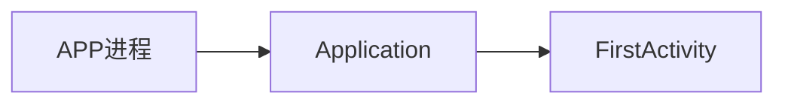

\


## 冷启动



\
\


### `Context`


- 给系统组件提供,访问系统服务,系统资源的能力
- Android应用层中枢

### `ClientTransaction`

\


### `Instrumentation`

- 统一的处理Activity创建,启动,生命周期转换.

## 热启动

\
已启动的Activity重新启动,或切换前台\


## 启动未注册的Activity


## Zygote通信为什么采用socket不采用Binder?

- Socket通信可以在不同用户空间之间进行,不需要共享内存区域,一定程度上增强了进程隔离和安全性
- Binder通信需要进程共享内存区域传递数据,某些情况下可能会带来安全风险
- Linux中fork进程是不推荐fork一个多线程的进程的，因为如果存在锁的情况下，会导致锁异常。而如果自身作为Binder机制的接收者，就会创建一个额外的线程来进行处理（发送者进程是无影响的）。所以，如果使用Binder机制，就会导致去fork一个多线程的进程。
- Socket 是一种简单高效的进程间通信方式,适用于Zygoute 进程与应用进程之间传递少量数据
- 相比之下,Binder通信机制较为复杂,更适合处理大量数据和复杂交互.

# Activity任务栈

`ActivityStarter`->`startActivityInner`\
\


# 通过Launcher 启动应用时,AMS,ATMS,WMS,ATMS 如何配合的,以及各自的职责

## 整体流程(调用顺序)

 

1. 用户点击桌面图标:Launch进程向AMS发送startActivityIntent.
2. AMS 解析Intent:通过PMS获取目标Acitivity组件信息
3. AMS检查进程:AMS检查目标进程是否存在
   - 冷启动: 目标进程不存在,请求Zygote进程 fork 新进程
   - 热启动: 通知应用进程启动Activity
4. AMS 通知 ATMS: AMS通知ATMS需要启动Activity,并提供Acitivity信息.
5. ATMS 管理任务栈
   - 冷启动: ATMS创建新任务栈(如果需要),将Activity加入任务栈,并分配TaskId
   - 热启动:ATMS将目标Activity的任务栈切换到前台
6. AMS 管理Activity:
   - 冷启动: AMS创建ActivityRecord,启动应用进程,调用Activity生命周期方法(onCreate,onStart,onResume).
   - 热启动:AMS通知应用进程恢复Activity,调用Activity生命周期方法(onRestart,onStart,onResume).
7. AMS 通知WMS: AMS通知WMS新的Activity或回复的Activity信息.
8. WMS 管理窗口: WMS为Activity创建窗口,计算窗口大小和位置,并于SurfaceFinger 协作将窗口显示在屏幕上.

## 各服务负责的功能

### Launcher: 显示桌面和应用列表,触发应用启动

### AMS

- 解析Intent,管理Activity生命周期,启动/恢复 Activity
- 管理应用进程, 与Zygote进程交互创建新进程
- 与ATMS,WMS协作,管理任务栈和窗口显示

### ATMS

- 管理Activity任务栈,为Activity分配TaskId
- 维护任务栈之间的关系,处理任务栈切换

### WMS

- 管理窗口创建, 显示和布局
- 与SurfaceFinger 协作,将窗口渲染到屏幕上

### PMS

- 管理系统中所有已安装应用的信息
  - 扫描APK文件:
    - 系统启动时,扫描系统分区和数据分区中所有APK文件
    - 扫描路径: `/system/app`、`/system/priv-app`、`/data/app` 等
  - 解析每个APK文件
    - 解析其`AndroidManifest.xml`,提取应用的包名,版本号,权限,组件信息(四大组件信息)
  - 监听应用安装卸载
    - 更新内部数据结构
  - 提供查询接口
  - 对应用进行签名验证.
- 提供应用组件信息给AMS

## 补充

Android10 以后: startActivity 交给了 ATMS\
\
\


桌面Launcher 点击应用图标 打开目标APP:\
`packages/apps/Launcher3/src/com/android/launcher3/model/data/AppInfo.java`

```java
/**
     * If set, and this activity is either being started in a new task or
     * bringing to the top an existing task, then it will be launched as
     * the front door of the task.  This will result in the application of
     * any affinities needed to have that task in the proper state (either
     * moving activities to or from it), or simply resetting that task to
     * its initial state if needed.
     *
     * @see android.R.attr#allowTaskReparenting
     * @see android.R.attr#clearTaskOnLaunch
     * @see android.R.attr#finishOnTaskLaunch
     */
    public static final int FLAG_ACTIVITY_RESET_TASK_IF_NEEDED = 0x00200000;

public AppInfo(@NonNull PackageInstallInfo installInfo) {
        componentName = installInfo.componentName;
        intent = new Intent(Intent.ACTION_MAIN)
            .addCategory(Intent.CATEGORY_LAUNCHER)
            .setComponent(componentName)
            .setFlags(Intent.FLAG_ACTIVITY_NEW_TASK
                | Intent.FLAG_ACTIVITY_RESET_TASK_IF_NEEDED);
        setProgressLevel(installInfo);
        user = installInfo.user;
    }
```

### `FLAG_ACTIVITY_RESET_TASK_IF_NEEDED` 最关键的一个flag

1. 通过PKMS 查询 目标应用的Launch Acitivity.添加 FLAG.构建完整的 Intent.
2. 交给ATMS, ATMS 会根据该 FLAG 检查是否有该应用存活的Activity任务栈..如果查找到就直接讲该任务栈放到前台.结束
3. 不存在,创建新的任务栈,稍后将创建好的Activity放入任务栈中,并推到前台.判断目标"Activity进程"是否创建,不存在,通知AMS 创建 目标进程(双向绑定 ApplicationThread,ActivityManagerService),\
   `ActivityThread`

```java
final H mH = new H();
public static void main(String[] args){
    ...
        Looper.prepareMainLooper();

        // Find the value for {@link #PROC_START_SEQ_IDENT} if provided on the command line.
        // It will be in the format "seq=114"
        long startSeq = 0;
        if (args != null) {
            for (int i = args.length - 1; i >= 0; --i) {
                if (args[i] != null && args[i].startsWith(PROC_START_SEQ_IDENT)) {
                    startSeq = Long.parseLong(
                            args[i].substring(PROC_START_SEQ_IDENT.length()));
                }
            }
        }
        ActivityThread thread = new ActivityThread();
        thread.attach(false, startSeq);

        if (sMainThreadHandler == null) {
            sMainThreadHandler = thread.getHandler();
        }

        if (false) {
            Looper.myLooper().setMessageLogging(new
                    LogPrinter(Log.DEBUG, "ActivityThread"));
        }

        // End of event ActivityThreadMain.
        Trace.traceEnd(Trace.TRACE_TAG_ACTIVITY_MANAGER);
        Looper.loop();
        ...
}

private void attach(boolean system, long startSeq){
    ...
         if (!system) {
            android.ddm.DdmHandleAppName.setAppName("<pre-initialized>",
                                                    UserHandle.myUserId());
            RuntimeInit.setApplicationObject(mAppThread.asBinder());
            final IActivityManager mgr = ActivityManager.getService();
            try {
                mgr.attachApplication(mAppThread, startSeq);
            } catch (RemoteException ex) {
                throw ex.rethrowFromSystemServer();
            }
             
        ...
}
```

`frameworks/base/services/core/java/com/android/server/am/ActivityManagerService.java`

```java
@Override
    public final void attachApplication(IApplicationThread thread, long startSeq) {
        if (thread == null) {
            throw new SecurityException("Invalid application interface");
        }
        synchronized (this) {
            int callingPid = Binder.getCallingPid();
            final int callingUid = Binder.getCallingUid();
            final long origId = Binder.clearCallingIdentity();
            attachApplicationLocked(thread, callingPid, callingUid, startSeq);
            Binder.restoreCallingIdentity(origId);
        }
    }
private void attachApplicationLocked(@NonNull IApplicationThread thread,
            int pid, int callingUid, long startSeq) {
    ...
        if (app.getIsolatedEntryPoint() != null) {
                // This is an isolated process which should just call an entry point instead of
                // being bound to an application.
                thread.runIsolatedEntryPoint(
                        app.getIsolatedEntryPoint(), app.getIsolatedEntryPointArgs());
            } else if (instr2 != null) {
                thread.bindApplication(processName, appInfo,
                        app.sdkSandboxClientAppVolumeUuid, app.sdkSandboxClientAppPackage,
                        instr2.mIsSdkInSandbox,
                        providerList,
                        instr2.mClass,
                        profilerInfo, instr2.mArguments,
                        instr2.mWatcher,
                        instr2.mUiAutomationConnection, testMode,
                        mBinderTransactionTrackingEnabled, enableTrackAllocation,
                        isRestrictedBackupMode || !normalMode, app.isPersistent(),
                        new Configuration(app.getWindowProcessController().getConfiguration()),
                        app.getCompat(), getCommonServicesLocked(app.isolated),
                        mCoreSettingsObserver.getCoreSettingsLocked(),
                        buildSerial, autofillOptions, contentCaptureOptions,
                        app.getDisabledCompatChanges(), serializedSystemFontMap,
                        app.getStartElapsedTime(), app.getStartUptime());
            } else {
                thread.bindApplication(processName, appInfo,
                        app.sdkSandboxClientAppVolumeUuid, app.sdkSandboxClientAppPackage,
                        /* isSdkInSandbox= */ false,
                        providerList, null, profilerInfo, null, null, null, testMode,
                        mBinderTransactionTrackingEnabled, enableTrackAllocation,
                        isRestrictedBackupMode || !normalMode, app.isPersistent(),
                        new Configuration(app.getWindowProcessController().getConfiguration()),
                        app.getCompat(), getCommonServicesLocked(app.isolated),
                        mCoreSettingsObserver.getCoreSettingsLocked(),
                        buildSerial, autofillOptions, contentCaptureOptions,
                        app.getDisabledCompatChanges(), serializedSystemFontMap,
                        app.getStartElapsedTime(), app.getStartUptime());
            }
        ...
}
```

`ApplicationThread`

```java
@Override
        public final void bindApplication(String processName, ApplicationInfo appInfo,
                String sdkSandboxClientAppVolumeUuid, String sdkSandboxClientAppPackage,
                ProviderInfoList providerList, ComponentName instrumentationName,
                ProfilerInfo profilerInfo, Bundle instrumentationArgs,
                IInstrumentationWatcher instrumentationWatcher,
                IUiAutomationConnection instrumentationUiConnection, int debugMode,
                boolean enableBinderTracking, boolean trackAllocation,
                boolean isRestrictedBackupMode, boolean persistent, Configuration config,
                CompatibilityInfo compatInfo, Map services, Bundle coreSettings,
                String buildSerial, AutofillOptions autofillOptions,
                ContentCaptureOptions contentCaptureOptions, long[] disabledCompatChanges,
                SharedMemory serializedSystemFontMap,
                long startRequestedElapsedTime, long startRequestedUptime) {
            ...
                // mH.sendMessage(msg);
                sendMessage(H.BIND_APPLICATION, data);
                ...
        }
```
