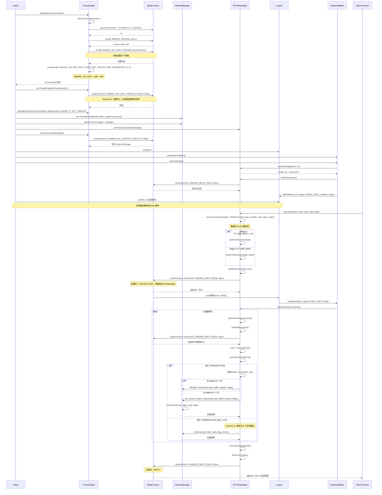

### 定位源文件

```shell
$ grep " servicemanager" ./ -rn --include="*.rc"                                                                                                                                                                                                                     [18:33:09]
grep: ./.DocumentRevisions-V100: Permission denied
grep: ./.TemporaryItems: Permission denied
grep: ./.Trashes: Permission denied
./frameworks/native/cmds/servicemanager/servicemanager.rc:1:service servicemanager /system/bin/servicemanager
./out/soong/.intermediates/system/core/rootdir/init.rc/android_arm64_armv8-a/init.rc:395:    start servicemanager
./out/target/product/blueline/obj/ETC/init.rc_intermediates/init.rc:395:    start servicemanager
./out/target/product/blueline/system/etc/init/hw/init.rc:395:    start servicemanager
./out/target/product/blueline/system/etc/init/servicemanager.rc:1:service servicemanager /system/bin/servicemanager
./system/core/rootdir/init.rc:395:    start servicemanager
```

- `/frameworks/native/cmds/servicemanager/servicemanager.rc`

```
service servicemanager /system/bin/servicemanager
    class core animation
    user system
    group system readproc
    critical
    onrestart restart healthd
    onrestart restart zygote
    onrestart restart audioserver
    onrestart restart media
    onrestart restart surfaceflinger
    onrestart restart inputflinger
    onrestart restart drm
    onrestart restart cameraserver
    onrestart restart keystore
    onrestart restart gatekeeperd
    onrestart restart thermalservice
    writepid /dev/cpuset/system-background/tasks
    shutdown critical
```


- ./frameworks/native/cmds/servicemanager/Android.bp

```xml
cc_binary {
    name: "servicemanager",
    defaults: ["servicemanager_defaults"],
    init_rc: ["servicemanager.rc"],
    srcs: ["main.cpp"],
}
```

### 源文件 `/frameworks/native/cmds/servicemanager/main.cpp`

```cpp
int main(int argc, char** argv) {
    if (argc > 2) {
        LOG(FATAL) << "usage: " << argv[0] << " [binder driver]";
    }

    const char* driver = argc == 2 ? argv[1] : "/dev/binder";
	// 初始化并打开 binder驱动
    sp<ProcessState> ps = ProcessState::initWithDriver(driver);
	// 单线程处理
    ps->setThreadPoolMaxThreadCount(0);
	// 
    ps->setCallRestriction(ProcessState::CallRestriction::FATAL_IF_NOT_ONEWAY);

    sp<ServiceManager> manager = new ServiceManager(std::make_unique<Access>());
	// 将自己添加到 ServiceMap mNameToService; 其他进程可以通过名字查找到
    if (!manager->addService("manager", manager, false /*allowIsolated*/, IServiceManager::DUMP_FLAG_PRIORITY_DEFAULT).isOk()) {
        LOG(ERROR) << "Could not self register servicemanager";
    }
	
    IPCThreadState::self()->setTheContextObject(manager);
	// 把自己成为servicemanager
    ps->becomeContextManager(nullptr, nullptr);
	// 通过Looper epoll机制处理binder事务 ,监听fd
    sp<Looper> looper = Looper::prepare(false /*allowNonCallbacks*/);
	// Binder 驱动中数据变化
    BinderCallback::setupTo(looper);
	// 客户端 
    ClientCallbackCallback::setupTo(looper, manager);

	//进入looper循环
    while(true) {
        looper->pollAll(-1);
    }

    // should not be reached
    return EXIT_FAILURE;
}

class BinderCallback : public LooperCallback {
public:
    static sp<BinderCallback> setupTo(const sp<Looper>& looper) {
        sp<BinderCallback> cb = new BinderCallback;

        int binder_fd = -1;
        IPCThreadState::self()->setupPolling(&binder_fd);
        LOG_ALWAYS_FATAL_IF(binder_fd < 0, "Failed to setupPolling: %d", binder_fd);

        // Flush after setupPolling(), to make sure the binder driver
        // knows about this thread handling commands.
        IPCThreadState::self()->flushCommands();

        int ret = looper->addFd(binder_fd,
                                Looper::POLL_CALLBACK,
                                Looper::EVENT_INPUT,
                                cb,
                                nullptr /*data*/);
        LOG_ALWAYS_FATAL_IF(ret != 1, "Failed to add binder FD to Looper");

        return cb;
    }

    int handleEvent(int /* fd */, int /* events */, void* /* data */) override {
        IPCThreadState::self()->handlePolledCommands();
        return 1;  // Continue receiving callbacks.
    }
};


```

- `ServiceManager`

```cpp
//ServiceManager.h
class ServiceManager : public os::BnServiceManager, public IBinder::DeathRecipient {
...
//ServiceManager.cpp
sp<IBinder> ServiceManager::tryGetService(const std::string& name, bool startIfNotFound) {
    auto ctx = mAccess->getCallingContext();

    sp<IBinder> out;
    Service* service = nullptr;
    if (auto it = mNameToService.find(name); it != mNameToService.end()) {
        service = &(it->second);

        if (!service->allowIsolated) {
            uid_t appid = multiuser_get_app_id(ctx.uid);
            bool isIsolated = appid >= AID_ISOLATED_START && appid <= AID_ISOLATED_END;

            if (isIsolated) {
                return nullptr;
            }
        }
        out = service->binder;
    }

    if (!mAccess->canFind(ctx, name)) {
        return nullptr;
    }

    if (!out && startIfNotFound) {
        tryStartService(name);
    }

    if (out) {
        // Setting this guarantee each time we hand out a binder ensures that the client-checking
        // loop knows about the event even if the client immediately drops the service
        service->guaranteeClient = true;
    }

    return out;
}
Status ServiceManager::addService(const std::string& name, const sp<IBinder>& binder, bool allowIsolated, int32_t dumpPriority) {
	...
	 mNameToService[name] = Service {
        .binder = binder,
        .allowIsolated = allowIsolated,
        .dumpPriority = dumpPriority,
        .debugPid = ctx.debugPid,
    };
}

//-------------aidl---------- 编译时生成--------
//BnServiceManager 是 aidl 生成的,具体在out/song... 目录下
//BpServiceManager.h
namespace android {

namespace os {

class BpServiceManager : public ::android::BpInterface<IServiceManager> {
public:
  explicit BpServiceManager(const ::android::sp<::android::IBinder>& _aidl_impl);
  virtual ~BpServiceManager() = default;
  ::android::binder::Status getService(const ::std::string& name, ::android::sp<::android::IBinder>* _aidl_return) override;
  ::android::binder::Status checkService(const ::std::string& name, ::android::sp<::android::IBinder>* _aidl_return) override;
  ::android::binder::Status addService(const ::std::string& name, const ::android::sp<::android::IBinder>& service, bool allowIsolated, int32_t dumpPriority) override;
  ::android::binder::Status listServices(int32_t dumpPriority, ::std::vector<::std::string>* _aidl_return) override;
  ::android::binder::Status registerForNotifications(const ::std::string& name, const ::android::sp<::android::os::IServiceCallback>& callback) override;
  ::android::binder::Status unregisterForNotifications(const ::std::string& name, const ::android::sp<::android::os::IServiceCallback>& callback) override;
  ::android::binder::Status isDeclared(const ::std::string& name, bool* _aidl_return) override;
  ::android::binder::Status registerClientCallback(const ::std::string& name, const ::android::sp<::android::IBinder>& service, const ::android::sp<::android::os::IClientCallback>& callback) override;
  ::android::binder::Status tryUnregisterService(const ::std::string& name, const ::android::sp<::android::IBinder>& service) override;
};  // class BpServiceManager

}  // namespace os

}  // namespace android

#endif  // AIDL_GENERATED_ANDROID_OS_BP_SERVICE_MANAGER_H_
//BnServiceManager.h
...
class BnServiceManager : public ::android::BnInterface<IServiceManager> {
public:
  explicit BnServiceManager();
  ::android::status_t onTransact(uint32_t _aidl_code, const ::android::Parcel& _aidl_data, ::android::Parcel* _aidl_reply, uint32_t _aidl_flags) override;
};  // class BnServiceManager

}  // namespace os

}  // namespace android

#endif  // AIDL_GENERATED_ANDROID_OS_BN_SERVICE_MANAGER_H_
...
//IServiceManager.cpp
...
namespace android {

namespace os {

BnServiceManager::BnServiceManager()
{
  ::android::internal::Stability::markCompilationUnit(this);
}

::android::status_t BnServiceManager::onTransact(uint32_t _aidl_code, const ::android::Parcel& _aidl_data, ::android::Parcel* _aidl_reply, uint32_t _aidl_flags) {
  ::android::status_t _aidl_ret_status = ::android::OK;
  switch (_aidl_code) {
  case ::android::IBinder::FIRST_CALL_TRANSACTION + 0 /* getService */:
  {
  ...
   ::android::binder::Status _aidl_status(getService(in_name, &_aidl_return));
    _aidl_ret_status = _aidl_status.writeToParcel(_aidl_reply);
    if (((_aidl_ret_status) != (::android::OK))) {
      break;
    }
	break;
  }
   case ::android::IBinder::FIRST_CALL_TRANSACTION + 1 /* checkService */:
	   
	{
		...
		::android::binder::Status _aidl_status(checkService(in_name, &_aidl_return));
		_aidl_ret_status = _aidl_status.writeToParcel(_aidl_reply);
		...
	  break;
	}
	... 
	 case ::android::IBinder::FIRST_CALL_TRANSACTION + 2 /* addService */:
  {
	::android::binder::Status _aidl_status(addService(in_name, in_service, in_allowIsolated, in_dumpPriority));
    _aidl_ret_status = _aidl_status.writeToParcel(_aidl_reply);
	  ...
		  break;
	}
	...
		}
}


//BpServiceManager
BpServiceManager::BpServiceManager(const ::android::sp<::android::IBinder>& _aidl_impl)
    : BpInterface<IServiceManager>(_aidl_impl){
}
::android::binder::Status BpServiceManager::getService(const ::std::string& name, ::android::sp<::android::IBinder>* _aidl_return) {
	...
	 _aidl_ret_status = remote()->transact(::android::IBinder::FIRST_CALL_TRANSACTION + 0 /* getService */, _aidl_data, &_aidl_reply);
	...
}
```


- `/frameworks/native/include/binder/ProcessState.cpp`

```cpp
sp<ProcessState> ProcessState::initWithDriver(const char* driver)
{
    Mutex::Autolock _l(gProcessMutex);
    if (gProcess != nullptr) {
        // Allow for initWithDriver to be called repeatedly with the same
        // driver.
        if (!strcmp(gProcess->getDriverName().c_str(), driver)) {
            return gProcess;
        }
        LOG_ALWAYS_FATAL("ProcessState was already initialized.");
    }

    if (access(driver, R_OK) == -1) {
        ALOGE("Binder driver %s is unavailable. Using /dev/binder instead.", driver);
        driver = "/dev/binder";
    }
	
    gProcess = new ProcessState(driver);
    return gProcess;
}
...
ProcessState::ProcessState(const char *driver)
    : mDriverName(String8(driver))
    , mDriverFD(open_driver(driver)) 
    , mVMStart(MAP_FAILED)
    , mThreadCountLock(PTHREAD_MUTEX_INITIALIZER)
    , mThreadCountDecrement(PTHREAD_COND_INITIALIZER)
    , mExecutingThreadsCount(0)
    , mMaxThreads(DEFAULT_MAX_BINDER_THREADS)
    , mStarvationStartTimeMs(0)
    , mBinderContextCheckFunc(nullptr)
    , mBinderContextUserData(nullptr)
    , mThreadPoolStarted(false)
    , mThreadPoolSeq(1)
    , mCallRestriction(CallRestriction::NONE)
{

// TODO(b/139016109): enforce in build system
#if defined(__ANDROID_APEX__)
    LOG_ALWAYS_FATAL("Cannot use libbinder in APEX (only system.img libbinder) since it is not stable.");
#endif

    if (mDriverFD >= 0) {
        // mmap the binder, providing a chunk of virtual address space to receive transactions.
		// 内存映射 BINDER_VM_SIZE ((1 * 1024 * 1024) - sysconf(_SC_PAGE_SIZE) * 2)
        mVMStart = mmap(nullptr, BINDER_VM_SIZE, PROT_READ, MAP_PRIVATE | MAP_NORESERVE, mDriverFD, 0);
        if (mVMStart == MAP_FAILED) {
            // *sigh*
            ALOGE("Using %s failed: unable to mmap transaction memory.\n", mDriverName.c_str());
            close(mDriverFD);
            mDriverFD = -1;
            mDriverName.clear();
        }
    }

#ifdef __ANDROID__
    LOG_ALWAYS_FATAL_IF(mDriverFD < 0, "Binder driver '%s' could not be opened.  Terminating.", driver);
#endif
}

status_t ProcessState::setThreadPoolMaxThreadCount(size_t maxThreads) {
    status_t result = NO_ERROR;
    if (ioctl(mDriverFD, BINDER_SET_MAX_THREADS, &maxThreads) != -1) {
        mMaxThreads = maxThreads;
    } else {
        result = -errno;
        ALOGE("Binder ioctl to set max threads failed: %s", strerror(-result));
    }
    return result;
}
...
static int open_driver(const char *driver)
{
	//打开驱动
    int fd = open(driver, O_RDWR | O_CLOEXEC);
    if (fd >= 0) {
        int vers = 0;
		// 配置 BINDER_VERSION
        status_t result = ioctl(fd, BINDER_VERSION, &vers);
        if (result == -1) {
            ALOGE("Binder ioctl to obtain version failed: %s", strerror(errno));
            close(fd);
            fd = -1;
        }
        if (result != 0 || vers != BINDER_CURRENT_PROTOCOL_VERSION) {
          ALOGE("Binder driver protocol(%d) does not match user space protocol(%d)! ioctl() return value: %d",
                vers, BINDER_CURRENT_PROTOCOL_VERSION, result);
            close(fd);
            fd = -1;
        }
        size_t maxThreads = DEFAULT_MAX_BINDER_THREADS; //15
		// 配置最大线程数
        result = ioctl(fd, BINDER_SET_MAX_THREADS, &maxThreads);
        if (result == -1) {
            ALOGE("Binder ioctl to set max threads failed: %s", strerror(errno));
        }
    } else {
        ALOGW("Opening '%s' failed: %s\n", driver, strerror(errno));
    }
    return fd;
}

bool ProcessState::becomeContextManager(context_check_func checkFunc, void* userData)
{
    AutoMutex _l(mLock);
    mBinderContextCheckFunc = checkFunc;
    mBinderContextUserData = userData;

    flat_binder_object obj {
        .flags = FLAT_BINDER_FLAG_TXN_SECURITY_CTX,
    };

    int result = ioctl(mDriverFD, BINDER_SET_CONTEXT_MGR_EXT, &obj);

    // fallback to original method
    if (result != 0) {
        android_errorWriteLog(0x534e4554, "121035042");

        int dummy = 0;
        result = ioctl(mDriverFD, BINDER_SET_CONTEXT_MGR, &dummy);
    }

    if (result == -1) {
        mBinderContextCheckFunc = nullptr;
        mBinderContextUserData = nullptr;
        ALOGE("Binder ioctl to become context manager failed: %s\n", strerror(errno));
    }

    return result == 0;
}

```

- `/frameworks/native/include/binder/IPCThreadState.cpp`

```cpp
...
// IPCThreadState.h
class IPCThreadState {
private:
    Parcel mIn;   // 从Binder驱动读取的数据
    Parcel mOut;  // 要发送给Binder驱动的数据
};
...
// 处理 binder 驱动传来的数据
status_t IPCThreadState::handlePolledCommands()
{
    status_t result;

    do {
        result = getAndExecuteCommand();
    } while (mIn.dataPosition() < mIn.dataSize());

    processPendingDerefs();
    flushCommands();
    return result;
}
status_t IPCThreadState::getAndExecuteCommand()
{
	status_t result;
    int32_t cmd;
	result = talkWithDriver();
	if (result >= NO_ERROR) {
		 ...
		cmd = mIn.readInt32();
		result = executeCommand(cmd);
		...
	}
	return result;
}
...
status_t IPCThreadState::executeCommand(int32_t cmd)
{
	BBinder* obj;
    RefBase::weakref_type* refs;
    status_t result = NO_ERROR;

    switch ((uint32_t)cmd) {
    case BR_ERROR:
        result = mIn.readInt32();
        break;

    case BR_OK:
        break;
		...
	case BR_TRANSACTION_SEC_CTX:
    case BR_TRANSACTION:
		...
		//
	 	if (tr.target.ptr) {
            // We only have a weak reference on the target object, so we must first try to
            // safely acquire a strong reference before doing anything else with it.
            if (reinterpret_cast<RefBase::weakref_type*>(
                    tr.target.ptr)->attemptIncStrong(this)) {
                error = reinterpret_cast<BBinder*>(tr.cookie)->transact(tr.code, buffer,
                        &reply, tr.flags);
                reinterpret_cast<BBinder*>(tr.cookie)->decStrong(this);
            } else {
                error = UNKNOWN_TRANSACTION;
            }

        } else {
            error = the_context_object->transact(tr.code, buffer, &reply, tr.flags);
        }
		...
		break;
}


//mOut 装填数据
status_t IPCThreadState::transact(int32_t handle,
                                  uint32_t code, const Parcel& data,
                                  Parcel* reply, uint32_t flags)
{
	...
	// 将事务数据写入mOut
	err = writeTransactionData(BC_TRANSACTION, flags, handle, code, data, nullptr);
	 if (err != NO_ERROR) {
        if (reply) reply->setError(err);
        return (mLastError = err);
    }
	// 等待回复
	if ((flags & TF_ONE_WAY) == 0){
		...
		 if (reply) {
            err = waitForResponse(reply);
        } else {
            Parcel fakeReply;
            err = waitForResponse(&fakeReply);
        }
	}else{
		err = waitForResponse(nullptr, nullptr);
	}
	return err;

}
status_t IPCThreadState::writeTransactionData(int32_t cmd, uint32_t binderFlags,
    int32_t handle, uint32_t code, const Parcel& data, status_t* statusBuffer)
{
    binder_transaction_data tr;

    tr.target.ptr = 0; /* Don't pass uninitialized stack data to a remote process */
    tr.target.handle = handle;
    tr.code = code;
    tr.flags = binderFlags;
    tr.cookie = 0;
    tr.sender_pid = 0;
    tr.sender_euid = 0;

    ...
	// 写入数据
    mOut.writeInt32(cmd);
    mOut.write(&tr, sizeof(tr));

    return NO_ERROR;
}

status_t IPCThreadState::talkWithDriver(bool doReceive)
{
    if (mProcess->mDriverFD < 0) {
        return -EBADF;
    }
	binder_write_read bwr;
	const size_t outAvail = (!doReceive || needRead) ? mOut.dataSize() : 0;

	// 输出数据 mOut -> 驱动
    bwr.write_size = outAvail;
    bwr.write_buffer = (uintptr_t)mOut.data();

    // This is what we'll read.
	// 输入数据 驱动 -> mIn
    if (doReceive && needRead) {
        bwr.read_size = mIn.dataCapacity();
        bwr.read_buffer = (uintptr_t)mIn.data();
    } else {
        bwr.read_size = 0;
        bwr.read_buffer = 0;
    }
	...
	do {
		...
		//与驱动交互
		if (ioctl(mProcess->mDriverFD, BINDER_WRITE_READ, &bwr) >= 0)
            err = NO_ERROR;
        else
            err = -errno;
	} while (err == -EINTR);
	...
	//更新mIn数据大小
	if (bwr.read_consumed > 0) {
        mIn.setDataSize(bwr.read_consumed);
        mIn.setDataPosition(0);
    }
}
```

### 流程小结(个人理解)



- 内核驱动 `binder.c`

```cpp
static struct binder_ref *binder_get_ref_for_node_olocked(
					struct binder_proc *proc,
					struct binder_node *node,
					struct binder_ref *new_ref)
{
	struct binder_context *context = proc->context;
	...
	// 约定??? handl 0
	new_ref->data.desc = (node == context->binder_context_mgr_node) ? 0 : 1;
	for (n = rb_first(&proc->refs_by_desc); n != NULL; n = rb_next(n)) {
		ref = rb_entry(n, struct binder_ref, rb_node_desc);
		if (ref->data.desc > new_ref->data.desc)
			break;
		new_ref->data.desc = ref->data.desc + 1;
	}
	...
	return new_ref;
	
}
```
