#### 查看系统窗口层级

`adb shell dumpsys activity containers`\


```xml
...
// 带一个系统弹窗+一个应用弹窗

ACTIVITY MANAGER CONTAINERS (dumpsys activity containers)
ROOT type=undefined mode=fullscreen override-mode=undefined
  #0 Display 0 name="Built-in Screen" type=undefined mode=fullscreen override-mode=fullscreen
   #1 mOverlayContainers type=undefined mode=fullscreen override-mode=undefined
   #0 mWindowContainers type=undefined mode=fullscreen override-mode=undefined
    #0 DisplayArea.Root type=undefined mode=fullscreen override-mode=undefined
     #5 Leaf:17:34 type=undefined mode=fullscreen override-mode=undefined
      #7 WindowToken{d615f35 android.os.BinderProxy@994dd6c} type=undefined mode=fullscreen override-mode=undefined
       #0 575dfca SecondaryHomeHandle0 type=undefined mode=fullscreen override-mode=undefined
      #6 WindowToken{dbbffe6 android.os.BinderProxy@cc1be41} type=undefined mode=fullscreen override-mode=undefined
       #0 2e83927 EdgeBackGestureHandler0 type=undefined mode=fullscreen override-mode=undefined
      #5 WindowToken{3a72b6c android.os.BinderProxy@b53ec1f} type=undefined mode=fullscreen override-mode=undefined
       #0 ef09535 pip-dismiss-overlay type=undefined mode=fullscreen override-mode=undefined
      #4 WindowToken{a22facd android.os.BinderProxy@a4d81f7} type=undefined mode=fullscreen override-mode=undefined
       #0 6ce4693 ScreenDecorOverlayBottom type=undefined mode=fullscreen override-mode=undefined
      #3 WindowToken{6faf5a0 android.os.BinderProxy@42c405d} type=undefined mode=fullscreen override-mode=undefined
       #0 1f551ff ScreenDecorOverlay type=undefined mode=fullscreen override-mode=undefined
      #2 WindowToken{8d3f67 android.os.BinderProxy@d474a81} type=undefined mode=fullscreen override-mode=undefined
       #0 61f9114 NavigationBar0 type=undefined mode=fullscreen override-mode=undefined
      #1 WindowToken{b41b3b0 android.os.BinderProxy@2b85962} type=undefined mode=fullscreen override-mode=undefined
       #0 9d95229 NotificationShade type=undefined mode=fullscreen override-mode=undefined
      #0 WindowToken{88be7e5 android.os.BinderProxy@95d734f} type=undefined mode=fullscreen override-mode=undefined
       #0 457b2ba StatusBar type=undefined mode=fullscreen override-mode=undefined
     #4 ImeContainer type=undefined mode=fullscreen override-mode=undefined
      #0 WindowToken{e2ee7d android.os.Binder@5417cd4} type=undefined mode=fullscreen override-mode=undefined
       #0 bb4d0a5 InputMethod type=undefined mode=fullscreen override-mode=undefined
     #3 Leaf:3:14 type=undefined mode=fullscreen override-mode=undefined
      #1 WindowToken{faaef18 android.os.BinderProxy@cbb02fb} type=undefined mode=fullscreen override-mode=undefined
       #0 5314d71 Sys2038:com.example.mysystemdialog/com.example.mysystemdialog.MainActivity type=undefined mode=fullscreen override-mode=undefined
      #0 WindowToken{e1b8679 android.os.BinderProxy@dd702c3} type=undefined mode=fullscreen override-mode=undefined
       #0 f474fbe AssistPreviewPanel type=undefined mode=fullscreen override-mode=undefined
     #2 DefaultTaskDisplayArea type=undefined mode=fullscreen override-mode=undefined
      #3 Task=135 type=standard mode=fullscreen override-mode=undefined
       #0 ActivityRecord{226514b u0 com.example.mysystemdialog/.MainActivity t135} type=standard mode=fullscreen override-mode=undefined
        #1 cea373a com.example.mysystemdialog/com.example.mysystemdialog.MainActivity type=standard mode=fullscreen override-mode=undefined
        #0 df3257a com.example.mysystemdialog/com.example.mysystemdialog.MainActivity type=standard mode=fullscreen override-mode=undefined
      #2 Task=1 type=home mode=fullscreen override-mode=undefined
       #1 Task=13 type=home mode=fullscreen override-mode=undefined
        #0 ActivityRecord{6153a60 u0 com.android.launcher3/.uioverrides.QuickstepLauncher t13} type=home mode=fullscreen override-mode=undefined
         #0 1d68ea2 com.android.launcher3/com.android.launcher3.uioverrides.QuickstepLauncher type=home mode=fullscreen override-mode=undefined
       #0 Task=1000003 type=home mode=fullscreen override-mode=undefined
        #0 ActivityRecord{8f7c931 u10 com.android.launcher3/.uioverrides.QuickstepLauncher t1000003} type=home mode=fullscreen override-mode=undefined
         #0 6a6358a com.android.launcher3/com.android.launcher3.uioverrides.QuickstepLauncher type=home mode=fullscreen override-mode=undefined
      #1 Task=62 type=undefined mode=split-screen-primary override-mode=split-screen-primary
      #0 Task=63 type=undefined mode=split-screen-secondary override-mode=split-screen-secondary
     #1 Leaf:2:2 type=undefined mode=fullscreen override-mode=undefined
     #0 Leaf:0:1 type=undefined mode=fullscreen override-mode=undefined
      #0 WallpaperWindowToken{a3ca807 token=android.os.Binder@2a34088} type=undefined mode=fullscreen override-mode=fullscreen
       #0 db1af0c com.android.systemui.ImageWallpaper type=undefined mode=fullscreen override-mode=undefined
```

**梳理层级**

```mermaid
graph TD
classDef added fill:#ffefef,stroke:#cc3333,stroke-width:2px,color:#990000;
classDef changed fill:#fff7e6,stroke:#ff9f0a,stroke-width:2px,color:#8a4b00;

ROOT["ROOT"]
D0["#0 Display 0 (Built-in Screen)"]
ROOT --> D0

%% Display 0 Containers（树形：D0 -> 子容器；仅对子容器左右次序排序）
D0 --> D0_sub["Display 0 Containers"]
subgraph D0_siblings[ ]
  direction LR
  MOC["#1 mOverlayContainers"]
  MWC["#0 mWindowContainers"]
end
D0_sub --> MOC
D0_sub --> MWC

%% DisplayArea.Root（树形：MWC -> DisplayAreaRoot；仅对子 display areas 排序）
MWC --> DisplayAreaRoot["#0 DisplayArea.Root"]
subgraph DAR_siblings[ ]
  direction LR
  L_17_34["#5 Leaf:17:34"]
  IME["#4 ImeContainer"]
  L_3_14["#3 Leaf:3:14"]
  DTDA["#2 DefaultTaskDisplayArea"]
  L_2_2["#1 Leaf:2:2"]
  L_0_1["#0 Leaf:0:1"]
end
DisplayAreaRoot --> L_17_34
DisplayAreaRoot --> IME
DisplayAreaRoot --> L_3_14
DisplayAreaRoot --> DTDA
DisplayAreaRoot --> L_2_2
DisplayAreaRoot --> L_0_1

%% Leaf:17:34（树形：L_17_34 -> 各 WindowToken；仅对子节点左右排序）
subgraph L1734_siblings[ ]
  direction LR
  WT1["#7 WindowToken {d615f35}"] --> SHH["SecondaryHomeHandle0"]
  WT2["#6 WindowToken {dbbffe6}"] --> EBGH["EdgeBackGestureHandler0"]
  WT3["#5 WindowToken {3a72b6c}"] --> PIPDO["pip-dismiss-overlay"]
  WT4["#4 WindowToken {a22facd}"] --> SDO_B["ScreenDecorOverlayBottom"]
  WT5["#3 WindowToken {6faf5a0}"] --> SDO["ScreenDecorOverlay"]
  WT6["#2 WindowToken {8d3f67}"] --> NB0["NavigationBar0"]
  WT7["#1 WindowToken {b41b3b0}"] --> NS["NotificationShade"]
  WT8["#0 WindowToken {88be7e5}"] --> SB["StatusBar"]
end
L_17_34 --> WT1
L_17_34 --> WT2
L_17_34 --> WT3
L_17_34 --> WT4
L_17_34 --> WT5
L_17_34 --> WT6
L_17_34 --> WT7
L_17_34 --> WT8

%% ImeContainer（树形：只有一个不排序）
IME --> IMEWT["WindowToken {e2ee7d}"] --> IMEWIN["InputMethod"]

%% Leaf:3:14（树形：L_3_14 -> 两个 WindowToken；仅左右排序，新增高亮）
subgraph L314_siblings[ ]
  direction LR
  APWT2["#1 WindowToken {faaef18}"]:::added --> SYS2038["Sys2038: com.example.mysystemdialog/com.example.mysystemdialog.MainActivity"]:::added
  APWT["#0 WindowToken {e1b8679}"] --> APP["AssistPreviewPanel"]
end
L_3_14 --> APWT2
L_3_14 --> APWT

%% DefaultTaskDisplayArea（树形：DTDA -> 各 Task；仅左右排序）
subgraph DTDA_siblings[ ]
  direction LR
  Task135["#3 Task=135 (standard/fullscreen)"]
  Task1["#2 Task=1 (home/fullscreen)"]
  Task62["#1 Task=62 (split-screen-primary)"]
  Task63["#0 Task=63 (split-screen-secondary)"]
end
DTDA --> Task135
DTDA --> Task1
DTDA --> Task62
DTDA --> Task63

%% Task=135（树形：Task135 -> AR135 -> 子窗口；仅 AR135 的子窗口左右排序）
Task135 --> AR135["ActivityRecord {226514b} u0 com.example.mysystemdialog/.MainActivity t135"]
subgraph AR135_siblings[ ]
  direction LR
  ACT135_1["#1 cea373a com.example.mysystemdialog/com.example.mysystemdialog.MainActivity"]:::changed
  ACT135_0["#0 df3257a com.example.mysystemdialog/com.example.mysystemdialog.MainActivity"]
end
AR135 --> ACT135_1
AR135 --> ACT135_0

%% Task=1（树形：Task1 -> 两个子任务；仅左右排序）
subgraph Task1_siblings[ ]
  direction LR
  Task13["#1 Task=13 (home/fullscreen)"]
  Task1000003["#0 Task=1000003 (home/fullscreen)"]
end
Task1 --> Task13
Task1 --> Task1000003
Task13 --> AR13["ActivityRecord {6153a60} u0 com.android.launcher3/.uioverrides.QuickstepLauncher t13"] --> ACT13["com.android.launcher3/com.android.launcher3.uioverrides.QuickstepLauncher"]
Task1000003 --> AR1000003["ActivityRecord {8f7c931} u10 com.android.launcher3/.uioverrides.QuickstepLauncher t1000003"] --> ACT1000003["com.android.launcher3/com.android.launcher3.uioverrides.QuickstepLauncher"]

%% Leaf:0:1（树形：只有一个不排序）
L_0_1 --> WWT["WallpaperWindowToken {a3ca807}"] --> WIMG["com.android.systemui.ImageWallpaper"]
```



#### 层级说明

##### DisplayArea.Root

- `#0` Leaf 0:1 (壁纸层)
- `#1` Leaf 2:2 (中间层)
- `#2` DefaultTaskDisplayArea (应用任务区域)
- `#3` Leaf:3:14 (系统窗口)
  - \#1 Activity的系统弹窗
- `#4` ImeContainer (输入法容器)
- `#5` Leaf:17:34 (系统UI层) - 最顶层

##### 系统UI层的WindowToken (按Z-Order从底到顶)

- `#0` - StatusBar (状态栏)
- `#1` - NotificationShade (通知栏)
- `#2` - NavigationBar0 (导航栏)
- `#3` - ScreenDecorOverlay (屏幕装饰覆盖层)
- `#4` - ScreenDecorOverlayBottom (底部装饰覆盖层)
- `#5` - pip-dismiss-overlay (画中画关闭覆盖层)
- `#6` - EdgeBackGestureHandler0 (边缘返回手势处理)
- `#7` - SecondaryHomeHandle0 (副主屏幕句柄) - **最顶层**

##### 任务显示区域的Task (按Z-Order从底到顶)

- `#0` - Task=4 (分屏副区域)
- `#1` - Task=3 (分屏主区域)
- `#2` - Task=1 (主屏幕任务)
- `#3` - Task=135 (前台应用) - **最顶层**
  - **ActivityRecord**
    - **#0 Activity**
    - **#1 应用Dialog**

#### **当前活跃状态**

- **前台应用**: `com.example.servicedemo.MainActivity` (Task=18)
- **后台桌面**: `com.android.launcher3.uioverrides.QuickstepLauncher` (Task=5)
- **分屏模式**: 已准备但未激活 (Task=3, Task=4为空)

#### **Binder对象类型**

- **BinderProxy**: 跨进程的Binder代理对象 (系统UI组件)
- **Binder**: 本地Binder对象 (输入法、壁纸)
