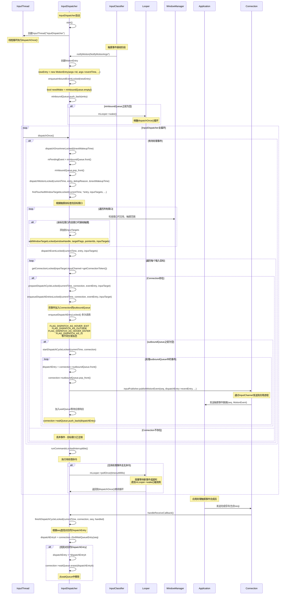

### InputDispatcher

#### 时序图



```cpp

...
//registerInputChannel
status_t InputDispatcher::registerInputChannel(const sp<InputChannel>& inputChannel) {
#if DEBUG_REGISTRATION
    ALOGD("channel '%s' ~ registerInputChannel", inputChannel->getName().c_str());
#endif

    { // acquire lock
        std::scoped_lock _l(mLock);
        sp<Connection> existingConnection = getConnectionLocked(inputChannel->getConnectionToken());
        if (existingConnection != nullptr) {
            ALOGW("Attempted to register already registered input channel '%s'",
                  inputChannel->getName().c_str());
            return BAD_VALUE;
        }

        sp<Connection> connection = new Connection(inputChannel, false /*monitor*/, mIdGenerator);

        int fd = inputChannel->getFd();
        mConnectionsByFd[fd] = connection;
        mInputChannelsByToken[inputChannel->getConnectionToken()] = inputChannel;
		//添加 epoll 监听, handleReceiveCallback,应用端处理完 touch 事件会调用
        mLooper->addFd(fd, 0, ALOOPER_EVENT_INPUT, handleReceiveCallback, this);
    } // release lock

    // Wake the looper because some connections have changed.
    mLooper->wake();
    return OK;
}


...
//input 事件分发
mDispatcher = createInputDispatcher(dispatcherPolicy);
//代理对象, 会将监听事件转发到 mDispatcher
mClassifier = new InputClassifier(mDispatcher);
//监听
mReader = createInputReader(readerPolicy, mClassifier);
...


class InputClassifier : public InputClassifierInterface {
public:
    explicit InputClassifier(const sp<InputListenerInterface>& listener);
}

InputDispatcher::InputDispatcher(const sp<InputDispatcherPolicyInterface>& policy)
      : mPolicy(policy),
        mPendingEvent(nullptr),
        mLastDropReason(DropReason::NOT_DROPPED),
        mIdGenerator(IdGenerator::Source::INPUT_DISPATCHER),
        mAppSwitchSawKeyDown(false),
        mAppSwitchDueTime(LONG_LONG_MAX),
        mNextUnblockedEvent(nullptr),
        mDispatchEnabled(false),
        mDispatchFrozen(false),
        mInputFilterEnabled(false),
        // mInTouchMode will be initialized by the WindowManager to the default device config.
        // To avoid leaking stack in case that call never comes, and for tests,
        // initialize it here anyways.
        mInTouchMode(true),
        mFocusedDisplayId(ADISPLAY_ID_DEFAULT) {
    mLooper = new Looper(false);
    mReporter = createInputReporter();

    mKeyRepeatState.lastKeyEntry = nullptr;

    policy->getDispatcherConfiguration(&mConfig);
}

//native start---> mDispatcher->start();
status_t InputDispatcher::start() {
    if (mThread) {
        return ALREADY_EXISTS;
    }
	//同样的,启动一个线程循环执行 dispatchOnce()
    mThread = std::make_unique<InputThread>(
            "InputDispatcher", [this]() { dispatchOnce(); }, [this]() { mLooper->wake(); });
    return OK;
}

void InputDispatcher::dispatchOnce() {
    nsecs_t nextWakeupTime = LONG_LONG_MAX;
    { // acquire lock
        std::scoped_lock _l(mLock);
        mDispatcherIsAlive.notify_all();

        // Run a dispatch loop if there are no pending commands.
        // The dispatch loop might enqueue commands to run afterwards.
        if (!haveCommandsLocked()) {
			// 1. mPendingEvent = mInboundQueue.front(); mInboundQueue.pop_front();
			// 2. case EventEntry::Type::MOTION: dispatchMotionLocked()
            dispatchOnceInnerLocked(&nextWakeupTime);
        }

        // Run all pending commands if there are any.
        // If any commands were run then force the next poll to wake up immediately.
        if (runCommandsLockedInterruptible()) {
            nextWakeupTime = LONG_LONG_MIN;
        }

        // If we are still waiting for ack on some events,
        // we might have to wake up earlier to check if an app is anr'ing.
		// anr检测
        const nsecs_t nextAnrCheck = processAnrsLocked();
        nextWakeupTime = std::min(nextWakeupTime, nextAnrCheck);

        // We are about to enter an infinitely long sleep, because we have no commands or
        // pending or queued events
        if (nextWakeupTime == LONG_LONG_MAX) {
            mDispatcherEnteredIdle.notify_all();
        }
    } // release lock

    // Wait for callback or timeout or wake.  (make sure we round up, not down)
    nsecs_t currentTime = now();
    int timeoutMillis = toMillisecondTimeoutDelay(currentTime, nextWakeupTime);
	//没有需要 处理的消息就一直 等待被唤醒
    mLooper->pollOnce(timeoutMillis);
}

//唤醒
void InputDispatcher::notifyMotion(const NotifyMotionArgs* args) {
	...
    // Just enqueue a new motion event.
    MotionEntry* newEntry =
            new MotionEntry(args->id, args->eventTime, args->deviceId, args->source,
                            args->displayId, policyFlags, args->action, args->actionButton,
                            args->flags, args->metaState, args->buttonState,
                            args->classification, args->edgeFlags, args->xPrecision,
                            args->yPrecision, args->xCursorPosition, args->yCursorPosition,
                            args->downTime, args->pointerCount, args->pointerProperties,
                            args->pointerCoords, 0, 0);

    needWake = enqueueInboundEventLocked(newEntry);
	...
	if (needWake) {
		//looperOnce()
    	mLooper->wake();
    }
}


bool InputDispatcher::enqueueInboundEventLocked(EventEntry* entry) {
	//目前 iq 是否为空,为空需要唤醒 分发线程,进行分发
    bool needWake = mInboundQueue.empty();
	// 填充iq 数据
    mInboundQueue.push_back(entry);
    traceInboundQueueLengthLocked();

    switch (entry->type) {
        case EventEntry::Type::KEY: {
            // Optimize app switch latency.
            // If the application takes too long to catch up then we drop all events preceding
            // the app switch key.
            const KeyEntry& keyEntry = static_cast<const KeyEntry&>(*entry);
            if (isAppSwitchKeyEvent(keyEntry)) {
                if (keyEntry.action == AKEY_EVENT_ACTION_DOWN) {
                    mAppSwitchSawKeyDown = true;
                } else if (keyEntry.action == AKEY_EVENT_ACTION_UP) {
                    if (mAppSwitchSawKeyDown) {
#if DEBUG_APP_SWITCH
                        ALOGD("App switch is pending!");
#endif
                        mAppSwitchDueTime = keyEntry.eventTime + APP_SWITCH_TIMEOUT;
                        mAppSwitchSawKeyDown = false;
                        needWake = true;
                    }
                }
            }
            break;
        }

        case EventEntry::Type::MOTION: {
			//是否应该丢弃当前事件,默认不会丢弃
            if (shouldPruneInboundQueueLocked(static_cast<MotionEntry&>(*entry))) {
                mNextUnblockedEvent = entry;
                needWake = true;
            }
            break;
        }
        case EventEntry::Type::FOCUS: {
            LOG_ALWAYS_FATAL("Focus events should be inserted using enqueueFocusEventLocked");
            break;
        }
        case EventEntry::Type::CONFIGURATION_CHANGED:
        case EventEntry::Type::DEVICE_RESET: {
            // nothing to do
            break;
        }
    }
    return needWake;
}
// 分发事件
bool InputDispatcher::dispatchMotionLocked(nsecs_t currentTime, MotionEntry* entry,
                                           DropReason* dropReason, nsecs_t* nextWakeupTime) {
    ATRACE_CALL();
    // Preprocessing.
    if (!entry->dispatchInProgress) {
        entry->dispatchInProgress = true;

        logOutboundMotionDetails("dispatchMotion - ", *entry);
    }

    // Clean up if dropping the event.
    if (*dropReason != DropReason::NOT_DROPPED) {
        setInjectionResult(entry,
                           *dropReason == DropReason::POLICY ? INPUT_EVENT_INJECTION_SUCCEEDED
                                                             : INPUT_EVENT_INJECTION_FAILED);
        return true;
    }

    bool isPointerEvent = entry->source & AINPUT_SOURCE_CLASS_POINTER;

    // Identify targets.
    std::vector<InputTarget> inputTargets;

    bool conflictingPointerActions = false;
    int32_t injectionResult;
    if (isPointerEvent) {
        // Pointer event.  (eg. touchscreen)
		// 触摸事件,查找 可以接受事件的 window ,赋值 inputTargets(包含 inputChannel)
        injectionResult =
                findTouchedWindowTargetsLocked(currentTime, *entry, inputTargets, nextWakeupTime,
                                               &conflictingPointerActions);
    } else {
        // Non touch event.  (eg. trackball)
        injectionResult =
                findFocusedWindowTargetsLocked(currentTime, *entry, inputTargets, nextWakeupTime);
    }
    if (injectionResult == INPUT_EVENT_INJECTION_PENDING) {
        return false;
    }

    setInjectionResult(entry, injectionResult);
    if (injectionResult == INPUT_EVENT_INJECTION_PERMISSION_DENIED) {
        ALOGW("Permission denied, dropping the motion (isPointer=%s)", toString(isPointerEvent));
        return true;
    }
    if (injectionResult != INPUT_EVENT_INJECTION_SUCCEEDED) {
        CancelationOptions::Mode mode(isPointerEvent
                                              ? CancelationOptions::CANCEL_POINTER_EVENTS
                                              : CancelationOptions::CANCEL_NON_POINTER_EVENTS);
        CancelationOptions options(mode, "input event injection failed");
        synthesizeCancelationEventsForMonitorsLocked(options);
        return true;
    }

    // Add monitor channels from event's or focused display.
    addGlobalMonitoringTargetsLocked(inputTargets, getTargetDisplayId(*entry));

    if (isPointerEvent) {
        std::unordered_map<int32_t, TouchState>::iterator it =
                mTouchStatesByDisplay.find(entry->displayId);
        if (it != mTouchStatesByDisplay.end()) {
            const TouchState& state = it->second;
            if (!state.portalWindows.empty()) {
                // The event has gone through these portal windows, so we add monitoring targets of
                // the corresponding displays as well.
                for (size_t i = 0; i < state.portalWindows.size(); i++) {
                    const InputWindowInfo* windowInfo = state.portalWindows[i]->getInfo();
                    addGlobalMonitoringTargetsLocked(inputTargets, windowInfo->portalToDisplayId,
                                                     -windowInfo->frameLeft, -windowInfo->frameTop);
                }
            }
        }
    }

    // Dispatch the motion.
    if (conflictingPointerActions) {
        CancelationOptions options(CancelationOptions::CANCEL_POINTER_EVENTS,
                                   "conflicting pointer actions");
        synthesizeCancelationEventsForAllConnectionsLocked(options);
    }
    dispatchEventLocked(currentTime, entry, inputTargets);
    return true;
}
...
int32_t InputDispatcher::findTouchedWindowTargetsLocked(nsecs_t currentTime,
                                                        const MotionEntry& entry,
                                                        std::vector<InputTarget>&inputTargets,
                                                        nsecs_t* nextWakeupTime,
                                                        bool* outConflictingPointerActions) {

	bool newGesture = (maskedAction == AMOTION_EVENT_ACTION_DOWN ||
                       maskedAction == AMOTION_EVENT_ACTION_SCROLL || isHoverAction);
	...
	 if (newGesture || (isSplit && maskedAction == AMOTION_EVENT_ACTION_POINTER_DOWN)) {
		if (isFromMouse) {
            x = int32_t(entry.xCursorPosition);
            y = int32_t(entry.yCursorPosition);
        } else {
            x = int32_t(entry.pointerCoords[pointerIndex].getAxisValue(AMOTION_EVENT_AXIS_X));
            y = int32_t(entry.pointerCoords[pointerIndex].getAxisValue(AMOTION_EVENT_AXIS_Y));
        }
        bool isDown = maskedAction == AMOTION_EVENT_ACTION_DOWN;
		//遍历 window 根据 window 是否可见,是否接受触摸事件,是否 可以获取焦点,以及 x,y 坐标是否位于窗口内 找到第一个可以使用的window
        sp<InputWindowHandle> newTouchedWindowHandle =
                findTouchedWindowAtLocked(displayId, x, y, &tempTouchState,
                                          isDown /*addOutsideTargets*/, true /*addPortalWindows*/);
		// Figure out whether splitting will be allowed for this window.
		//split 处理: 只要有一个窗口射者了该属性,多指时,都不需要再次查找新窗口
        if (newTouchedWindowHandle != nullptr &&
            newTouchedWindowHandle->getInfo()->supportsSplitTouch()) {
            // New window supports splitting, but we should never split mouse events.
            isSplit = !isFromMouse;
        } else if (isSplit) {
            // New window does not support splitting but we have already split events.
            // Ignore the new window.
            newTouchedWindowHandle = nullptr;
        }
		...
		 // Success!  Output targets.
	    injectionResult = INPUT_EVENT_INJECTION_SUCCEEDED;
	
	    for (const TouchedWindow& touchedWindow : tempTouchState.windows) {
	        addWindowTargetLocked(touchedWindow.windowHandle, touchedWindow.targetFlags,
	                              touchedWindow.pointerIds, inputTargets);
	    }
	
	    for (const TouchedMonitor& touchedMonitor : tempTouchState.gestureMonitors) {
	        addMonitoringTargetLocked(touchedMonitor.monitor, touchedMonitor.xOffset,
	                                  touchedMonitor.yOffset, inputTargets);
	    }
	
	    // Drop the outside or hover touch windows since we will not care about them
	    // in the next iteration.
	    tempTouchState.filterNonAsIsTouchWindows();
		...
	 }
}
...
void InputDispatcher::dispatchEventLocked(nsecs_t currentTime, EventEntry* eventEntry,
                                          const std::vector<InputTarget>& inputTargets) {
    ATRACE_CALL();
#if DEBUG_DISPATCH_CYCLE
    ALOGD("dispatchEventToCurrentInputTargets");
#endif

    ALOG_ASSERT(eventEntry->dispatchInProgress); // should already have been set to true

    pokeUserActivityLocked(*eventEntry);

    for (const InputTarget& inputTarget : inputTargets) {
        sp<Connection> connection =
                getConnectionLocked(inputTarget.inputChannel->getConnectionToken());
        if (connection != nullptr) {
			// enqueueDispatchEntriesLocked(currentTime, connection, eventEntry, inputTarget);
            prepareDispatchCycleLocked(currentTime, connection, eventEntry, inputTarget);
        } else {
            if (DEBUG_FOCUS) {
                ALOGD("Dropping event delivery to target with channel '%s' because it "
                      "is no longer registered with the input dispatcher.",
                      inputTarget.inputChannel->getName().c_str());
            }
        }
    }
}
...

void InputDispatcher::enqueueDispatchEntriesLocked(nsecs_t currentTime,
                                               const sp<Connection>& connection,
                                               EventEntry* eventEntry,
                                               const InputTarget& inputTarget) {
	if (ATRACE_ENABLED()) {
	    std::string message =
	            StringPrintf("enqueueDispatchEntriesLocked(inputChannel=%s, id=0x%" PRIx32 ")",
	                         connection->getInputChannelName().c_str(), eventEntry->id);
	    ATRACE_NAME(message.c_str());
	}
	
	bool wasEmpty = connection->outboundQueue.empty();
	
	// Enqueue dispatch entries for the requested modes.
	enqueueDispatchEntryLocked(connection, eventEntry, inputTarget,
	                           InputTarget::FLAG_DISPATCH_AS_HOVER_EXIT);
	enqueueDispatchEntryLocked(connection, eventEntry, inputTarget,
	                           InputTarget::FLAG_DISPATCH_AS_OUTSIDE);
	enqueueDispatchEntryLocked(connection, eventEntry, inputTarget,
	                           InputTarget::FLAG_DISPATCH_AS_HOVER_ENTER);
	enqueueDispatchEntryLocked(connection, eventEntry, inputTarget,
	                           InputTarget::FLAG_DISPATCH_AS_IS);
	enqueueDispatchEntryLocked(connection, eventEntry, inputTarget,
	                           InputTarget::FLAG_DISPATCH_AS_SLIPPERY_EXIT);
	enqueueDispatchEntryLocked(connection, eventEntry, inputTarget,
	                           InputTarget::FLAG_DISPATCH_AS_SLIPPERY_ENTER);
	
	// If the outbound queue was previously empty, start the dispatch cycle going.
	if (wasEmpty && !connection->outboundQueue.empty()) {
	    startDispatchCycleLocked(currentTime, connection);
	}
}

void InputDispatcher::startDispatchCycleLocked(nsecs_t currentTime,
                                               const sp<Connection>& connection) {
	...
	while (connection->status == Connection::STATUS_NORMAL && !connection->outboundQueue.empty()) {
	    DispatchEntry* dispatchEntry = connection->outboundQueue.front();
		// 获取超时时间间隔( 5s): window->getDispatchingTimeout(DEFAULT_INPUT_DISPATCHING_TIMEOUT).count();
		const nsecs_t timeout =
                getDispatchingTimeoutLocked(connection->inputChannel->getConnectionToken());
		// 超时时间
		dispatchEntry->timeoutTime = currentTime + timeout;
	
		status =
			    connection->inputPublisher
			            .publishKeyEvent(dispatchEntry->seq, dispatchEntry->resolvedEventId,
			                             keyEntry->deviceId, keyEntry->source,
			                             keyEntry->displayId, std::move(hmac),
			                             dispatchEntry->resolvedAction,
			                             dispatchEntry->resolvedFlags, keyEntry->keyCode,
			                             keyEntry->scanCode, keyEntry->metaState,
			                             keyEntry->repeatCount, keyEntry->downTime,
			                             keyEntry->eventTime);
		...
		// Re-enqueue the event on the wait queue.
		connection->outboundQueue.erase(std::remove(connection->outboundQueue.begin(),
		                                            connection->outboundQueue.end(),
		                                            dispatchEntry));
		traceOutboundQueueLength(connection);
		//wq 入队
		connection->waitQueue.push_back(dispatchEntry);
		if (connection->responsive) {
			//anr检测
		    mAnrTracker.insert(dispatchEntry->timeoutTime,
		                       connection->inputChannel->getConnectionToken());
		}
		traceWaitQueueLength(connection);
	}
}
```

## 补充 ,查找合适的窗口

```cpp
sp<InputWindowHandle> InputDispatcher::findTouchedWindowAtLocked(int32_t displayId, int32_t x,
                                                                 int32_t y, TouchState* touchState,
                                                                 bool addOutsideTargets,
                                                                 bool addPortalWindows) {
    if ((addPortalWindows || addOutsideTargets) && touchState == nullptr) {
        LOG_ALWAYS_FATAL(
                "Must provide a valid touch state if adding portal windows or outside targets");
    }
	// 获取该 display 上的所有窗口
    const std::vector<sp<InputWindowHandle>> windowHandles = getWindowHandlesLocked(displayId);
    for (const sp<InputWindowHandle>& windowHandle : windowHandles) {
        const InputWindowInfo* windowInfo = windowHandle->getInfo();
		// displayId验证
        if (windowInfo->displayId == displayId) {
            int32_t flags = windowInfo->layoutParamsFlags;
			//只查找可见窗口
            if (windowInfo->visible) {
				//忽略不可触摸
                if (!(flags & InputWindowInfo::FLAG_NOT_TOUCHABLE)) {
					// 如果没有设置 NOT_FOCUSABLE 与 NOT_TOUCH_MODAL 即认为是可以接受触摸事件的
                    bool isTouchModal = (flags &
                                         (InputWindowInfo::FLAG_NOT_FOCUSABLE |
                                          InputWindowInfo::FLAG_NOT_TOUCH_MODAL)) == 0;
					// 检查触摸点是否在窗口范围内
                    if (isTouchModal || windowInfo->touchableRegionContainsPoint(x, y)) {
                        int32_t portalToDisplayId = windowInfo->portalToDisplayId;
                        if (portalToDisplayId != ADISPLAY_ID_NONE &&
                            portalToDisplayId != displayId) {
                            if (addPortalWindows) {
                                // For the monitoring channels of the display.
                                touchState->addPortalWindow(windowHandle);
                            }
                            return findTouchedWindowAtLocked(portalToDisplayId, x, y, touchState,
                                                             addOutsideTargets, addPortalWindows);
                        }
						// 命中：返回当前窗口（最前且满足条件）
                        return windowHandle;
                    }
                }
				// FLAG_WATCH_OUTSIDE_TOUCH 属性处理( 处理window外的触摸事件?)
                if (addOutsideTargets && (flags & InputWindowInfo::FLAG_WATCH_OUTSIDE_TOUCH)) {
                    touchState->addOrUpdateWindow(windowHandle,
                                                  InputTarget::FLAG_DISPATCH_AS_OUTSIDE,
                                                  BitSet32(0));
                }
            }
        }
    }
    return nullptr;
}

```
