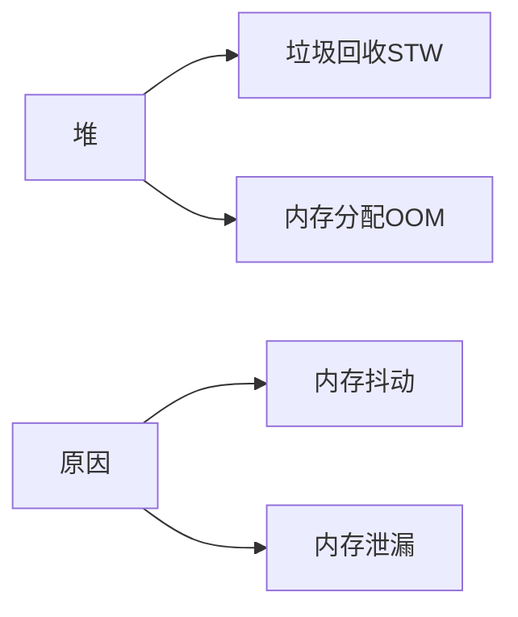
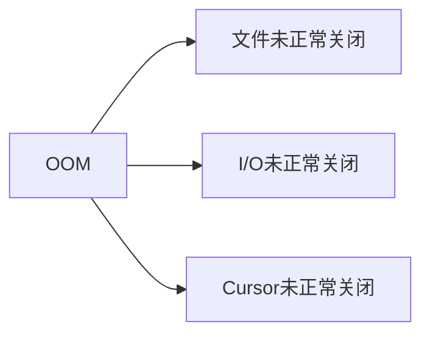
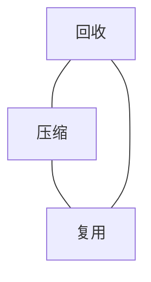

## 1.堆内存

`所申请内存(缩小)>可分配内存(增大)-已分配内存(减少)`

### STW

- 并行,并发回收
- 缩小回收范围
- 减缓GC触发频率
  - 减少大实例
  - 复用实例

### OOM

#### String与内存抖动

#### Bitmap内存治理

- 压缩
  
- 复用
  

#### Activity内存泄漏

#### 拆装箱

#### 枚举

## 线程

线程数超限,野线程

- 控制并发线程数
  
  

## FD

- 控制fd的数量
  
  
  

## 内存治理三板斧

1. 单例模式引发的内存泄漏：
   原因：单例模式里的静态实例持有对象的引用，导致对象无法被回收，常见为持有Activity的引用
   优化：改为持有Application的引用，或者不持有使用的时候传递。
2. 集合操作不当引发的内存泄漏：
   原因：集合只增不减
   优化：有对应的删除或卸载操作
3. 线程的操作不当引发的内存泄漏：
   原因：线程持有对象的引用在后台执行，与对象的生命周期不一致
   优化：静态实例+弱引用(WeakReference)方式，使其生命周期一致
4. 匿名内部类/非静态内部类操作不当引发的内存泄漏：
   原因：内部类持有对象引用，导致无法释放，比如各种回调
   优化：保持生命周期一致，改为静态实例+对象的弱引用方式（WeakReference）
5. 常用的资源未关闭回收引发的内存泄漏：
   原因：BroadcastReceiver，File，Cursor，IO流，Bitmap等资源使用未关闭
   优化：使用后有对应的关闭和卸载机制
6. Handler使用不当造成的内存泄漏：
   原因：Handler持有Activity的引用，其发送的Message中持有Handler的引用，当队列处理Message的时间过长会导致Handler无法被回收
   优化：静态实例+弱引用(WeakReference)方式
7. 内存溢出：
   原因：
   1.内存泄漏长时间的积累
   2.业务操作使用超大内存
   优化：
   1.调整图像大小后再放入内存、及时回收
   2.不要过多的创建静态变量
