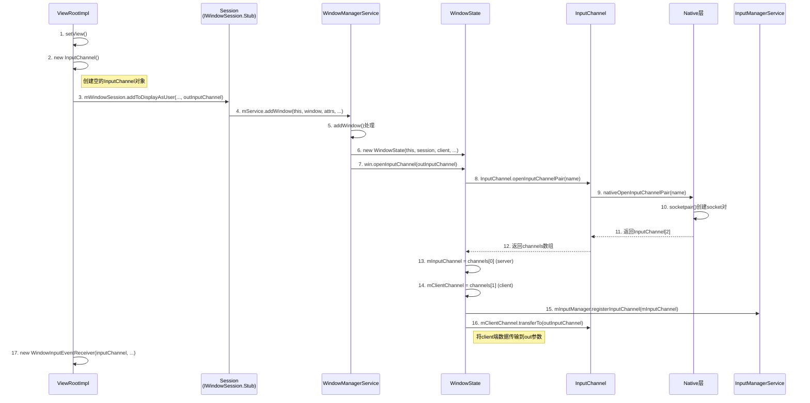

### socket

- `sockfd = socket(AF_UNIX, SOCK_STREAM, 0)`

```cpp
//@ 文件
memset(&serun, 0, sizeof(serun));
serun.sun_family = AF_UNIX;
strncpy(serun.sun_path,server_path ,
               sizeof(serun.sun_path) - 1);
```

#### server

- `bind`
- `connfd = accept(sockfd, (struct sockaddr *)&cliun, &cliun_len)`
- `read(connfd,buf...)` `write(connfd,buf...)`

#### client

- `connect(sockfd,...)` >0 成功
- `read(connfd,buf...)` `write(connfd,buf...)`
- `close(sockfd)`

#### Android 源码中(Android 11) 的Socket

- ZygoteInit.main -> ZygoteServer() -> Zygote.createManagedSocketFromInitSocket()-> new LocalServerSocket(fd)
- zygote.runSelectLoop() -> 接受 fork请求

### socketPair

- `socketpair(AF_UNIX, SOCK_STREAM, 0, socket_pair) == -1`
- client:
  - `read(socket_pair[0],buf...)` `write(socket_pair[0],buf...)`
- server:
  - `read(socket_pair[1],buf...)` `write(socket_pair[1],buf...)`

#### Android 源码中(Android 11)

`ViewRootImpl`

```java
public void setView(View view, WindowManager.LayoutParams attrs, View panelParentView,
            int userId) {
	InputChannel inputChannel = null;
    if ((mWindowAttributes.inputFeatures
            & WindowManager.LayoutParams.INPUT_FEATURE_NO_INPUT_CHANNEL) == 0) {
        inputChannel = new InputChannel();
    }
mForceDecorViewVisibility = (mWindowAttributes.privateFlags
            & PRIVATE_FLAG_FORCE_DECOR_VIEW_VISIBILITY) != 0;
	try {
	    mOrigWindowType = mWindowAttributes.type;
	    mAttachInfo.mRecomputeGlobalAttributes = true;
	    collectViewAttributes();
	    adjustLayoutParamsForCompatibility(mWindowAttributes);
		//关键位置 1
	    res = mWindowSession.addToDisplayAsUser(mWindow, mSeq, mWindowAttributes,
	            getHostVisibility(), mDisplay.getDisplayId(), userId, mTmpFrame,
	            mAttachInfo.mContentInsets, mAttachInfo.mStableInsets,
	            mAttachInfo.mDisplayCutout, inputChannel,
	            mTempInsets, mTempControls);
	    setFrame(mTmpFrame);
	} catch (RemoteException e) {
	    mAdded = false;
	    mView = null;
	    mAttachInfo.mRootView = null;
	    inputChannel = null;
	    mFallbackEventHandler.setView(null);
	    unscheduleTraversals();
	    setAccessibilityFocus(null, null);
	    throw new RuntimeException("Adding window failed", e);
	} finally {
	    if (restore) {
	        attrs.restore();
	    }
	}
	...
	if (inputChannel != null) {
        if (mInputQueueCallback != null) {
            mInputQueue = new InputQueue();
            mInputQueueCallback.onInputQueueCreated(mInputQueue);
        }
		//
        mInputEventReceiver = new WindowInputEventReceiver(inputChannel,
                Looper.myLooper());
    }
}
...
//InputChannel.java
public final class InputChannel implements Parcelable {
	private static native long[] nativeOpenInputChannelPair(String name);
	...
	public static InputChannel[] openInputChannelPair(String name) {
        if (name == null) {
            throw new IllegalArgumentException("name must not be null");
        }

        if (DEBUG) {
            Slog.d(TAG, "Opening input channel pair '" + name + "'");
        }
        return nativeOpenInputChannelPair(name);
    }
}

...
IWindowSession.aidl

//关键点2: out InsetsSourceControl[] activeControls (out 关键字: 服务端写入数据. )
int addToDisplayAsUser(IWindow window, int seq, in WindowManager.LayoutParams attrs,
                in int viewVisibility, in int layerStackId, in int userId,
                out Rect outFrame, out Rect outContentInsets, out Rect outStableInsets,
                out DisplayCutout.ParcelableWrapper displayCutout, out InputChannel outInputChannel,
                out InsetsState insetsState, out InsetsSourceControl[] activeControls);

				
//IWindowSession 服务端
class Session extends IWindowSession.Stub implements IBinder.DeathRecipient {
	final WindowManagerService mService;
	
	@Override
    public int addToDisplayAsUser(IWindow window, WindowManager.LayoutParams attrs,
            int viewVisibility, int displayId, int userId, InsetsVisibilities requestedVisibilities,
            InputChannel outInputChannel, InsetsState outInsetsState,
            InsetsSourceControl[] outActiveControls) {
        return mService.addWindow(this, window, attrs, viewVisibility, displayId, userId,
                requestedVisibilities, outInputChannel, outInsetsState, outActiveControls);
    }
	...
}


//WindowManagerService.java
public class WindowManagerService extends IWindowManager.Stub
        implements Watchdog.Monitor, WindowManagerPolicy.WindowManagerFuncs {
		final InputManagerService mInputManager;
		public int addWindow(Session session, IWindow client, LayoutParams attrs, int viewVisibility,
            int displayId, int requestUserId, InsetsVisibilities requestedVisibilities,
            InputChannel outInputChannel, InsetsState outInsetsState,
            InsetsSourceControl[] outActiveControls) {
			...
			final WindowState win = new WindowState(this, session, client, token, parentWindow,
                    appOp[0], attrs, viewVisibility, session.mUid, userId,
                    session.mCanAddInternalSystemWindow);
			...
			final boolean openInputChannels = (outInputChannel != null
                    && (attrs.inputFeatures & INPUT_FEATURE_NO_INPUT_CHANNEL) == 0);
            if  (openInputChannels) {
                win.openInputChannel(outInputChannel);
            }
		}	
}
//WindowState.java
...
// protected final WindowManagerService mWmService;
 void openInputChannel(InputChannel outInputChannel) {
        if (mInputChannel != null) {
            throw new IllegalStateException("Window already has an input channel.");
        }
        String name = getName();
	 	// 打开 socketPair
        InputChannel[] inputChannels = InputChannel.openInputChannelPair(name);
	 	//服务端取第一个fd
        mInputChannel = inputChannels[0];
	 	//客户端取第二个fd
        mClientChannel = inputChannels[1];
        mWmService.mInputManager.registerInputChannel(mInputChannel);
        mInputWindowHandle.token = mInputChannel.getToken();
        if (outInputChannel != null) {
			//客户端写回 outInputChannel
            mClientChannel.transferTo(outInputChannel);
            mClientChannel.dispose();
            mClientChannel = null;
        } else {
            // If the window died visible, we setup a dummy input channel, so that taps
            // can still detected by input monitor channel, and we can relaunch the app.
            // Create dummy event receiver that simply reports all events as handled.
            mDeadWindowEventReceiver = new DeadWindowEventReceiver(mClientChannel);
        }
        mWmService.mInputToWindowMap.put(mInputWindowHandle.token, this);
 }

```

`android_view_inputChannel.cpp`

```cpp
static jobjectArray android_view_InputChannel_nativeOpenInputChannelPair(JNIEnv* env,
        jclass clazz, jstring nameObj) {
    ScopedUtfChars nameChars(env, nameObj);
    std::string name = nameChars.c_str();

    sp<InputChannel> serverChannel;
    sp<InputChannel> clientChannel;
    status_t result = InputChannel::openInputChannelPair(name, serverChannel, clientChannel);

    ...
	jobjectArray channelPair = env->NewObjectArray(2, gInputChannelClassInfo.clazz, nullptr);
	...
    env->SetObjectArrayElement(channelPair, 0, serverChannelObj);
    env->SetObjectArrayElement(channelPair, 1, clientChannelObj);
    return channelPair;
}
```

`InputChannel.cpp`

```cpp
status_t InputChannel::openInputChannelPair(const std::string& name,
        sp<InputChannel>& outServerChannel, sp<InputChannel>& outClientChannel) {
    int sockets[2];
	//socketpair 返回 fd 数组
    if (socketpair(AF_UNIX, SOCK_SEQPACKET, 0, sockets)) {
        status_t result = -errno;
        ALOGE("channel '%s' ~ Could not create socket pair.  errno=%d",
                name.c_str(), errno);
        outServerChannel.clear();
        outClientChannel.clear();
        return result;
    }

    int bufferSize = SOCKET_BUFFER_SIZE;
    setsockopt(sockets[0], SOL_SOCKET, SO_SNDBUF, &bufferSize, sizeof(bufferSize));
    setsockopt(sockets[0], SOL_SOCKET, SO_RCVBUF, &bufferSize, sizeof(bufferSize));
    setsockopt(sockets[1], SOL_SOCKET, SO_SNDBUF, &bufferSize, sizeof(bufferSize));
    setsockopt(sockets[1], SOL_SOCKET, SO_RCVBUF, &bufferSize, sizeof(bufferSize));

    sp<IBinder> token = new BBinder();

    std::string serverChannelName = name + " (server)";
    android::base::unique_fd serverFd(sockets[0]);
    outServerChannel = InputChannel::create(serverChannelName, std::move(serverFd), token);

    std::string clientChannelName = name + " (client)";
    android::base::unique_fd clientFd(sockets[1]);
    outClientChannel = InputChannel::create(clientChannelName, std::move(clientFd), token);
    return OK;
}
...
// --- InputChannel ---

sp<InputChannel> InputChannel::create(const std::string& name, android::base::unique_fd fd,
                                      sp<IBinder> token) {
    const int result = fcntl(fd, F_SETFL, O_NONBLOCK);
    if (result != 0) {
        LOG_ALWAYS_FATAL("channel '%s' ~ Could not make socket non-blocking: %s", name.c_str(),
                         strerror(errno));
        return nullptr;
    }
    return new InputChannel(name, std::move(fd), token);
}

```

#### 时序图


