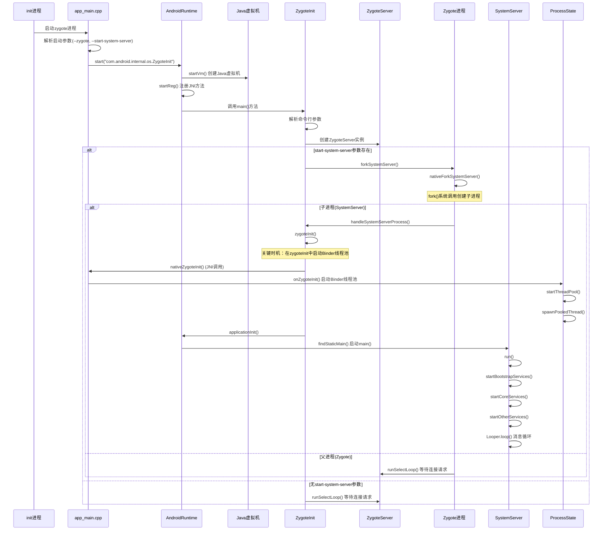

- 解析配置 文件 init.rc

```css
import /init.environ.rc // Generate init.environ.rc by populating BOOTCLASSPATH
import /system/etc/init/hw/init.usb.rc
import /init.${ro.hardware}.rc
import /vendor/etc/init/hw/init.${ro.hardware}.rc
import /system/etc/init/hw/init.usb.configfs.rc
import /system/etc/init/hw/init.${ro.zygote}.rc //Move init and ueventd scripts from / to /system/etc
....
```

- init.zygote64.rc

```css
service zygote /system/bin/app_process64 -Xzygote /system/bin --zygote --start-system-server
    class main
    priority -20
    user root
    group root readproc reserved_disk
    socket zygote stream 660 root system
    socket usap_pool_primary stream 660 root system
    onrestart exec_background - system system -- /system/bin/vdc volume abort_fuse
    onrestart write /sys/power/state on
    onrestart restart audioserver
    onrestart restart cameraserver
    onrestart restart media
    onrestart restart netd
    onrestart restart wificond
    writepid /dev/cpuset/foreground/tasks

```

\


#### app\_main.cpp

> 参数: -Xzygote /system/bin --zygote --start-system-server

- main ->

```cpp
    ...
    argc--;
    argv++;
    ...
    while (i < argc) {
        const char* arg = argv[i++];
        if (strcmp(arg, "--zygote") == 0) {
            zygote = true;
            niceName = ZYGOTE_NICE_NAME;
        } else if (strcmp(arg, "--start-system-server") == 0) {
            startSystemServer = true;
        } else if (strcmp(arg, "--application") == 0) {
            application = true;
        } else if (strncmp(arg, "--nice-name=", 12) == 0) {
            niceName.setTo(arg + 12);
        } else if (strncmp(arg, "--", 2) != 0) {
            className.setTo(arg);
            break;
        } else {
            --i;
            break;
        }
    }
    ...
    if (zygote) {
        runtime.start("com.android.internal.os.ZygoteInit", args, zygote);
    } else if (className) {
        runtime.start("com.android.internal.os.RuntimeInit", args, zygote);
    } else {
        fprintf(stderr, "Error: no class name or --zygote supplied.\n");
        app_usage();
        LOG_ALWAYS_FATAL("app_process: no class name or --zygote supplied.");
    }
```

- virtual void onZygoteInit()

```cpp
{
    sp<ProcessState> proc = ProcessState::self();
    ALOGV("App process: starting thread pool.\n");
    proc->startThreadPool();
}
...
//ProcessState.cpp
void ProcessState::startThreadPool()
{
    AutoMutex _l(mLock);
    if (!mThreadPoolStarted) {
        mThreadPoolStarted = true;
        spawnPooledThread(true);
    }
}
//ProcessState.cpp
void ProcessState::spawnPooledThread(bool isMain)
{
    if (mThreadPoolStarted) {
        String8 name = makeBinderThreadName();
        ALOGV("Spawning new pooled thread, name=%s\n", name.string());
        //创建 binder线程池
        sp<Thread> t = new PoolThread(isMain);
        t->run(name.string());
    }
}
```

#### AndroidRuntime.cpp

- void AndroidRuntime::start(const char\* className, const Vector<string8>& options, bool zygote)</string8>

```cpp
...
    JNIEnv* env;
    if (startVm(&mJavaVM, &env, zygote, primary_zygote) != 0) {
        return;
    }
    onVmCreated(env);
    /*
     * Register android functions.
     */
    if (startReg(env) < 0) {
        ALOGE("Unable to register all android natives\n");
        return;
    }

    ...
     /*
     * Start VM.  This thread becomes the main thread of the VM, and will
     * not return until the VM exits.
     */
    char* slashClassName = toSlashClassName(className != NULL ? className : "");
    jclass startClass = env->FindClass(slashClassName);
    if (startClass == NULL) {
        ALOGE("JavaVM unable to locate class '%s'\n", slashClassName);
        /* keep going */
    } else {
        jmethodID startMeth = env->GetStaticMethodID(startClass, "main",
            "([Ljava/lang/String;)V");
        if (startMeth == NULL) {
            ALOGE("JavaVM unable to find main() in '%s'\n", className);
            /* keep going */
        } else {
            //执行 ZygoteInit.java main函数
            env->CallStaticVoidMethod(startClass, startMeth, strArray);

#if 0
            if (env->ExceptionCheck())
                threadExitUncaughtException(env);
#endif
        }
    }
...
```

- int AndroidRuntime::startVm(JavaVM\*\* pJavaVM, JNIEnv\*\* pEnv, bool zygote, bool primary\_zygote)

```cpp
... 
    参数配置
    /*
     * Initialize the VM.
     *
     * The JavaVM* is essentially per-process, and the JNIEnv* is per-thread.
     * If this call succeeds, the VM is ready, and we can start issuing
     * JNI calls.
      创建Jvm虚拟机
     */
    if (JNI_CreateJavaVM(pJavaVM, pEnv, &initArgs) < 0) {
        ALOGE("JNI_CreateJavaVM failed\n");
        return -1;
    }
    return 0;
```

int register\_com\_android\_internal\_os\_ZygoteInit\_nativeZygoteInit(JNIEnv\* env)

```cpp
{
    const JNINativeMethod methods[] = {
        { "nativeZygoteInit", "()V",
            (void*) com_android_internal_os_ZygoteInit_nativeZygoteInit },
    };
    return jniRegisterNativeMethods(env, "com/android/internal/os/ZygoteInit",
        methods, NELEM(methods));
}
```

- static void com\_android\_internal\_os\_ZygoteInit\_nativeZygoteInit(JNIEnv\* env, jobject clazz)

```cpp
{	
    // app_main.cpp -> onZygoteInit
    gCurRuntime->onZygoteInit();
}
```

#### ZygoteInit.java

- public static void main(String argv\[])

```java
...
ZygoteServer zygoteServer = null;
...
try{
    ...
    for (int i = 1; i < argv.length; i++) {
        if ("start-system-server".equals(argv[i])) {
            startSystemServer = true;
        } else if ("--enable-lazy-preload".equals(argv[i])) {
            enableLazyPreload = true;
        } else if (argv[i].startsWith(ABI_LIST_ARG)) {
            abiList = argv[i].substring(ABI_LIST_ARG.length());
        } else if (argv[i].startsWith(SOCKET_NAME_ARG)) {
            zygoteSocketName = argv[i].substring(SOCKET_NAME_ARG.length());
        } else {
            throw new RuntimeException("Unknown command line argument: " + argv[i]);
        }
    }
    ...
    zygoteServer = new ZygoteServer(isPrimaryZygote);
    
    if (startSystemServer) {
        Runnable r = forkSystemServer(abiList, zygoteSocketName, zygoteServer);
    
        // {@code r == null} in the parent (zygote) process, and {@code r != null} in the
        // child (system_server) process.
        if (r != null) {
            r.run();
            return;
        }
    }
    Log.i(TAG, "Accepting command socket connections");

    // The select loop returns early in the child process after a fork and
    // loops forever in the zygote.
    caller = zygoteServer.runSelectLoop(abiList);
} catch (Throwable ex) {
    Log.e(TAG, "System zygote died with exception", ex);
    throw ex;
} finally {
    if (zygoteServer != null) {
        zygoteServer.closeServerSocket();
    }
}

// We're in the child process and have exited the select loop. Proceed to execute the
// command.
if (caller != null) {
    caller.run();
}
```

- private static Runnable forkSystemServer(String abiList, String socketName,\
  ZygoteServer zygoteServer)

```java
...
// 启动 SystemServer参数,注意最后一个参数:com.android.server.SystemServer
String args[] = {
        "--setuid=1000",
        "--setgid=1000",
        "--setgroups=1001,1002,1003,1004,1005,1006,1007,1008,1009,1010,1018,1021,1023,"
                + "1024,1032,1065,3001,3002,3003,3006,3007,3009,3010,3011",
        "--capabilities=" + capabilities + "," + capabilities,
        "--nice-name=system_server",
        "--runtime-args",
        "--target-sdk-version=" + VMRuntime.SDK_VERSION_CUR_DEVELOPMENT,
        "com.android.server.SystemServer",
};
try{
    /* Request to fork the system server process */
    pid = Zygote.forkSystemServer(
            parsedArgs.mUid, parsedArgs.mGid,
            parsedArgs.mGids,
            parsedArgs.mRuntimeFlags,
            null,
            parsedArgs.mPermittedCapabilities,
            parsedArgs.mEffectiveCapabilities);
} catch (IllegalArgumentException ex) {
    throw new RuntimeException(ex);
}
/* For child process */
if (pid == 0) {
    if (hasSecondZygote(abiList)) {
        waitForSecondaryZygote(socketName);
    }
    // 子进程,关闭 ServerSocket
    zygoteServer.closeServerSocket();
    return handleSystemServerProcess(parsedArgs);
}

...
```

- private static Runnable handleSystemServerProcess(ZygoteArguments parsedArgs)

```java
final String systemServerClasspath = Os.getenv("SYSTEMSERVERCLASSPATH");
...
if (parsedArgs.mInvokeWith != null) {
    ...
} else {
    //Zygote: Load system server code early
    ClassLoader cl = null;
    if (systemServerClasspath != null) {
        cl = createPathClassLoader(systemServerClasspath, parsedArgs.mTargetSdkVersion);

        Thread.currentThread().setContextClassLoader(cl);
    }

    /*
     * Pass the remaining arguments to SystemServer.
     */
    return ZygoteInit.zygoteInit(parsedArgs.mTargetSdkVersion,
            parsedArgs.mDisabledCompatChanges,
            parsedArgs.mRemainingArgs, cl);
}
```

- public static final Runnable zygoteInit(int targetSdkVersion, long\[] disabledCompatChanges,\
  String\[] argv, ClassLoader classLoader)

```java
public static final Runnable zygoteInit(int targetSdkVersion, long[] disabledCompatChanges,
        String[] argv, ClassLoader classLoader) {
    if (RuntimeInit.DEBUG) {
        Slog.d(RuntimeInit.TAG, "RuntimeInit: Starting application from zygote");
    }

    Trace.traceBegin(Trace.TRACE_TAG_ACTIVITY_MANAGER, "ZygoteInit");
    RuntimeInit.redirectLogStreams();
    RuntimeInit.commonInit();
    // 启动 Binder 线程池
    ZygoteInit.nativeZygoteInit();
    return RuntimeInit.applicationInit(targetSdkVersion, disabledCompatChanges, argv,
            classLoader);
}
```

#### Zygote.java

- forkSystemServer

```java
static int forkSystemServer(int uid, int gid, int[] gids, int runtimeFlags,
        int[][] rlimits, long permittedCapabilities, long effectiveCapabilities) {
    ZygoteHooks.preFork();

    int pid = nativeForkSystemServer(
            uid, gid, gids, runtimeFlags, rlimits,
            permittedCapabilities, effectiveCapabilities);

    // Set the Java Language thread priority to the default value for new apps.
    Thread.currentThread().setPriority(Thread.NORM_PRIORITY);

    ZygoteHooks.postForkCommon();
    return pid;
}
private static native int nativeForkSystemServer(int uid, int gid, int[] gids, int runtimeFlags,
            int[][] rlimits, long permittedCapabilities, long effectiveCapabilities);
```

#### om\_android\_internal\_os\_Zygote.cpp

- static jint com\_android\_internal\_os\_Zygote\_nativeForkSystemServer(\
  JNIEnv\* env, jclass, uid\_t uid, gid\_t gid, jintArray gids,\
  jint runtime\_flags, jobjectArray rlimits, jlong permitted\_capabilities,\
  jlong effective\_capabilities)

```cpp
...
// pid_t pid = fork();
pid_t pid = ForkCommon(env, true,
                         fds_to_close,
                         fds_to_ignore,
                         true);
if (pid == 0) {
      SpecializeCommon(env, uid, gid, gids, runtime_flags, rlimits,
                       capabilities, capabilities,
                       mount_external, se_info, nice_name, false,
                       is_child_zygote == JNI_TRUE, instruction_set, app_data_dir,
                       is_top_app == JNI_TRUE, pkg_data_info_list,
                       whitelisted_data_info_list,
                       mount_data_dirs == JNI_TRUE,
                       mount_storage_dirs == JNI_TRUE);
    }
return pid;
```

#### RuntimeInit.java

- protected static Runnable applicationInit(int targetSdkVersion, long\[] disabledCompatChanges,\
  String\[] argv, ClassLoader classLoader)

```java
protected static Runnable applicationInit(int targetSdkVersion, long[] disabledCompatChanges,
        String[] argv, ClassLoader classLoader) {
    // If the application calls System.exit(), terminate the process
    // immediately without running any shutdown hooks.  It is not possible to
    // shutdown an Android application gracefully.  Among other things, the
    // Android runtime shutdown hooks close the Binder driver, which can cause
    // leftover running threads to crash before the process actually exits.
    nativeSetExitWithoutCleanup(true);

    VMRuntime.getRuntime().setTargetSdkVersion(targetSdkVersion);
    VMRuntime.getRuntime().setDisabledCompatChanges(disabledCompatChanges);

    final Arguments args = new Arguments(argv);

    // The end of of the RuntimeInit event (see #zygoteInit).
    Trace.traceEnd(Trace.TRACE_TAG_ACTIVITY_MANAGER);

    // Remaining arguments are passed to the start class's static main
    // 查找运行 args.startClass main函数 ,启动 SystemServer
    return findStaticMain(args.startClass, args.startArgs, classLoader);
}
```

#### SystemServer.java

- main

```java
public static void main(String[] args) {
    new SystemServer().run();
}
```

- run

```java
...
Looper.prepareMainLooper();
...
// Initialize native services.
System.loadLibrary("android_servers");
...
try {
    t.traceBegin("StartServices");
    // 引导服务
    startBootstrapServices(t);
    // 核心服务
    startCoreServices(t);
    // 其它服务
    startOtherServices(t);
} catch (Throwable ex) {
    Slog.e("System", "******************************************");
    Slog.e("System", "************ Failure starting system services", ex);
    throw ex;
} finally {
    t.traceEnd(); // StartServices
}
...
Looper.loop();
```

## 时序图


