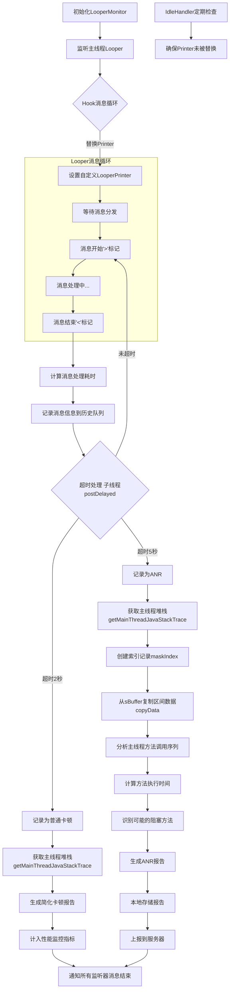
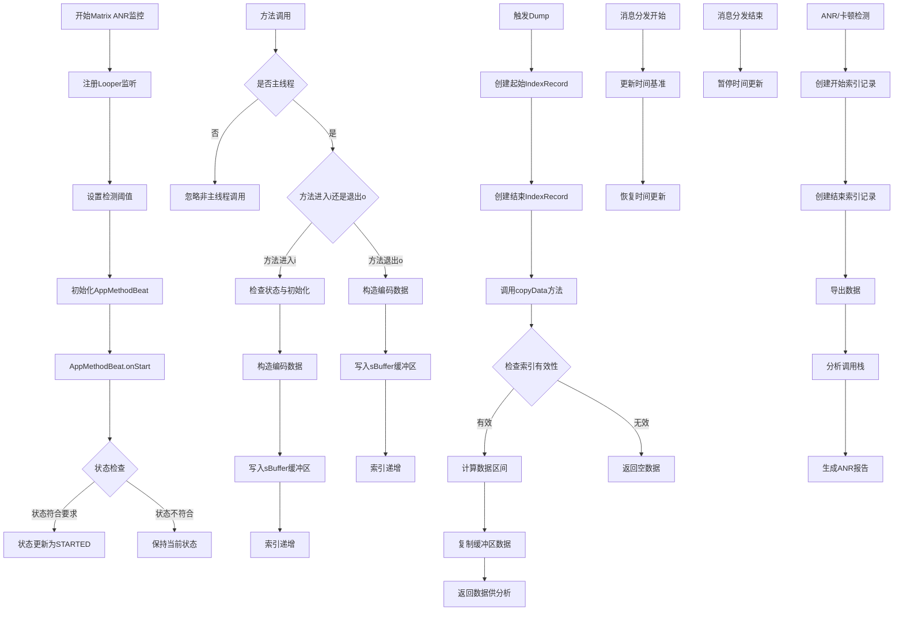

\[toc]

## 卡顿检测

### 开发阶段

TraceView 抓取卡顿过程中函数执行情况.

```java
//性能分析文件
Debug.startMethodTracing("app")
Debug.stopMethodTracing()
```

### 上线后

> 卡顿直接原因:主线程执行繁重UI绘制,大量计算或IO耗时操作.

#### 卡顿检测

getStackTrace 获取堆栈信息
两种方案:

1. 依赖主线程Looper(Looper.getMainLooper().setMessageLogging()),监控每次`dispatchMessage`执行耗时.

```java
public static void loop() {
    ...
    for (;;) {
        ...
        // This must be in a local variable, in case a UI event sets the logger
        Printer logging = me.mLogging;
        if (logging != null) {
            logging.println(">>>>> Dispatching to " + msg.target + " " +
                    msg.callback + ": " + msg.what);
        }
        msg.target.dispatchMessage(msg);
        if (logging != null) {
            logging.println("<<<<< Finished to " + msg.target + " " + msg.callback);
        }
        ...
    }
}
```

2. 依赖`Choreographer` ,监听 `Vsync` 事件 `doFrame`  统计两次 `Vsync` 时间间隔.

> Choreographer.doFrame 的掉帧检测
> 

## anr检测

```java
@Override
    public void onDispatchBegin(String log) {
        anrTask.beginRecord = AppMethodBeat.getInstance().maskIndex("AnrTracer#dispatchBegin");

        if (traceConfig.isDevEnv()) {
            MatrixLog.v(TAG, "* [dispatchBegin] index:%s", anrTask.beginRecord.index);
        }
        anrHandler.postDelayed(anrTask, Constants.DEFAULT_ANR);
        lagHandler.postDelayed(lagTask, Constants.DEFAULT_NORMAL_LAG);
    }

    @Override
    public void onDispatchEnd(String log, long beginNs, long endNs) {
        if (traceConfig.isDevEnv()) {
            long cost = (endNs - beginNs) / Constants.TIME_MILLIS_TO_NANO;
            MatrixLog.v(TAG, "[dispatchEnd] beginNs:%s endNs:%s cost:%sms", beginNs, endNs, cost);
        }
        anrTask.getBeginRecord().release();
        anrHandler.removeCallbacks(anrTask);
        lagHandler.removeCallbacks(lagTask);
    }
```



###### 技术要点

- 非侵入式监控:通过反射,hook技术,不修改系统代码
- 历史记录:维护消息历史,辅助分析ANR原因
- 自我保护:通过IdleHandler定期检查,确保监控持续有效

##### Matrix::AppMethodBeat



#### 函数耗时
