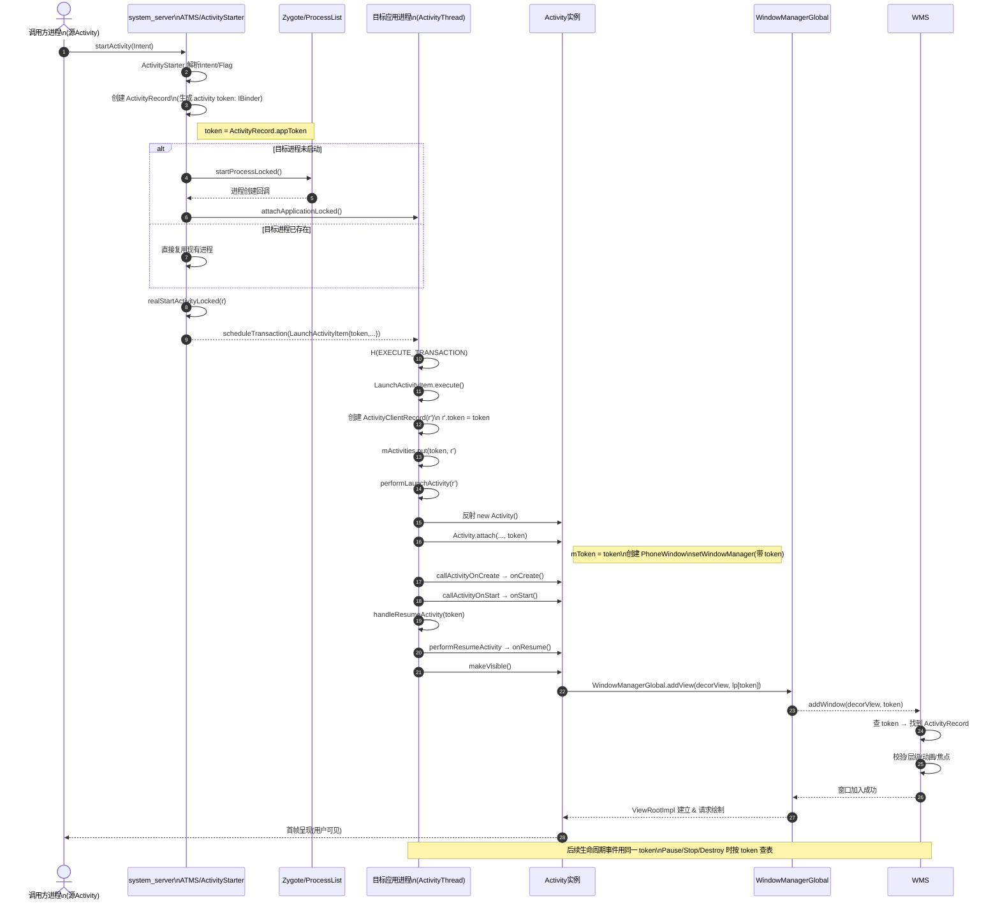

### 桌面点击 相机图标然后返回键退出到桌面


### Task 添加

> `class Task extends WindowContainer<WindowContainer>`


### ActivityRecord添加

> `final class ActivityRecord extends WindowToken`\
> `class WindowToken extends WindowContainer<WindowState>`

```java
ActivityRecord(ActivityTaskManagerService _service, WindowProcessController _caller,
            int _launchedFromPid, int _launchedFromUid, String _launchedFromPackage,
            @Nullable String _launchedFromFeature, Intent _intent, String _resolvedType,
            ActivityInfo aInfo, Configuration _configuration, ActivityRecord _resultTo,
            String _resultWho, int _reqCode, boolean _componentSpecified,
            boolean _rootVoiceInteraction, ActivityStackSupervisor supervisor,
            ActivityOptions options, ActivityRecord sourceRecord) {
        super(_service.mWindowManager, new Token(_intent).asBinder(), TYPE_APPLICATION, true,
                null /* displayContent */, false /* ownerCanManageAppTokens */);
...

```


### token添加


```java
static class Token extends IApplicationToken.Stub {
        private WeakReference<ActivityRecord> weakActivity;
        private final String name;
        private final String tokenString;

        Token(Intent intent) {
            name = intent.getComponent().flattenToShortString();
            tokenString = "Token{" + Integer.toHexString(System.identityHashCode(this)) + "}";
        }
}
```

### pause前一个 task


### realStartActivityLocked


### 执行顺序

```java
//ActivityStarter.java
int startActivityInner(final ActivityRecord r, ActivityRecord sourceRecord,
            IVoiceInteractionSession voiceSession, IVoiceInteractor voiceInteractor,
            int startFlags, boolean doResume, ActivityOptions options, Task inTask,
            boolean restrictedBgActivity, NeededUriGrants intentGrants) {
    //计算 task
    final Task targetTask = reusedTask != null ? reusedTask : computeTargetTask();
    //首次添加 newTask = true
    final boolean newTask = targetTask == null;
    ...
    if (mTargetStack == null) {
        //挂载 Task 节点 到 DefaultTaskDisplayArea
        mTargetStack = getLaunchStack(mStartActivity, mLaunchFlags, targetTask, mOptions);
    }
    if (newTask) {
        final Task taskToAffiliate = (mLaunchTaskBehind && mSourceRecord != null)
                ? mSourceRecord.getTask() : null;
        //挂载 activityRecord 到 上面的 Task 节点
        //
        setNewTask(taskToAffiliate);
        if (mService.getLockTaskController().isLockTaskModeViolation(
                mStartActivity.getTask())) {
            Slog.e(TAG, "Attempted Lock Task Mode violation mStartActivity=" + mStartActivity);
            return START_RETURN_LOCK_TASK_MODE_VIOLATION;
        }
    } else if (mAddingToTask) {
        addOrReparentStartingActivity(targetTask, "adding to task");
    }
    ...
    //task 切换动画 wms 侧
    mTargetStack.startActivityLocked(mStartActivity,
                topStack != null ? topStack.getTopNonFinishingActivity() : null, newTask,
                mKeepCurTransition, mOptions);
    ...
    //start Process
    mRootWindowContainer.resumeFocusedStacksTopActivities(
                        mTargetStack, mStartActivity, mOptions);
    ...
}
....


// 目标进程启动完成
- ams.attachApplication -> ams.attachApplicationLocked
	-> ATMS.attachApplication
		-> mRootWindowContainer.attachApplication 
		> 1. 遍历 每个display(一般只有一个display,但显示屏时)下的 TaskDisplayArea
		> 2. 根据uid, 状态name processName 等过滤目标进程的 ActivityRecord
		> 3. 符合条件的调用 `realStartActivityLocked`
	
//相关代码:
//mRootWindowContainer.attachApplication
boolean attachApplication(WindowProcessController app) throws RemoteException {
    boolean didSomething = false;
    for (int displayNdx = getChildCount() - 1; displayNdx >= 0; --displayNdx) {
        mTmpRemoteException = null;
        mTmpBoolean = false; // Set to true if an activity was started.

        final DisplayContent display = getChildAt(displayNdx);
        for (int areaNdx = display.getTaskDisplayAreaCount() - 1; areaNdx >= 0; --areaNdx) {
            final TaskDisplayArea taskDisplayArea = display.getTaskDisplayAreaAt(areaNdx);
            for (int taskNdx = taskDisplayArea.getStackCount() - 1; taskNdx >= 0; --taskNdx) {
                final ActivityStack rootTask = taskDisplayArea.getStackAt(taskNdx);
                if (rootTask.getVisibility(null /*starting*/) == STACK_VISIBILITY_INVISIBLE) {
                    break;
                }
                final PooledFunction c = PooledLambda.obtainFunction(
                        RootWindowContainer::startActivityForAttachedApplicationIfNeeded, this,
                        PooledLambda.__(ActivityRecord.class), app,
                        rootTask.topRunningActivity());
                rootTask.forAllActivities(c);
                c.recycle();
                if (mTmpRemoteException != null) {
                    throw mTmpRemoteException;
                }
            }
        }
        didSomething |= mTmpBoolean;
    }
    if (!didSomething) {
        ensureActivitiesVisible(null, 0, false /* preserve_windows */);
    }
    return didSomething;
}
private boolean startActivityForAttachedApplicationIfNeeded(ActivityRecord r,
        WindowProcessController app, ActivityRecord top) {
    if (r.finishing || !r.okToShowLocked() || !r.visibleIgnoringKeyguard || r.app != null
            || app.mUid != r.info.applicationInfo.uid || !app.mName.equals(r.processName)) {
        return false;
    }

    try {
        if (mStackSupervisor.realStartActivityLocked(r, app,
                top == r && r.isFocusable() /*andResume*/, true /*checkConfig*/)) {
            mTmpBoolean = true;
        }
    } catch (RemoteException e) {
        Slog.w(TAG, "Exception in new application when starting activity "
                + top.intent.getComponent().flattenToShortString(), e);
        mTmpRemoteException = e;
        return true;
    }
    return false;
}
```

### 关键时序图


