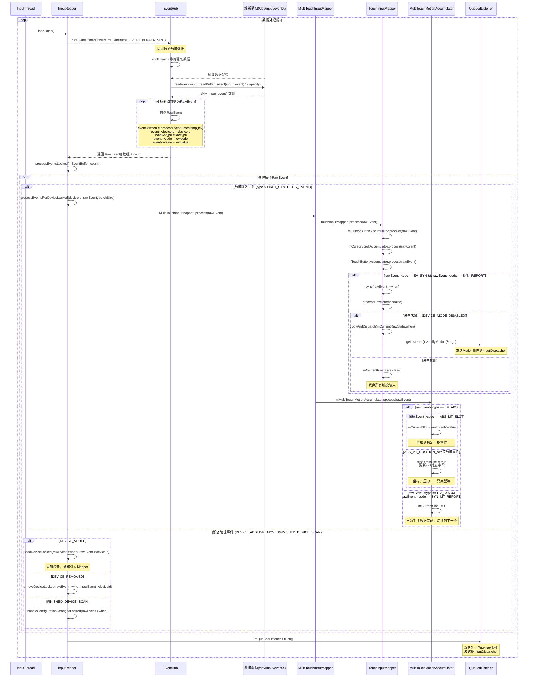

### InputReader

#### 时序图



```cpp
//InputReader.cpp
status_t InputReader::start() {
    if (mThread) {
        return ALREADY_EXISTS;
    }
    mThread = std::make_unique<InputThread>(
            "InputReader", [this]() { loopOnce(); }, [this]() { mEventHub->wake(); });
    return OK;
}
std::unordered_map<int32_t /*eventHubId*/, std::shared_ptr<InputDevice>> mDevices;
void InputReader::loopOnce() {
    int32_t oldGeneration;
    int32_t timeoutMillis;
    bool inputDevicesChanged = false;
    std::vector<InputDeviceInfo> inputDevices;
    { // acquire lock
        AutoMutex _l(mLock);

        oldGeneration = mGeneration;
        timeoutMillis = -1;

        uint32_t changes = mConfigurationChangesToRefresh;
        if (changes) {
            mConfigurationChangesToRefresh = 0;
            timeoutMillis = 0;
            refreshConfigurationLocked(changes);
        } else if (mNextTimeout != LLONG_MAX) {
            nsecs_t now = systemTime(SYSTEM_TIME_MONOTONIC);
            timeoutMillis = toMillisecondTimeoutDelay(now, mNextTimeout);
        }
    } // release lock
	
	//解析原始数据到 mEventBuffer 数组中
    size_t count = mEventHub->getEvents(timeoutMillis, mEventBuffer, EVENT_BUFFER_SIZE);

    { // acquire lock
        AutoMutex _l(mLock);
        mReaderIsAliveCondition.broadcast();

        if (count) {
			//处理 mEventBuffer 数据
			// 1. add device、 remove device...
			// 2. process data :  mapper.process(rawEvent);
            processEventsLocked(mEventBuffer, count);
        }

        if (mNextTimeout != LLONG_MAX) {
            nsecs_t now = systemTime(SYSTEM_TIME_MONOTONIC);
            if (now >= mNextTimeout) {
#if DEBUG_RAW_EVENTS
                ALOGD("Timeout expired, latency=%0.3fms", (now - mNextTimeout) * 0.000001f);
#endif
                mNextTimeout = LLONG_MAX;
                timeoutExpiredLocked(now);
            }
        }

        if (oldGeneration != mGeneration) {
            inputDevicesChanged = true;
            getInputDevicesLocked(inputDevices);
        }
    } // release lock

    // Send out a message that the describes the changed input devices.
    if (inputDevicesChanged) {
        mPolicy->notifyInputDevicesChanged(inputDevices);
    }

    // Flush queued events out to the listener.
    // This must happen outside of the lock because the listener could potentially call
    // back into the InputReader's methods, such as getScanCodeState, or become blocked
    // on another thread similarly waiting to acquire the InputReader lock thereby
    // resulting in a deadlock.  This situation is actually quite plausible because the
    // listener is actually the input dispatcher, which calls into the window manager,
    // which occasionally calls into the input reader.
	// 调用设置监听的 notify() InputDispatcher
    mQueuedListener->flush();
}

enum {
        // Sent when a device is added.
        DEVICE_ADDED = 0x10000000,
        // Sent when a device is removed.
        DEVICE_REMOVED = 0x20000000,
        // Sent when all added/removed devices from the most recent scan have been reported.
        // This event is always sent at least once.
        FINISHED_DEVICE_SCAN = 0x30000000,

        FIRST_SYNTHETIC_EVENT = DEVICE_ADDED,
    };
void InputReader::processEventsLocked(const RawEvent* rawEvents, size_t count) {
    for (const RawEvent* rawEvent = rawEvents; count;) {
        int32_t type = rawEvent->type;
        size_t batchSize = 1;
        if (type < EventHubInterface::FIRST_SYNTHETIC_EVENT) {
            int32_t deviceId = rawEvent->deviceId;
            while (batchSize < count) {
                if (rawEvent[batchSize].type >= EventHubInterface::FIRST_SYNTHETIC_EVENT ||
                    rawEvent[batchSize].deviceId != deviceId) {
                    break;
                }
                batchSize += 1;
            }
#if DEBUG_RAW_EVENTS
            ALOGD("BatchSize: %zu Count: %zu", batchSize, count);
#endif
            //处理具体事件,非ADDED
            //调用 MultiTouchInputMapper 处理事件,多指 装填到 Slot* mSlots;
            processEventsForDeviceLocked(deviceId, rawEvent, batchSize);
        } else {
            switch (rawEvent->type) {
                case EventHubInterface::DEVICE_ADDED:
                    //根据不同事件类型添加不同的解析 Mapper
                    //device->addEventHubDevice(eventHubId);
                    addDeviceLocked(rawEvent->when, rawEvent->deviceId);
                    break;
                case EventHubInterface::DEVICE_REMOVED:
                    removeDeviceLocked(rawEvent->when, rawEvent->deviceId);
                    break;
                case EventHubInterface::FINISHED_DEVICE_SCAN:
					//
                    handleConfigurationChangedLocked(rawEvent->when);
                    break;
                default:
                    ALOG_ASSERT(false); // can't happen
                    break;
            }
        }
        count -= batchSize;
        rawEvent += batchSize;
    }
}

//MultiTouchInputMapper.cpp
void MultiTouchInputMapper::process(const RawEvent* rawEvent) {
	// rawEvent ---> RawState
	// 处理 EV_SYN (标识事件开始或结束)
    TouchInputMapper::process(rawEvent);
	// 其他类型自己处理 
    mMultiTouchMotionAccumulator.process(rawEvent);
}
void MultiTouchMotionAccumulator::process(const RawEvent* rawEvent) {
    if (rawEvent->type == EV_ABS) {
        bool newSlot = false;
        if (mUsingSlotsProtocol) {
            if (rawEvent->code == ABS_MT_SLOT) {
                mCurrentSlot = rawEvent->value;
                newSlot = true;
            }
        } else if (mCurrentSlot < 0) {
            mCurrentSlot = 0;
        }

        if (mCurrentSlot < 0 || size_t(mCurrentSlot) >= mSlotCount) {
#if DEBUG_POINTERS
            if (newSlot) {
                ALOGW("MultiTouch device emitted invalid slot index %d but it "
                      "should be between 0 and %zd; ignoring this slot.",
                      mCurrentSlot, mSlotCount - 1);
            }
#endif
        } else {
            Slot* slot = &mSlots[mCurrentSlot];

            switch (rawEvent->code) {
                case ABS_MT_POSITION_X:
                    slot->mInUse = true;
                    slot->mAbsMTPositionX = rawEvent->value;
                    break;
                ...
                case ABS_MT_TOOL_TYPE:
                    slot->mInUse = true;
                    slot->mAbsMTToolType = rawEvent->value;
                    slot->mHaveAbsMTToolType = true;
                    break;
            }
        }
    } else if (rawEvent->type == EV_SYN && rawEvent->code == SYN_MT_REPORT) {
        // MultiTouch Sync: The driver has returned all data for *one* of the pointers.
        mCurrentSlot += 1;
    }
}
//TouchInputMapper.cpp
void TouchInputMapper::process(const RawEvent* rawEvent) {
    mCursorButtonAccumulator.process(rawEvent);
    mCursorScrollAccumulator.process(rawEvent);
    mTouchButtonAccumulator.process(rawEvent);

    if (rawEvent->type == EV_SYN && rawEvent->code == SYN_REPORT) {
        sync(rawEvent->when);
    }
}
void TouchInputMapper::sync(nsecs_t when) {
    ...
    processRawTouches(false /*timeout*/);
    
}
void TouchInputMapper::processRawTouches(bool timeout) {
    //判断是否需要拦截事件
    if (mDeviceMode == DEVICE_MODE_DISABLED) {
        // Drop all input if the device is disabled.
        mCurrentRawState.clear();
        mRawStatesPending.clear();
        return;
    }
    ...
    //pointer组装
    //事件分发 getListener()->notifyMotion(&args);
    cookAndDispatch(mCurrentRawState.when)
}
//EventHub.cpp
struct RawEvent {
    nsecs_t when;
    int32_t deviceId;
    int32_t type;
    int32_t code;
    int32_t value;
};
//读取驱动设备 
// - scanDirLocked
// 1. open每个节点
// 2. 获取节点基本信息: 名字,位置,节点类型...
// 3. 添加节点到 KeyedVector<int32_t, Device*> mDevices; 
// - epoll_wait(mEpollFd...)等待设备数据 mPendingEventItems
// - while (mPendingEventIndex < mPendingEventCount) 循环接受处理驱动数据
// 	- 读取驱动数据 到 buffer中 buffer 是个RawEvent数组
size_t EventHub::getEvents(int timeoutMillis, RawEvent* buffer, size_t bufferSize) {
    ALOG_ASSERT(bufferSize >= 1);

    AutoMutex _l(mLock);

    struct input_event readBuffer[bufferSize];

    RawEvent* event = buffer;
    size_t capacity = bufferSize;
    bool awoken = false;
    for (;;) {
        nsecs_t now = systemTime(SYSTEM_TIME_MONOTONIC);

        // Reopen input devices if needed.
        if (mNeedToReopenDevices) {
            mNeedToReopenDevices = false;

            ALOGI("Reopening all input devices due to a configuration change.");

            closeAllDevicesLocked();
            mNeedToScanDevices = true;
            break; // return to the caller before we actually rescan
        }

        // Report any devices that had last been added/removed.
        while (mClosingDevices) {
            Device* device = mClosingDevices;
            ALOGV("Reporting device closed: id=%d, name=%s\n", device->id, device->path.c_str());
            mClosingDevices = device->next;
            event->when = now;
            event->deviceId = (device->id == mBuiltInKeyboardId)
                    ? ReservedInputDeviceId::BUILT_IN_KEYBOARD_ID
                    : device->id;
            event->type = DEVICE_REMOVED;
            event += 1;
            delete device;
            mNeedToSendFinishedDeviceScan = true;
            if (--capacity == 0) {
                break;
            }
        }
        // 首次进入,需要扫描新节点
        if (mNeedToScanDevices) {
            mNeedToScanDevices = false;
            // 遍历int fd = open(devicePath, O_RDWR | O_CLOEXEC | O_NONBLOCK); 
            scanDevicesLocked();
            mNeedToSendFinishedDeviceScan = true;
        }

        while (mOpeningDevices != nullptr) {
            Device* device = mOpeningDevices;
            ALOGV("Reporting device opened: id=%d, name=%s\n", device->id, device->path.c_str());
            mOpeningDevices = device->next;
            event->when = now;
            event->deviceId = device->id == mBuiltInKeyboardId ? 0 : device->id;
            event->type = DEVICE_ADDED;
            event += 1;
            mNeedToSendFinishedDeviceScan = true;
            if (--capacity == 0) {
                break;
            }
        }

        if (mNeedToSendFinishedDeviceScan) {
            mNeedToSendFinishedDeviceScan = false;
            event->when = now;
            event->type = FINISHED_DEVICE_SCAN;
            event += 1;
            if (--capacity == 0) {
                break;
            }
        }

        // Grab the next input event.
        bool deviceChanged = false;
        while (mPendingEventIndex < mPendingEventCount) {
            const struct epoll_event& eventItem = mPendingEventItems[mPendingEventIndex++];
            if (eventItem.data.fd == mINotifyFd) {
                if (eventItem.events & EPOLLIN) {
                    mPendingINotify = true;
                } else {
                    ALOGW("Received unexpected epoll event 0x%08x for INotify.", eventItem.events);
                }
                continue;
            }

            if (eventItem.data.fd == mWakeReadPipeFd) {
                if (eventItem.events & EPOLLIN) {
                    ALOGV("awoken after wake()");
                    awoken = true;
                    char buffer[16];
                    ssize_t nRead;
                    do {
                        nRead = read(mWakeReadPipeFd, buffer, sizeof(buffer));
                    } while ((nRead == -1 && errno == EINTR) || nRead == sizeof(buffer));
                } else {
                    ALOGW("Received unexpected epoll event 0x%08x for wake read pipe.",
                          eventItem.events);
                }
                continue;
            }

            Device* device = getDeviceByFdLocked(eventItem.data.fd);
            if (!device) {
                ALOGE("Received unexpected epoll event 0x%08x for unknown fd %d.", eventItem.events,
                      eventItem.data.fd);
                ALOG_ASSERT(!DEBUG);
                continue;
            }
            if (device->videoDevice && eventItem.data.fd == device->videoDevice->getFd()) {
                if (eventItem.events & EPOLLIN) {
                    size_t numFrames = device->videoDevice->readAndQueueFrames();
                    if (numFrames == 0) {
                        ALOGE("Received epoll event for video device %s, but could not read frame",
                              device->videoDevice->getName().c_str());
                    }
                } else if (eventItem.events & EPOLLHUP) {
                    // TODO(b/121395353) - consider adding EPOLLRDHUP
                    ALOGI("Removing video device %s due to epoll hang-up event.",
                          device->videoDevice->getName().c_str());
                    unregisterVideoDeviceFromEpollLocked(*device->videoDevice);
                    device->videoDevice = nullptr;
                } else {
                    ALOGW("Received unexpected epoll event 0x%08x for device %s.", eventItem.events,
                          device->videoDevice->getName().c_str());
                    ALOG_ASSERT(!DEBUG);
                }
                continue;
            }
            // This must be an input event
            if (eventItem.events & EPOLLIN) {
                int32_t readSize =
                        read(device->fd, readBuffer, sizeof(struct input_event) * capacity);
                if (readSize == 0 || (readSize < 0 && errno == ENODEV)) {
                    // Device was removed before INotify noticed.
                    ALOGW("could not get event, removed? (fd: %d size: %" PRId32
                          " bufferSize: %zu capacity: %zu errno: %d)\n",
                          device->fd, readSize, bufferSize, capacity, errno);
                    deviceChanged = true;
                    closeDeviceLocked(device);
                } else if (readSize < 0) {
                    if (errno != EAGAIN && errno != EINTR) {
                        ALOGW("could not get event (errno=%d)", errno);
                    }
                } else if ((readSize % sizeof(struct input_event)) != 0) {
                    ALOGE("could not get event (wrong size: %d)", readSize);
                } else {
                    int32_t deviceId = device->id == mBuiltInKeyboardId ? 0 : device->id;

                    size_t count = size_t(readSize) / sizeof(struct input_event);
                    //构造出对应的event
                    for (size_t i = 0; i < count; i++) {
                        struct input_event& iev = readBuffer[i];
                        event->when = processEventTimestamp(iev);
                        event->deviceId = deviceId;
                        event->type = iev.type;
                        event->code = iev.code;
                        event->value = iev.value;
                        event += 1;
                        capacity -= 1;
                    }
                    if (capacity == 0) {
                        // The result buffer is full.  Reset the pending event index
                        // so we will try to read the device again on the next iteration.
                        mPendingEventIndex -= 1;
                        break;
                    }
                }
            } else if (eventItem.events & EPOLLHUP) {
                ALOGI("Removing device %s due to epoll hang-up event.",
                      device->identifier.name.c_str());
                deviceChanged = true;
                closeDeviceLocked(device);
            } else {
                ALOGW("Received unexpected epoll event 0x%08x for device %s.", eventItem.events,
                      device->identifier.name.c_str());
            }
        }

        // readNotify() will modify the list of devices so this must be done after
        // processing all other events to ensure that we read all remaining events
        // before closing the devices.
        if (mPendingINotify && mPendingEventIndex >= mPendingEventCount) {
            mPendingINotify = false;
            readNotifyLocked();
            deviceChanged = true;
        }

        // Report added or removed devices immediately.
        if (deviceChanged) {
            continue;
        }

        // Return now if we have collected any events or if we were explicitly awoken.
        if (event != buffer || awoken) {
            break;
        }

        // Poll for events.
        // When a device driver has pending (unread) events, it acquires
        // a kernel wake lock.  Once the last pending event has been read, the device
        // driver will release the kernel wake lock, but the epoll will hold the wakelock,
        // since we are using EPOLLWAKEUP. The wakelock is released by the epoll when epoll_wait
        // is called again for the same fd that produced the event.
        // Thus the system can only sleep if there are no events pending or
        // currently being processed.
        //
        // The timeout is advisory only.  If the device is asleep, it will not wake just to
        // service the timeout.
        mPendingEventIndex = 0;

        mLock.unlock(); // release lock before poll

        int pollResult = epoll_wait(mEpollFd, mPendingEventItems, EPOLL_MAX_EVENTS, timeoutMillis);

        mLock.lock(); // reacquire lock after poll

        if (pollResult == 0) {
            // Timed out.
            mPendingEventCount = 0;
            break;
        }

        if (pollResult < 0) {
            // An error occurred.
            mPendingEventCount = 0;

            // Sleep after errors to avoid locking up the system.
            // Hopefully the error is transient.
            if (errno != EINTR) {
                ALOGW("poll failed (errno=%d)\n", errno);
                usleep(100000);
            }
        } else {
            // Some events occurred.
            mPendingEventCount = size_t(pollResult);
        }
    }

    // All done, return the number of events we read.
    return event - buffer;
}


```
