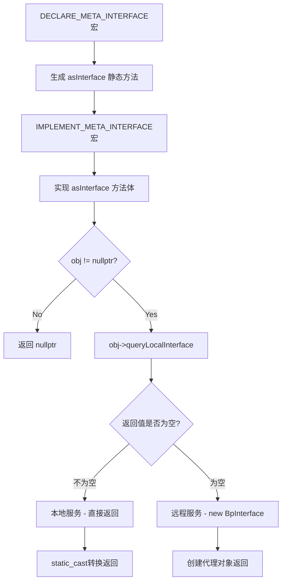

> `native\libs\binder\IServiceManager.cpp`

### 前置了解

```cpp
//IInterface.h
class BpInterface : public INTERFACE, public BpRefBase
{
public:
    explicit                    BpInterface(const sp<IBinder>& remote); //构造方法传入

protected:
    typedef INTERFACE           BaseInterface;
    virtual IBinder*            onAsBinder();
};
template<typename INTERFACE>
inline BpInterface<INTERFACE>::BpInterface(const sp<IBinder>& remote)
    : BpRefBase(remote)
{
}
//Binder.h
class BpRefBase : public virtual RefBase
{
protected:
	inline  IBinder*        remote()                { return mRemote; }
    inline  IBinder*        remote() const          { return mRemote; }
	...
}
//Binder.cpp
BpRefBase::BpRefBase(const sp<IBinder>& o)
    : mRemote(o.get()), mRefs(nullptr), mState(0)
{
    extendObjectLifetime(OBJECT_LIFETIME_WEAK);

    if (mRemote) {
        mRemote->incStrong(this);           // Removed on first IncStrong().
        mRefs = mRemote->createWeak(this);  // Held for our entire lifetime.
    }
}

//Interface.h
template<typename INTERFACE>
inline sp<INTERFACE> interface_cast(const sp<IBinder>& obj)
{
    return INTERFACE::asInterface(obj);
}

template<typename INTERFACE>
inline sp<IInterface> BnInterface<INTERFACE>::queryLocalInterface(
        const String16& _descriptor)
{
    if (_descriptor == INTERFACE::descriptor) return this;
    return nullptr;
}
// ----------------------------------------------------------------------

#define DECLARE_META_INTERFACE(INTERFACE)                               \
public:                                                                 \
    static const ::android::String16 descriptor;                        \
    static ::android::sp<I##INTERFACE> asInterface(                     \
            const ::android::sp<::android::IBinder>& obj);              \
    virtual const ::android::String16& getInterfaceDescriptor() const;  \
    I##INTERFACE();                                                     \
    virtual ~I##INTERFACE();                                            \
    static bool setDefaultImpl(std::unique_ptr<I##INTERFACE> impl);     \
    static const std::unique_ptr<I##INTERFACE>& getDefaultImpl();       \
private:                                                                \
    static std::unique_ptr<I##INTERFACE> default_impl;                  \
public:                                                                 \


#define __IINTF_CONCAT(x, y) (x ## y)

#ifndef DO_NOT_CHECK_MANUAL_BINDER_INTERFACES

#define IMPLEMENT_META_INTERFACE(INTERFACE, NAME)                       \
    static_assert(internal::allowedManualInterface(NAME),               \
                  "b/64223827: Manually written binder interfaces are " \
                  "considered error prone and frequently have bugs. "   \
                  "The preferred way to add interfaces is to define "   \
                  "an .aidl file to auto-generate the interface. If "   \
                  "an interface must be manually written, add its "     \
                  "name to the whitelist.");                            \
    DO_NOT_DIRECTLY_USE_ME_IMPLEMENT_META_INTERFACE(INTERFACE, NAME)    \

#else

#define IMPLEMENT_META_INTERFACE(INTERFACE, NAME)                       \
    DO_NOT_DIRECTLY_USE_ME_IMPLEMENT_META_INTERFACE(INTERFACE, NAME)    \

#endif

#define DO_NOT_DIRECTLY_USE_ME_IMPLEMENT_META_INTERFACE(INTERFACE, NAME)\
const ::android::StaticString16                                     \
    I##INTERFACE##_descriptor_static_str16(__IINTF_CONCAT(u, NAME));\
const ::android::String16 I##INTERFACE::descriptor(                 \
    I##INTERFACE##_descriptor_static_str16);                        \
const ::android::String16&                                          \
        I##INTERFACE::getInterfaceDescriptor() const {              \
    return I##INTERFACE::descriptor;                                \
}                                                                   \

//asInterface 模版方法实现
//1. queryLocalInterface : 有没有设置 descriptor
//2. new Bp##INTERFACE(obj)
::android::sp<I##INTERFACE> I##INTERFACE::asInterface(              \
        const ::android::sp<::android::IBinder>& obj)               \
{                                                                   \
    ::android::sp<I##INTERFACE> intr;                               \
    if (obj != nullptr) {                                           \
        intr = static_cast<I##INTERFACE*>(                          \
            obj->queryLocalInterface(                               \
                    I##INTERFACE::descriptor).get());               \
        if (intr == nullptr) {                                      \
            intr = new Bp##INTERFACE(obj);                          \
        }                                                           \
    }                                                               \
    return intr;                                                    \
}                                                                   \
std::unique_ptr<I##INTERFACE> I##INTERFACE::default_impl;           \
bool I##INTERFACE::setDefaultImpl(std::unique_ptr<I##INTERFACE> impl)\
{                                                                   \
    /* Only one user of this interface can use this function     */ \
    /* at a time. This is a heuristic to detect if two different */ \
    /* users in the same process use this function.              */ \
    assert(!I##INTERFACE::default_impl);                            \
    if (impl) {                                                     \
        I##INTERFACE::default_impl = std::move(impl);               \
        return true;                                                \
    }                                                               \
    return false;                                                   \
}                                                                   \
const std::unique_ptr<I##INTERFACE>& I##INTERFACE::getDefaultImpl() \
{                                                                   \
    return I##INTERFACE::default_impl;                              \
}                                                                   \
I##INTERFACE::I##INTERFACE() { }                                    \
I##INTERFACE::~I##INTERFACE() { }
```

#### `I##INTERFACE `宏展开机制

- `##` 是 C++ 预处理器的标记粘贴操作符（Token Pasting Operator），用于将两个标记连接成一个标记。
  eg

```cpp
class IServiceManager : public IInterface {
    DECLARE_META_INTERFACE(ServiceManager);  // INTERFACE = ServiceManager
    // ...
};
// 宏展开
class IServiceManager : public IInterface {
public:
    static ::android::sp<IServiceManager> asInterface(  // I##ServiceManager = IServiceManager
            const ::android::sp<::android::IBinder>& obj);
    // ...
};
```



### 定义实现

```cpp
//IServiceManager.h
namespace android {
// 不是这个

class IServiceManager : public IInterface
{
	...
}

//IServiceManager.cpp
namespace android {
//注意: android / os /IServiceManager
using AidlServiceManager = android::os::IServiceManager;
sp<IServiceManager> defaultServiceManager()
{
    std::call_once(gSmOnce, []() {
        sp<AidlServiceManager> sm = nullptr;
        while (sm == nullptr) {
			//getContextObject(nullptr) ---> BpBinder::create(0)
            sm = interface_cast<AidlServiceManager>(ProcessState::self()->getContextObject(nullptr));
            if (sm == nullptr) {
                ALOGE("Waiting 1s on context object on %s.", ProcessState::self()->getDriverName().c_str());
                sleep(1);
            }
        }

        gDefaultServiceManager = new ServiceManagerShim(sm);
    });

    return gDefaultServiceManager;
}
	...
}
```

> 需要注意真正的实现类是 aidl生成的 android/os

### 具体实现

```xml
$ find out/ -name "IServiceManager.h" -o -name "IServiceManager.cpp" [18:46:28]
out/soong/.intermediates/frameworks/native/libs/binder/libbinder/android_arm64_armv8-a_shared/gen/aidl/android/os/IServiceManager.h
out/soong/.intermediates/frameworks/native/libs/binder/libbinder/android_arm64_armv8-a_shared/gen/aidl/frameworks/native/libs/binder/aidl/android/os/IServiceManager.cpp
...
```

```cpp
//.../aidl/android/os/IServiceManager.h
namespace android {

namespace os {

class IServiceManager : public ::android::IInterface {
public:
  DECLARE_META_INTERFACE(ServiceManager) // INTERFACE = ServiceManager
	...
}
...
//.../aidl/android/os/IServiceManager.c
	
#include <android/os/IServiceManager.h>
#include <android/os/BpServiceManager.h>

namespace android {

namespace os {

DO_NOT_DIRECTLY_USE_ME_IMPLEMENT_META_INTERFACE(ServiceManager, "android.os.IServiceManager")

}  // namespace os

}  // namespace android
#include <android/os/BpServiceManager.h>
#include <binder/Parcel.h>
#include <android-base/macros.h>

namespace android {

namespace os {
// 客户端实现
BpServiceManager::BpServiceManager(const ::android::sp<::android::IBinder>& _aidl_impl)
    : BpInterface<IServiceManager>(_aidl_impl){
}

::android::binder::Status BpServiceManager::getService(const ::std::string& name, ::android::sp<::android::IBinder>* _aidl_return) {
  ::android::Parcel _aidl_data;
  ::android::Parcel _aidl_reply;
  ::android::status_t _aidl_ret_status = ::android::OK;
  ::android::binder::Status _aidl_status;
  ...
  // remote() : 	其实就是_aidl_impl -> BpBinder(0)
  _aidl_ret_status = remote()->transact(::android::IBinder::FIRST_CALL_TRANSACTION + 0 /* getService */, _aidl_data, &_aidl_reply);
  if (UNLIKELY(_aidl_ret_status == ::android::UNKNOWN_TRANSACTION && IServiceManager::getDefaultImpl())) {
     return IServiceManager::getDefaultImpl()->getService(name, _aidl_return);
  }
  ...
  return _aidl_status;
}

...

::android::binder::Status BpServiceManager::addService(const ::std::string& name, const ::android::sp<::android::IBinder>& service, bool allowIsolated, int32_t dumpPriority) {
  ::android::Parcel _aidl_data;
  ::android::Parcel _aidl_reply;
  ::android::status_t _aidl_ret_status = ::android::OK;
  ::android::binder::Status _aidl_status;
  _aidl_ret_status = _aidl_data.writeInterfaceToken(getInterfaceDescriptor());
  if (((_aidl_ret_status) != (::android::OK))) {
    goto _aidl_error;
  }
  _aidl_ret_status = _aidl_data.writeUtf8AsUtf16(name);
  if (((_aidl_ret_status) != (::android::OK))) {
    goto _aidl_error;
  }
  _aidl_ret_status = _aidl_data.writeStrongBinder(service);
  if (((_aidl_ret_status) != (::android::OK))) {
    goto _aidl_error;
  }
  _aidl_ret_status = _aidl_data.writeBool(allowIsolated);
  if (((_aidl_ret_status) != (::android::OK))) {
    goto _aidl_error;
  }
  _aidl_ret_status = _aidl_data.writeInt32(dumpPriority);
  if (((_aidl_ret_status) != (::android::OK))) {
    goto _aidl_error;
  }
  _aidl_ret_status = remote()->transact(::android::IBinder::FIRST_CALL_TRANSACTION + 2 /* addService */, _aidl_data, &_aidl_reply);
  if (UNLIKELY(_aidl_ret_status == ::android::UNKNOWN_TRANSACTION && IServiceManager::getDefaultImpl())) {
     return IServiceManager::getDefaultImpl()->addService(name, service, allowIsolated, dumpPriority);
  }
  if (((_aidl_ret_status) != (::android::OK))) {
    goto _aidl_error;
  }
  _aidl_ret_status = _aidl_status.readFromParcel(_aidl_reply);
  if (((_aidl_ret_status) != (::android::OK))) {
    goto _aidl_error;
  }
  if (!_aidl_status.isOk()) {
    return _aidl_status;
  }
  _aidl_error:
  _aidl_status.setFromStatusT(_aidl_ret_status);
  return _aidl_status;
}
...

}  // namespace os

}  // namespace android
#include <android/os/BnServiceManager.h>
#include <binder/Parcel.h>
#include <binder/Stability.h>

namespace android {

namespace os {
//服务端实现
BnServiceManager::BnServiceManager()
{
  ::android::internal::Stability::markCompilationUnit(this);
}

::android::status_t BnServiceManager::onTransact(uint32_t _aidl_code, const ::android::Parcel& _aidl_data, ::android::Parcel* _aidl_reply, uint32_t _aidl_flags) {
  ::android::status_t _aidl_ret_status = ::android::OK;
  switch (_aidl_code) {
  case ::android::IBinder::FIRST_CALL_TRANSACTION + 0 /* getService */:
  ...
  default:
  {
    _aidl_ret_status = ::android::BBinder::onTransact(_aidl_code, _aidl_data, _aidl_reply, _aidl_flags);
  }
  break;
  }
  if (_aidl_ret_status == ::android::UNEXPECTED_NULL) {
    _aidl_ret_status = ::android::binder::Status::fromExceptionCode(::android::binder::Status::EX_NULL_POINTER).writeToParcel(_aidl_reply);
  }
  return _aidl_ret_status;
}

}  // namespace os

}  // namespace android

```

### 总结:

defaultServiceManager() -> interface\_cast<AidlServiceManager>(ProcessState::self()->getContextObject(nullptr));
相当于:
new BpServiceManager(new BpBinder(0))
