#### native binder 通信

- `BBinder`

```cpp
//Binder.h
class BBinder : public IBinder
{
    ...
public:
    virtual status_t    transact(   uint32_t code,
                                    const Parcel& data,
                                    Parcel* reply,
                                    uint32_t flags = 0) final;
    ...
protected
    virtual             ~BBinder();
    // NOLINTNEXTLINE(google-default-arguments)
    virtual status_t    onTransact( uint32_t code,
                                    const Parcel& data,
                                    Parcel* reply,
                                    uint32_t flags = 0);
    ...
}

//Binder.cpp
status_t BBinder::transact(
    uint32_t code, const Parcel& data, Parcel* reply, uint32_t flags)
{
    data.setDataPosition(0);

    status_t err = NO_ERROR;
    switch (code) {
        case PING_TRANSACTION:
            err = pingBinder();
            break;
        case EXTENSION_TRANSACTION:
            err = reply->writeStrongBinder(getExtension());
            break;
        case DEBUG_PID_TRANSACTION:
            err = reply->writeInt32(getDebugPid());
            break;
        default:
            //这里:调用onTransact
            err = onTransact(code, data, reply, flags);
            break;
    }

    // In case this is being transacted on in the same process.
    if (reply != nullptr) {
        reply->setDataPosition(0);
    }

    return err;
}
```

- BpBinder

```cpp
//BpBinder.h
class BpBinder : public IBinder
{
public:
    static BpBinder*    create(int32_t handle);

    int32_t             handle() const;
    ...
     virtual status_t    transact(   uint32_t code,
                                    const Parcel& data,
                                    Parcel* reply,
                                    uint32_t flags = 0) final;
...
//BpBinder.cpp
status_t BpBinder::transact(
    uint32_t code, const Parcel& data, Parcel* reply, uint32_t flags)
{
    // Once a binder has died, it will never come back to life.
    if (mAlive) {
        bool privateVendor = flags & FLAG_PRIVATE_VENDOR;
        // don't send userspace flags to the kernel
        flags = flags & ~FLAG_PRIVATE_VENDOR;

        // user transactions require a given stability level
        if (code >= FIRST_CALL_TRANSACTION && code <= LAST_CALL_TRANSACTION) {
            using android::internal::Stability;

            auto stability = Stability::get(this);
            auto required = privateVendor ? Stability::VENDOR : Stability::kLocalStability;

            if (CC_UNLIKELY(!Stability::check(stability, required))) {
                ALOGE("Cannot do a user transaction on a %s binder in a %s context.",
                    Stability::stabilityString(stability).c_str(),
                    Stability::stabilityString(required).c_str());
                return BAD_TYPE;
            }
        }
        // 
        status_t status = IPCThreadState::self()->transact(
            mHandle, code, data, reply, flags);
        if (status == DEAD_OBJECT) mAlive = 0;

        return status;
    }

    return DEAD_OBJECT;
}
//IPCThreadState.cpp
status_t IPCThreadState::transact(int32_t handle,
                                  uint32_t code, const Parcel& data,
                                  Parcel* reply, uint32_t flags)
{
    ...
    //mOut.write( binder_transaction_data ...)
    err = writeTransactionData(BC_TRANSACTION, flags, handle, code, data, nullptr);
    ...
    if ((flags & TF_ONE_WAY) == 0){
        if (reply) {
            err = waitForResponse(reply);
        } else {
            Parcel fakeReply;
            err = waitForResponse(&fakeReply);
        }
    }else{
        err = waitForResponse(nullptr, nullptr);
    }
    ...
}
status_t IPCThreadState::waitForResponse(Parcel *reply, status_t *acquireResult)
{
    uint32_t cmd;
    int32_t err;

    while (1) {
        if ((err=talkWithDriver()) < NO_ERROR) break;
        cmd = (uint32_t)mIn.readInt32();
         switch (cmd) {
             
         }
    }
}
status_t IPCThreadState::talkWithDriver(bool doReceive)
{
    binder_write_read bwr;
    ...
    bwr.write_size = outAvail;
    bwr.write_buffer = (uintptr_t)mOut.data();
    // This is what we'll read.
    if (doReceive && needRead) {
        bwr.read_size = mIn.dataCapacity();
        bwr.read_buffer = (uintptr_t)mIn.data();
    } else {
        bwr.read_size = 0;
        bwr.read_buffer = 0;
    }
    ...
    do {
        IF_LOG_COMMANDS() {
            alog << "About to read/write, write size = " << mOut.dataSize() << endl;
        }
#if defined(__ANDROID__)
        // binder 驱动通信
        if (ioctl(mProcess->mDriverFD, BINDER_WRITE_READ, &bwr) >= 0)
            err = NO_ERROR;
        else
            err = -errno;
#else
        err = INVALID_OPERATION;
#endif
        if (mProcess->mDriverFD < 0) {
            err = -EBADF;
        }
        IF_LOG_COMMANDS() {
            alog << "Finished read/write, write size = " << mOut.dataSize() << endl;
        }
    } while (err == -EINTR);
    ...
    if (err >= NO_ERROR) {
        if (bwr.write_consumed > 0) {
            if (bwr.write_consumed < mOut.dataSize())
                LOG_ALWAYS_FATAL("Driver did not consume write buffer. "
                                 "err: %s consumed: %zu of %zu",
                                 statusToString(err).c_str(),
                                 (size_t)bwr.write_consumed,
                                 mOut.dataSize());
            else {
                mOut.setDataSize(0);
                processPostWriteDerefs();
            }
        }
        if (bwr.read_consumed > 0) {
            mIn.setDataSize(bwr.read_consumed);
            mIn.setDataPosition(0);
        }
        IF_LOG_COMMANDS() {
            TextOutput::Bundle _b(alog);
            alog << "Remaining data size: " << mOut.dataSize() << endl;
            alog << "Received commands from driver: " << indent;
            const void* cmds = mIn.data();
            const void* end = mIn.data() + mIn.dataSize();
            alog << HexDump(cmds, mIn.dataSize()) << endl;
            while (cmds < end) cmds = printReturnCommand(alog, cmds);
            alog << dedent;
        }
        return NO_ERROR;
    }

    return err;	
}
```

##### Binder通信 native示例

**client.cpp**

```cpp
class SampleCallback : public BBinder
{
public:
    SampleCallback()
    {
        ALOGE("Callback ------------------------------ %d", __LINE__);
        mydescriptor = String16(SAMPLE_CB_SERIVCE_DES);
    }
    virtual ~SampleCallback()
    {
    }
    // 服务名
    virtual const String16 &getInterfaceDescriptor() const
    {
        return mydescriptor;
    }

protected:
    void callFunction(int val)
    {
       ...
    }
    virtual status_t onTransact(uint32_t code,
                                const Parcel &data,
                                Parcel *reply,
                                uint32_t flags = 0)
    {
       
        switch (code)
        {
        case CB_CODE:
            ...
            //注意读写顺序
            ...
            callFunction(44332211);
            break;
        default:
            return BBinder::onTransact(code, data, reply, flags);
            break;
        }
        return 0;
    }

private:
    String16 mydescriptor;
};

int main()
{
    sp<IServiceManager> sm = defaultServiceManager();
    //向 ServiceManager获取服务
    sp<IBinder> ibinder = sm->getService(String16(SAMPLE_SERIVCE_DES));
    if (ibinder == NULL)
    {
        ALOGW("Client can't find Service");
        return -1;
    }

    Parcel _data, _reply;
    SampleCallback *callback = new SampleCallback();
    //注册callback
    _data.writeStrongBinder(sp<IBinder>(callback));
    _data.writeInterfaceToken(String16(SAMPLE_CB_SERIVCE_DES));
    //远程调用 
    ibinder->transact(SRV_CODE, _data, &_reply, 0);
    IPCThreadState::self()->joinThreadPool();
    printf("Client ------------------------------ main end");
    return 0;
}
```

**server.cpp**

```cpp
class SampleService : public BBinder
{
public:
    SampleService()
    {
        ALOGE("Server ------------------------------ %d", __LINE__);
        mydescriptor = String16(SAMPLE_SERIVCE_DES);
    }
    virtual ~SampleService()
    {
    }
    // 服务名
    virtual const String16 &getInterfaceDescriptor() const
    {
        return mydescriptor;
    }

protected:
    void callFunction(int val)
    {
        ALOGE("Server ------------------------------ %d", __LINE__);
        ALOGI("Service: %s(), %d, val = %d", __FUNCTION__, __LINE__, val);
    }
    virtual status_t onTransact(uint32_t code,
                                const Parcel &data,
                                Parcel *reply,
                                uint32_t flags = 0)
    {
        ALOGD("Service onTransact,line = %d, code = %d", __LINE__, code);
        switch (code)
        {
        case SRV_CODE:
            ...
            //注意读写顺序
            ...
            callFunction(666);
            break;
        default:
            return BBinder::onTransact(code, data, reply, flags);
            break;
        }
        return 0;
    }

private:
    String16 mydescriptor;
    sp<IBinder> callback;
};

int main()
{
    sp<IServiceManager> sm = defaultServiceManager();
    SampleService *samServ = new SampleService();

    //向 ServiceManager注册服务
    sm->addService(String16(SAMPLE_SERIVCE_DES), samServ);
    ALOGD("Service addservice");
    printf("server before joinThreadPool \n");
    IPCThreadState::self()->joinThreadPool(true);
    printf("server before joinThreadPool \n");
    return 0;
}

```

- `/frameworks/native/binder/IServiceManager.cpp` : defaultServiceManager

```cpp
class ServiceManagerShim : public IServiceManager
{
public:
    explicit ServiceManagerShim (const sp<AidlServiceManager>& impl);
     sp<IBinder> getService(const String16& name) const override;
     ...
     ...
private:
    // AIDL生成的ServiceManager代理类 (相当于 BpServiceManager)
    sp<AidlServiceManager> mTheRealServiceManager;
};
}

ServiceManagerShim::ServiceManagerShim(const sp<AidlServiceManager>& impl)
 : mTheRealServiceManager(impl)
{}
sp<IServiceManager> defaultServiceManager()
{
    std::call_once(gSmOnce, []() {
        sp<AidlServiceManager> sm = nullptr;
        while (sm == nullptr) {
            sm = interface_cast<AidlServiceManager>(ProcessState::self()->getContextObject(nullptr));
            if (sm == nullptr) {
                ALOGE("Waiting 1s on context object on %s.", ProcessState::self()->getDriverName().c_str());
                sleep(1);
            }
        }
        //ServiceManager BpBinder
        //
        gDefaultServiceManager = new ServiceManagerShim(sm);
    });

    return gDefaultServiceManager;
}
```

- `/frameworks/native/binder/ProcessState.cpp`

```cpp
sp<IBinder> ProcessState::getContextObject(const sp<IBinder>& /*caller*/)
{
    // handle 0-> serviceManager BpBinder
    sp<IBinder> context = getStrongProxyForHandle(0);

    if (context == nullptr) {
       ALOGW("Not able to get context object on %s.", mDriverName.c_str());
    }

    // The root object is special since we get it directly from the driver, it is never
    // written by Parcell::writeStrongBinder.
    internal::Stability::tryMarkCompilationUnit(context.get());

    return context;
}
sp<IBinder> ProcessState::getStrongProxyForHandle(int32_t handle)
{
    sp<IBinder> result;

    AutoMutex _l(mLock);

    handle_entry* e = lookupHandleLocked(handle);

    if (e != nullptr) {
      
        IBinder* b = e->binder;
        if (b == nullptr || !e->refs->attemptIncWeak(this)) {
            if (handle == 0) {
                Parcel data;
                // 先ping 一下service Manager
                status_t status = IPCThreadState::self()->transact(
                        0, IBinder::PING_TRANSACTION, data, nullptr, 0);
                if (status == DEAD_OBJECT)
                   return nullptr;
            }
            // 创建BpBinder
            b = BpBinder::create(handle);
            e->binder = b;
            if (b) e->refs = b->getWeakRefs();
            result = b;
        } else {
            // This little bit of nastyness is to allow us to add a primary
            // reference to the remote proxy when this team doesn't have one
            // but another team is sending the handle to us.
            result.force_set(b);
            e->refs->decWeak(this);
        }
    }

    return result;
}
```

### 流程图梳理

基于前一篇 [ServiceManger 进程启动](/p/492325a1893e4be1817945807fe8d71e) 与本篇

```mermaid
sequenceDiagram
    participant App as 客户端应用
    participant BpSM as BpServiceManager
    participant BpBinder as BpBinder(客户端代理)
    participant IPC as IPCThreadState/ProcessState
    participant Driver as Binder驱动
    participant SM as ServiceManager
    participant Server as 服务端
    participant BBinder as BBinder

    Note over App, BBinder: 🚀 阶段1: 系统初始化

    Note over SM: ServiceManager启动
    SM->>Driver: open("/dev/binder")
    SM->>Driver: becomeContextManager() (获得handle=0)
    SM->>SM: 进入Looper事件循环

    Note over Server: 服务端启动
    Server->>BBinder: 创建服务实现对象

    Note over App, BBinder: 📝 阶段2: 服务注册流程

    Server->>BpSM: defaultServiceManager()
    BpSM->>BpBinder: new BpBinder(handle=0)
    Server->>BpSM: addService("MyService", serverBinder)
    
    BpSM->>BpBinder: transact(ADD_SERVICE_TRANSACTION)
    BpBinder->>IPC: transact(handle=0, code, data)
    IPC->>IPC: writeTransactionData(BC_TRANSACTION)
    IPC->>Driver: ioctl(BINDER_WRITE_READ)
    
    Driver->>Driver: 根据handle=0找到ServiceManager
    Driver->>SM: 唤醒SM线程, 传递BR_TRANSACTION
    SM->>SM: handlePolledCommands()
    SM->>SM: onTransact(ADD_SERVICE_TRANSACTION)
    SM->>SM: addService() 存入mNameToService
    
    SM->>Driver: BC_REPLY
    Driver->>IPC: BR_REPLY
    IPC->>BpBinder: 返回成功状态
    BpBinder->>Server: 注册完成

    Server->>Server: joinThreadPool() 等待客户端请求

    Note over App, BBinder: 🔍 阶段3: 服务发现流程

    App->>BpSM: defaultServiceManager()
    App->>BpSM: getService("MyService")
    
    BpSM->>BpBinder: transact(GET_SERVICE_TRANSACTION)
    BpBinder->>IPC: transact(handle=0, code, data)
    IPC->>Driver: ioctl(BINDER_WRITE_READ)
    
    Driver->>SM: BR_TRANSACTION
    SM->>SM: onTransact(GET_SERVICE_TRANSACTION)
    SM->>SM: getService() 查找mNameToService
    SM->>Driver: BC_REPLY (返回服务handle)
    
    Driver->>IPC: BR_REPLY
    IPC->>BpBinder: 返回服务handle
    BpBinder->>App: 返回BpBinder(serviceHandle)

    Note over App, BBinder: 📞 阶段4: 服务调用流程

    App->>BpBinder: transact(BUSINESS_CODE, data, reply)
    BpBinder->>IPC: transact(serviceHandle, code, data, reply)
    
    IPC->>IPC: writeTransactionData(BC_TRANSACTION)
    Note over IPC: 准备发送数据:<br/>- 写入接口Token<br/>- 写入业务参数<br/>- 设置目标handle
    
    IPC->>Driver: ioctl(BINDER_WRITE_READ, mOut, mIn)
    
    Driver->>Driver: 根据serviceHandle找到目标进程
    Note over Driver: Binder驱动处理:<br/>- 查找目标进程<br/>- 数据拷贝/共享内存<br/>- 管理事务状态
    
    Driver->>Server: 唤醒服务端线程, BR_TRANSACTION
    
    Server->>Server: handlePolledCommands()
    Server->>BBinder: transact(code, data, reply)
    BBinder->>BBinder: onTransact() 业务逻辑处理
    
    Note over BBinder: 服务端处理:<br/>- 解析业务参数<br/>- 执行具体业务<br/>- 准备返回数据
    
    BBinder->>Server: 返回处理结果
    Server->>Driver: BC_REPLY
    
    Driver->>Driver: 将reply数据传回客户端
    Driver->>IPC: BR_REPLY
    
    IPC->>IPC: 从mIn读取reply数据
    IPC->>BpBinder: 返回reply
    BpBinder->>App: 返回业务结果

    Note over App, BBinder: ✅ 调用完成

    Note over App, BBinder: 🔄 后续调用循环
    Note over App: 客户端可以继续发起新的调用
    Note over Server: 服务端继续在线程池中等待新请求


```


