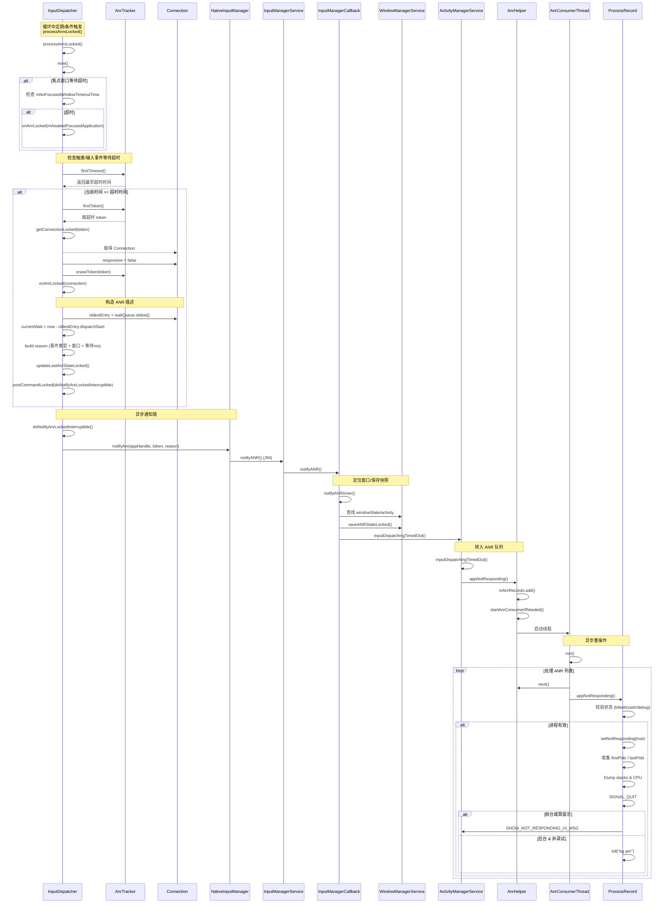

### 时序图



### ANR 检测

```cpp
namespace android::inputdispatcher {

template <typename T>
static T max(const T& a, const T& b) {
    return a < b ? b : a;
}
// std::multiset - 自动排序
// std::pair<nsecs_t, sp<IBinder>> 超时时间戳 ,IBinder token 
std::multiset<std::pair<nsecs_t /*timeoutTime*/, sp<IBinder> /*connectionToken*/>> mAnrTimeouts;

void AnrTracker::insert(nsecs_t timeoutTime, sp<IBinder> token) {
	// 按timeoutTime排序插入
    mAnrTimeouts.insert(std::make_pair(timeoutTime, std::move(token)));
}

/**
 * Erase a single entry only. If there are multiple duplicate entries
 * (same time, same connection), then only remove one of them.
 */
void AnrTracker::erase(nsecs_t timeoutTime, const sp<IBinder>& token) {
    auto pair = std::make_pair(timeoutTime, token);
    auto it = mAnrTimeouts.find(pair);
    if (it != mAnrTimeouts.end()) {
        mAnrTimeouts.erase(it);
    }
}

void AnrTracker::eraseToken(const sp<IBinder>& token) {
    for (auto it = mAnrTimeouts.begin(); it != mAnrTimeouts.end();) {
        if (it->second == token) {
            it = mAnrTimeouts.erase(it);
        } else {
            ++it;
        }
    }
}

bool AnrTracker::empty() const {
    return mAnrTimeouts.empty();
}

// If empty() is false, return the time at which the next connection should cause an ANR
// If empty() is true, return LONG_LONG_MAX
nsecs_t AnrTracker::firstTimeout() const {
    if (mAnrTimeouts.empty()) {
        return std::numeric_limits<nsecs_t>::max();
    }
	// 最大时间戳
    return mAnrTimeouts.begin()->first;
}

const sp<IBinder>& AnrTracker::firstToken() const {
    return mAnrTimeouts.begin()->second;
}

void AnrTracker::clear() {
    mAnrTimeouts.clear();
}

} // namespace android::inputdispatcher


/**
 * Check if any of the connections' wait queues have events that are too old.
 * If we waited for events to be ack'ed for more than the window timeout, raise an ANR.
 * Return the time at which we should wake up next.
 */
//ANR 检测
nsecs_t InputDispatcher::processAnrsLocked() {
    const nsecs_t currentTime = now();
    nsecs_t nextAnrCheck = LONG_LONG_MAX;
    // Check if we are waiting for a focused window to appear. Raise ANR if waited too long
	//焦点窗口 是否超时
    if (mNoFocusedWindowTimeoutTime.has_value() && mAwaitedFocusedApplication != nullptr) {
        if (currentTime >= *mNoFocusedWindowTimeoutTime) {
            onAnrLocked(mAwaitedFocusedApplication);
            mAwaitedFocusedApplication.clear();
            return LONG_LONG_MIN;
        } else {
            // Keep waiting
            const nsecs_t millisRemaining = ns2ms(*mNoFocusedWindowTimeoutTime - currentTime);
            ALOGW("Still no focused window. Will drop the event in %" PRId64 "ms", millisRemaining);
            nextAnrCheck = *mNoFocusedWindowTimeoutTime;
        }
    }

    // Check if any connection ANRs are due
	// 触摸事件anr 检测
    nextAnrCheck = std::min(nextAnrCheck, mAnrTracker.firstTimeout());
	//未超时
    if (currentTime < nextAnrCheck) { // most likely scenario
        return nextAnrCheck;          // everything is normal. Let's check again at nextAnrCheck
    }

    // If we reached here, we have an unresponsive connection.
    sp<Connection> connection = getConnectionLocked(mAnrTracker.firstToken());
    if (connection == nullptr) {
        ALOGE("Could not find connection for entry %" PRId64, mAnrTracker.firstTimeout());
        return nextAnrCheck;
    }
    connection->responsive = false;
    // Stop waking up for this unresponsive connection
    mAnrTracker.eraseToken(connection->inputChannel->getConnectionToken());
	//发生超时,执行anr
    onAnrLocked(connection);
    return LONG_LONG_MIN;
}

void InputDispatcher::onAnrLocked(const sp<Connection>& connection) {
    // Since we are allowing the policy to extend the timeout, maybe the waitQueue
    // is already healthy again. Don't raise ANR in this situation
	// 如果 wq已经空了,表示没有待处理的新事件,就忽略本次超时
    if (connection->waitQueue.empty()) {
        ALOGI("Not raising ANR because the connection %s has recovered",
              connection->inputChannel->getName().c_str());
        return;
    }
    /**
     * The "oldestEntry" is the entry that was first sent to the application. That entry, however,
     * may not be the one that caused the timeout to occur. One possibility is that window timeout
     * has changed. This could cause newer entries to time out before the already dispatched
     * entries. In that situation, the newest entries caused ANR. But in all likelihood, the app
     * processes the events linearly. So providing information about the oldest entry seems to be
     * most useful.
     */
    DispatchEntry* oldestEntry = *connection->waitQueue.begin();
    const nsecs_t currentWait = now() - oldestEntry->deliveryTime;
    std::string reason =
            android::base::StringPrintf("%s is not responding. Waited %" PRId64 "ms for %s",
                                        connection->inputChannel->getName().c_str(),
                                        ns2ms(currentWait),
                                        oldestEntry->eventEntry->getDescription().c_str());
	//dump 收集anr 场景信息 包括窗口信息: iq,wq 与 adb shell dumpsys input 类似
    updateLastAnrStateLocked(getWindowHandleLocked(connection->inputChannel->getConnectionToken()),
                             reason);

    std::unique_ptr<CommandEntry> commandEntry =
            std::make_unique<CommandEntry>(&InputDispatcher::doNotifyAnrLockedInterruptible);
    commandEntry->inputApplicationHandle = nullptr;
    commandEntry->inputChannel = connection->inputChannel;
    commandEntry->reason = std::move(reason);
    postCommandLocked(std::move(commandEntry));
}

void InputDispatcher::doNotifyAnrLockedInterruptible(CommandEntry* commandEntry) {
    sp<IBinder> token =
            commandEntry->inputChannel ? commandEntry->inputChannel->getConnectionToken() : nullptr;
    mLock.unlock();
	//anr 通知
    const nsecs_t timeoutExtension =
            mPolicy->notifyAnr(commandEntry->inputApplicationHandle, token, commandEntry->reason);

    mLock.lock();

    if (timeoutExtension > 0) {
        extendAnrTimeoutsLocked(commandEntry->inputApplicationHandle, token, timeoutExtension);
    } else {
        // stop waking up for events in this connection, it is already not responding
        sp<Connection> connection = getConnectionLocked(token);
        if (connection == nullptr) {
            return;
        }
        cancelEventsForAnrLocked(connection);
    }
}

//NativeInputManager
nsecs_t NativeInputManager::notifyAnr(const sp<InputApplicationHandle>& inputApplicationHandle,
                                      const sp<IBinder>& token, const std::string& reason) {
#if DEBUG_INPUT_DISPATCHER_POLICY
    ALOGD("notifyANR");
#endif
    ATRACE_CALL();

    JNIEnv* env = jniEnv();
    ScopedLocalFrame localFrame(env);

    jobject inputApplicationHandleObj =
            getInputApplicationHandleObjLocalRef(env, inputApplicationHandle);

    jobject tokenObj = javaObjectForIBinder(env, token);
    jstring reasonObj = env->NewStringUTF(reason.c_str());

    jlong newTimeout = env->CallLongMethod(mServiceObj,
            gServiceClassInfo.notifyANR, inputApplicationHandleObj, tokenObj,
                 reasonObj);
	//调用 InputManagerService 的  notifyANR 方法
    if (checkAndClearExceptionFromCallback(env, "notifyANR")) {
        newTimeout = 0; // abort dispatch
    } else {
        assert(newTimeout >= 0);
    }
    return newTimeout;
}
// InputManagerService.java
// Native callback.
private long notifyANR(InputApplicationHandle inputApplicationHandle, IBinder token,
        String reason) {
    return mWindowManagerCallbacks.notifyANR(inputApplicationHandle,
            token, reason);
}

// SystemServer.java
//WindowManagerService wm
inputManager.setWindowManagerCallbacks(wm.getInputManagerCallback());
//InputManagerCallback.java
final class InputManagerCallback implements InputManagerService.WindowManagerCallbacks {
	/**
     * Notifies the window manager about an application that is not responding.
     * Returns a new timeout to continue waiting in nanoseconds, or 0 to abort dispatch.
     *
     * Called by the InputManager.
     */
    @Override
    public long notifyANR(InputApplicationHandle inputApplicationHandle, IBinder token,
            String reason) {
        final long startTime = SystemClock.uptimeMillis();
        try {
            return notifyANRInner(inputApplicationHandle, token, reason);
        } finally {
            // Log the time because the method is called from InputDispatcher thread. It shouldn't
            // take too long that may affect input response time.
            Slog.d(TAG_WM, "notifyANR took " + (SystemClock.uptimeMillis() - startTime) + "ms");
        }
    }

    private long notifyANRInner(InputApplicationHandle inputApplicationHandle, IBinder token,
            String reason) {
        ActivityRecord activity = null;
        WindowState windowState = null;
        boolean aboveSystem = false;
        int windowPid = INVALID_PID;

        preDumpIfLockTooSlow();

        //TODO(b/141764879) Limit scope of wm lock when input calls notifyANR
        synchronized (mService.mGlobalLock) {

            // Check if we can blame a window
            if (token != null) {
				//尝试获取当前窗口容器
                windowState = mService.mInputToWindowMap.get(token);
                if (windowState != null) {
                    activity = windowState.mActivityRecord;
                    windowPid = windowState.mSession.mPid;
                    // Figure out whether this window is layered above system windows.
                    // We need to do this here to help the activity manager know how to
                    // layer its ANR dialog.
                    aboveSystem = isWindowAboveSystem(windowState);
                }
            }

            // Check if we can blame an embedded window
            if (token != null && windowState == null) {
                EmbeddedWindow embeddedWindow = mService.mEmbeddedWindowController.get(token);
                if (embeddedWindow != null) {
                    windowPid = embeddedWindow.mOwnerPid;
                    WindowState hostWindowState = embeddedWindow.mHostWindowState;
                    if (hostWindowState == null) {
                        // The embedded window has no host window and we cannot easily determine
                        // its z order. Try to place the anr dialog as high as possible.
                        aboveSystem = true;
                    } else {
                        aboveSystem = isWindowAboveSystem(hostWindowState);
                    }
                }
            }

            // Check if we can blame an activity. If we don't have an activity to blame, pull out
            // the token passed in via input application handle. This can happen if there are no
            // focused windows but input dispatcher knows the focused app.
            if (activity == null && inputApplicationHandle != null) {
                activity = ActivityRecord.forTokenLocked(inputApplicationHandle.token);
            }

            if (windowState != null) {
                Slog.i(TAG_WM, "Input event dispatching timed out "
                        + "sending to " + windowState.mAttrs.getTitle()
                        + ".  Reason: " + reason);
            } else if (activity != null) {
                Slog.i(TAG_WM, "Input event dispatching timed out "
                        + "sending to application " + activity.stringName
                        + ".  Reason: " + reason);
            } else {
                Slog.i(TAG_WM, "Input event dispatching timed out "
                        + ".  Reason: " + reason);
            }
			//保存 当前 window 树信息
            mService.saveANRStateLocked(activity, windowState, reason);
        }

        // All the calls below need to happen without the WM lock held since they call into AM.
		
        mService.mAtmInternal.saveANRState(reason);

        if (activity != null && activity.appToken != null) {
            // Notify the activity manager about the timeout and let it decide whether
            // to abort dispatching or keep waiting.
            final boolean abort = activity.keyDispatchingTimedOut(reason, windowPid);
            if (!abort) {
                // The activity manager declined to abort dispatching.
                // Wait a bit longer and timeout again later.
                return activity.mInputDispatchingTimeoutNanos;
            }
        } else if (windowState != null || windowPid != INVALID_PID) {
            // Notify the activity manager about the timeout and let it decide whether
            // to abort dispatching or keep waiting.
            long timeout = mService.mAmInternal.inputDispatchingTimedOut(windowPid, aboveSystem,
                    reason);
            if (timeout >= 0) {
                // The activity manager declined to abort dispatching.
                // Wait a bit longer and timeout again later.
                return timeout * 1000000L; // nanoseconds
            }
        }
        return 0; // abort dispatching
    }
}

//最后又会调到 AMS
long inputDispatchingTimedOut(int pid, final boolean aboveSystem, String reason) {
    if (checkCallingPermission(FILTER_EVENTS) != PackageManager.PERMISSION_GRANTED) {
        throw new SecurityException("Requires permission " + FILTER_EVENTS);
    }
    ProcessRecord proc;
    long timeout;
    synchronized (this) {
        synchronized (mPidsSelfLocked) {
            proc = mPidsSelfLocked.get(pid);
        }
        timeout = proc != null ? proc.getInputDispatchingTimeout() : KEY_DISPATCHING_TIMEOUT_MS;
    }

    if (inputDispatchingTimedOut(proc, null, null, null, null, aboveSystem, reason)) {
        return -1;
    }

    return timeout;
}
**
 * Handle input dispatching timeouts.
 * @return whether input dispatching should be aborted or not.
 */
boolean inputDispatchingTimedOut(ProcessRecord proc, String activityShortComponentName,
        ApplicationInfo aInfo, String parentShortComponentName,
        WindowProcessController parentProcess, boolean aboveSystem, String reason) {
    if (checkCallingPermission(FILTER_EVENTS) != PackageManager.PERMISSION_GRANTED) {
        throw new SecurityException("Requires permission " + FILTER_EVENTS);
    }

    final String annotation;
    if (reason == null) {
        annotation = "Input dispatching timed out";
    } else {
        annotation = "Input dispatching timed out (" + reason + ")";
    }

    if (proc != null) {
        synchronized (this) {
            if (proc.isDebugging()) {
                return false;
            }

            if (proc.getActiveInstrumentation() != null) {
                Bundle info = new Bundle();
                info.putString("shortMsg", "keyDispatchingTimedOut");
                info.putString("longMsg", annotation);
                finishInstrumentationLocked(proc, Activity.RESULT_CANCELED, info);
                return true;
            }
        }
        mAnrHelper.appNotResponding(proc, activityShortComponentName, aInfo,
                parentShortComponentName, parentProcess, aboveSystem, annotation);
    }

    return true;
}

//AnrHelper.java
void appNotResponding(ProcessRecord anrProcess, String activityShortComponentName,
        ApplicationInfo aInfo, String parentShortComponentName,
        WindowProcessController parentProcess, boolean aboveSystem, String annotation) {
    synchronized (mAnrRecords) {
		//添加一条anr 记录
        mAnrRecords.add(new AnrRecord(anrProcess, activityShortComponentName, aInfo,
                parentShortComponentName, parentProcess, aboveSystem, annotation));
    }
    startAnrConsumerIfNeeded();
}
// 开启子线程
private void startAnrConsumerIfNeeded() {
    if (mRunning.compareAndSet(false, true)) {
        new AnrConsumerThread().start();
    }
}

	...
	//AnrConsumerThread.run
	...
	AnrRecord r;
    while ((r = next()) != null) {
        final long startTime = SystemClock.uptimeMillis();
        // If there are many ANR at the same time, the latency may be larger. If the latency
        // is too large, the stack trace might not be meaningful.
        final long reportLatency = startTime - r.mTimestamp;
        final boolean onlyDumpSelf = reportLatency > EXPIRED_REPORT_TIME_MS;
		//通知对应 窗口
        r.appNotResponding(onlyDumpSelf);
        final long endTime = SystemClock.uptimeMillis();
        Slog.d(TAG, "Completed ANR of " + r.mApp.processName + " in "
                + (endTime - startTime) + "ms, latency " + reportLatency
                + (onlyDumpSelf ? "ms (expired, only dump ANR app)" : "ms"));
    }
	...
		
	private AnrRecord next() {
	    synchronized (mAnrRecords) {
	        return mAnrRecords.isEmpty() ? null : mAnrRecords.remove(0);
	    }
	}


private static class AnrRecord {
    final ProcessRecord mApp;
    final String mActivityShortComponentName;
    final String mParentShortComponentName;
    final String mAnnotation;
    final ApplicationInfo mAppInfo;
    final WindowProcessController mParentProcess;
    final boolean mAboveSystem;
    final long mTimestamp = SystemClock.uptimeMillis();

    AnrRecord(ProcessRecord anrProcess, String activityShortComponentName,
            ApplicationInfo aInfo, String parentShortComponentName,
            WindowProcessController parentProcess, boolean aboveSystem, String annotation) {
        mApp = anrProcess;
        mActivityShortComponentName = activityShortComponentName;
        mParentShortComponentName = parentShortComponentName;
        mAnnotation = annotation;
        mAppInfo = aInfo;
        mParentProcess = parentProcess;
        mAboveSystem = aboveSystem;
    }

    void appNotResponding(boolean onlyDumpSelf) {
        mApp.appNotResponding(mActivityShortComponentName, mAppInfo,
                mParentShortComponentName, mParentProcess, mAboveSystem, mAnnotation,
                onlyDumpSelf);
    }
}
void appNotResponding(String activityShortComponentName, ApplicationInfo aInfo,
        String parentShortComponentName, WindowProcessController parentProcess,
        boolean aboveSystem, String annotation, boolean onlyDumpSelf) {
	// 优先dump 的进程
    ArrayList<Integer> firstPids = new ArrayList<>(5);
	// 后续dump 的进程
    SparseArray<Boolean> lastPids = new SparseArray<>(20);
	// 通知WindowProcessController进入ANR状态
    mWindowProcessController.appEarlyNotResponding(annotation, () -> kill("anr",
              ApplicationExitInfo.REASON_ANR, true));

    long anrTime = SystemClock.uptimeMillis();
    if (isMonitorCpuUsage()) {
        mService.updateCpuStatsNow();
    }

    final boolean isSilentAnr;
	//跳过 anr 的情况:系统关机, anr时 ,crash时,应用死亡
    synchronized (mService) {
        // PowerManager.reboot() can block for a long time, so ignore ANRs while shutting down.
        if (mService.mAtmInternal.isShuttingDown()) {
            Slog.i(TAG, "During shutdown skipping ANR: " + this + " " + annotation);
            return;
        } else if (isNotResponding()) {
            Slog.i(TAG, "Skipping duplicate ANR: " + this + " " + annotation);
            return;
        } else if (isCrashing()) {
            Slog.i(TAG, "Crashing app skipping ANR: " + this + " " + annotation);
            return;
        } else if (killedByAm) {
            Slog.i(TAG, "App already killed by AM skipping ANR: " + this + " " + annotation);
            return;
        } else if (killed) {
            Slog.i(TAG, "Skipping died app ANR: " + this + " " + annotation);
            return;
        }

        // In case we come through here for the same app before completing
        // this one, mark as anring now so we will bail out.
        setNotResponding(true);

        // Log the ANR to the event log.
        EventLog.writeEvent(EventLogTags.AM_ANR, userId, pid, processName, info.flags,
                annotation);

        // Dump thread traces as quickly as we can, starting with "interesting" processes.
        firstPids.add(pid);

        // Don't dump other PIDs if it's a background ANR or is requested to only dump self.
		// ANR进程本身
        isSilentAnr = isSilentAnr();
        if (!isSilentAnr && !onlyDumpSelf) {
            int parentPid = pid;
			// 父进程
            if (parentProcess != null && parentProcess.getPid() > 0) {
                parentPid = parentProcess.getPid();
            }
            if (parentPid != pid) firstPids.add(parentPid);
			// 系统服务进程
            if (MY_PID != pid && MY_PID != parentPid) firstPids.add(MY_PID);

			// LRU进程列表
            for (int i = getLruProcessList().size() - 1; i >= 0; i--) {
                ProcessRecord r = getLruProcessList().get(i);
                if (r != null && r.thread != null) {
                    int myPid = r.pid;
                    if (myPid > 0 && myPid != pid && myPid != parentPid && myPid != MY_PID) {
                        if (r.isPersistent()) {
                            firstPids.add(myPid);
                            if (DEBUG_ANR) Slog.i(TAG, "Adding persistent proc: " + r);
                        } else if (r.treatLikeActivity) {
                            firstPids.add(myPid);
                            if (DEBUG_ANR) Slog.i(TAG, "Adding likely IME: " + r);
                        } else {
                            lastPids.put(myPid, Boolean.TRUE);
                            if (DEBUG_ANR) Slog.i(TAG, "Adding ANR proc: " + r);
                        }
                    }
                }
            }
        }
    }

    // Log the ANR to the main log.
	// 采集 ANR 信息
    StringBuilder info = new StringBuilder();
    info.setLength(0);
    info.append("ANR in ").append(processName);
    if (activityShortComponentName != null) {
        info.append(" (").append(activityShortComponentName).append(")");
    }
    info.append("\n");
    info.append("PID: ").append(pid).append("\n");
    if (annotation != null) {
        info.append("Reason: ").append(annotation).append("\n");
    }
    if (parentShortComponentName != null
            && parentShortComponentName.equals(activityShortComponentName)) {
        info.append("Parent: ").append(parentShortComponentName).append("\n");
    }

    StringBuilder report = new StringBuilder();
    report.append(MemoryPressureUtil.currentPsiState());
    ProcessCpuTracker processCpuTracker = new ProcessCpuTracker(true);

    // don't dump native PIDs for background ANRs unless it is the process of interest
    String[] nativeProcs = null;
    if (isSilentAnr || onlyDumpSelf) {
        for (int i = 0; i < NATIVE_STACKS_OF_INTEREST.length; i++) {
            if (NATIVE_STACKS_OF_INTEREST[i].equals(processName)) {
                nativeProcs = new String[] { processName };
                break;
            }
        }
    } else {
        nativeProcs = NATIVE_STACKS_OF_INTEREST;
    }

    int[] pids = nativeProcs == null ? null : Process.getPidsForCommands(nativeProcs);
    ArrayList<Integer> nativePids = null;

    if (pids != null) {
        nativePids = new ArrayList<>(pids.length);
        for (int i : pids) {
            nativePids.add(i);
        }
    }

    // For background ANRs, don't pass the ProcessCpuTracker to
    // avoid spending 1/2 second collecting stats to rank lastPids.
    StringWriter tracesFileException = new StringWriter();
    // To hold the start and end offset to the ANR trace file respectively.
    final long[] offsets = new long[2];
	// 生成堆栈跟踪文件
    File tracesFile = ActivityManagerService.dumpStackTraces(firstPids,
            isSilentAnr ? null : processCpuTracker, isSilentAnr ? null : lastPids,
            nativePids, tracesFileException, offsets);
	// 记录 cpu 信息
    if (isMonitorCpuUsage()) {
        mService.updateCpuStatsNow();
        synchronized (mService.mProcessCpuTracker) {
            report.append(mService.mProcessCpuTracker.printCurrentState(anrTime));
        }
        info.append(processCpuTracker.printCurrentLoad());
        info.append(report);
    }
    report.append(tracesFileException.getBuffer());

    info.append(processCpuTracker.printCurrentState(anrTime));

    Slog.e(TAG, info.toString());
    if (tracesFile == null) {
        // There is no trace file, so dump (only) the alleged culprit's threads to the log
		//不dump信息时直接发送SIGNAL_QUIT信号
        Process.sendSignal(pid, Process.SIGNAL_QUIT);
    } else if (offsets[1] > 0) {
        // We've dumped into the trace file successfully
        mService.mProcessList.mAppExitInfoTracker.scheduleLogAnrTrace(
                pid, uid, getPackageList(), tracesFile, offsets[0], offsets[1]);
    }

    FrameworkStatsLog.write(FrameworkStatsLog.ANR_OCCURRED, uid, processName,
            activityShortComponentName == null ? "unknown": activityShortComponentName,
            annotation,
            (this.info != null) ? (this.info.isInstantApp()
                    ? FrameworkStatsLog.ANROCCURRED__IS_INSTANT_APP__TRUE
                    : FrameworkStatsLog.ANROCCURRED__IS_INSTANT_APP__FALSE)
                    : FrameworkStatsLog.ANROCCURRED__IS_INSTANT_APP__UNAVAILABLE,
            isInterestingToUserLocked()
                    ? FrameworkStatsLog.ANROCCURRED__FOREGROUND_STATE__FOREGROUND
                    : FrameworkStatsLog.ANROCCURRED__FOREGROUND_STATE__BACKGROUND,
            getProcessClassEnum(),
            (this.info != null) ? this.info.packageName : "");
    final ProcessRecord parentPr = parentProcess != null
            ? (ProcessRecord) parentProcess.mOwner : null;
    mService.addErrorToDropBox("anr", this, processName, activityShortComponentName,
            parentShortComponentName, parentPr, annotation, report.toString(), tracesFile,
            null);

    if (mWindowProcessController.appNotResponding(info.toString(), () -> kill("anr",
            ApplicationExitInfo.REASON_ANR, true),
            () -> {
                synchronized (mService) {
                    mService.mServices.scheduleServiceTimeoutLocked(this);
                }
            })) {
        return;
    }

    synchronized (mService) {
        // mBatteryStatsService can be null if the AMS is constructed with injector only. This
        // will only happen in tests.
        if (mService.mBatteryStatsService != null) {
            mService.mBatteryStatsService.noteProcessAnr(processName, uid);
        }
		// 后台程序且非调试状态,直接干掉
        if (isSilentAnr() && !isDebugging()) {
            kill("bg anr", ApplicationExitInfo.REASON_ANR, true);
            return;
        }

        // Set the app's notResponding state, and look up the errorReportReceiver
        makeAppNotRespondingLocked(activityShortComponentName,
                annotation != null ? "ANR " + annotation : "ANR", info.toString());

        // mUiHandler can be null if the AMS is constructed with injector only. This will only
        // happen in tests.
		// 应用无响应弹窗
        if (mService.mUiHandler != null) {
            // Bring up the infamous App Not Responding dialog
            Message msg = Message.obtain();
            msg.what = ActivityManagerService.SHOW_NOT_RESPONDING_UI_MSG;
            msg.obj = new AppNotRespondingDialog.Data(this, aInfo, aboveSystem);

            mService.mUiHandler.sendMessage(msg);
        }
    }
}

```
