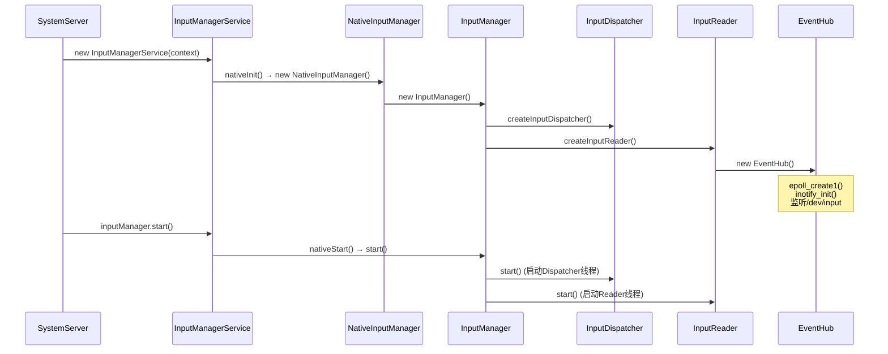

## 时序图



## 缘起

```java
SystemServer.java
// main->SystemServer().run()->
private void run() {
    ...
    try {
        t.traceBegin("StartServices");
        startBootstrapServices(t);
        startCoreServices(t);
        startOtherServices(t);
    } catch (Throwable ex) {
        Slog.e("System", "******************************************");
        Slog.e("System", "************ Failure starting system services", ex);
        throw ex;
    } finally {
        t.traceEnd(); // StartServices
    }
    ...
}

private void startOtherServices(@NonNull TimingsTraceAndSlog t){
    ...
    inputManager = new InputManagerService(context);
    wm = WindowManagerService.main(context, inputManager, !mFirstBoot, mOnlyCore,
            new PhoneWindowManager(), mActivityManagerService.mActivityTaskManager);
    // 向 ServiceManager 注册
    ServiceManager.addService(Context.WINDOW_SERVICE, wm, /* allowIsolated= */ false,
            DUMP_FLAG_PRIORITY_CRITICAL | DUMP_FLAG_PROTO);
    ServiceManager.addService(Context.INPUT_SERVICE, inputManager,
            /* allowIsolated= */ false, DUMP_FLAG_PRIORITY_CRITICAL);
    inputManager.setWindowManagerCallbacks(wm.getInputManagerCallback());
            inputManager.start();
}
```

## 准备阶段

```java
//InputManagerService
public InputManagerService(Context context) {
    this.mContext = context;
    this.mHandler = new InputManagerHandler(DisplayThread.get().getLooper());

    mStaticAssociations = loadStaticInputPortAssociations();
    mUseDevInputEventForAudioJack =
            context.getResources().getBoolean(R.bool.config_useDevInputEventForAudioJack);
    Slog.i(TAG, "Initializing input manager, mUseDevInputEventForAudioJack="
            + mUseDevInputEventForAudioJack);
    //初始化
    mPtr = nativeInit(this, mContext, mHandler.getLooper().getQueue());

    String doubleTouchGestureEnablePath = context.getResources().getString(
            R.string.config_doubleTouchGestureEnableFile);
    mDoubleTouchGestureEnableFile = TextUtils.isEmpty(doubleTouchGestureEnablePath) ? null :
        new File(doubleTouchGestureEnablePath);

    LocalServices.addService(InputManagerInternal.class, new LocalService());
}
//com_android_server_input_InputManagerService.cpp
static jlong nativeInit(JNIEnv* env, jclass /* clazz */,
        jobject serviceObj, jobject contextObj, jobject messageQueueObj) {
    sp<MessageQueue> messageQueue = android_os_MessageQueue_getMessageQueue(env, messageQueueObj);
    if (messageQueue == nullptr) {
        jniThrowRuntimeException(env, "MessageQueue is not initialized.");
        return 0;
    }
    // 创建 native层的 NativeInputManager
    NativeInputManager* im = new NativeInputManager(contextObj, serviceObj,
            messageQueue->getLooper());
    im->incStrong(0);
    return reinterpret_cast<jlong>(im);
}
NativeInputManager::NativeInputManager(jobject contextObj,
        jobject serviceObj, const sp<Looper>& looper) :
        mLooper(looper), mInteractive(true) {
    JNIEnv* env = jniEnv();

    mServiceObj = env->NewGlobalRef(serviceObj);

    {
        AutoMutex _l(mLock);
        mLocked.systemUiVisibility = ASYSTEM_UI_VISIBILITY_STATUS_BAR_VISIBLE;
        mLocked.pointerSpeed = 0;
        mLocked.pointerGesturesEnabled = true;
        mLocked.showTouches = false;
        mLocked.pointerCapture = false;
        mLocked.pointerDisplayId = ADISPLAY_ID_DEFAULT;
    }
    mInteractive = true;
    
    mInputManager = new InputManager(this, this);
    //添加 inputflinger 服务到ServiceManager 中
    defaultServiceManager()->addService(String16("inputflinger"),
            mInputManager, false);
}
//InputManager.cpp
InputManager::InputManager(
        const sp<InputReaderPolicyInterface>& readerPolicy,
        const sp<InputDispatcherPolicyInterface>& dispatcherPolicy) {
    //input 事件分发
    mDispatcher = createInputDispatcher(dispatcherPolicy);
    mClassifier = new InputClassifier(mDispatcher);
    //input 事件解析与装填, 注意 : mClassifier 会接受 InputReader 处理结束后的数据, notify 唤醒
    mReader = createInputReader(readerPolicy, mClassifier);
}

//InputReaderFactory.cpp
namespace android {
sp<InputReaderInterface> createInputReader(const sp<InputReaderPolicyInterface>& policy,
                                           const sp<InputListenerInterface>& listener) {
    return new InputReader(std::make_unique<EventHub>(), policy, listener);
}
//EventHub.cpp
static const char* DEVICE_PATH = "/dev/input";

EventHub::EventHub(void)
      : mBuiltInKeyboardId(NO_BUILT_IN_KEYBOARD),
        mNextDeviceId(1),
        mControllerNumbers(),
        mOpeningDevices(nullptr),
        mClosingDevices(nullptr),
        mNeedToSendFinishedDeviceScan(false),
        mNeedToReopenDevices(false),
        mNeedToScanDevices(true),
        mPendingEventCount(0),
        mPendingEventIndex(0),
        mPendingINotify(false) {
    ensureProcessCanBlockSuspend();

    mEpollFd = epoll_create1(EPOLL_CLOEXEC);
    LOG_ALWAYS_FATAL_IF(mEpollFd < 0, "Could not create epoll instance: %s", strerror(errno));

    mINotifyFd = inotify_init();
    //监听 /dev/input 下的删除和新建 节点
    mInputWd = inotify_add_watch(mINotifyFd, DEVICE_PATH, IN_DELETE | IN_CREATE);
    LOG_ALWAYS_FATAL_IF(mInputWd < 0, "Could not register INotify for %s: %s", DEVICE_PATH,
                        strerror(errno));
    ...
    int result = epoll_ctl(mEpollFd, EPOLL_CTL_ADD, mINotifyFd, &eventItem);
    
}

```

## start

```java
//InputManagerService.java
public void start() {
    Slog.i(TAG, "Starting input manager");
    nativeStart(mPtr);

    // Add ourself to the Watchdog monitors.
    Watchdog.getInstance().addMonitor(this);

    registerPointerSpeedSettingObserver();
    registerShowTouchesSettingObserver();
    registerAccessibilityLargePointerSettingObserver();
    registerLongPressTimeoutObserver();

    mContext.registerReceiver(new BroadcastReceiver() {
        @Override
        public void onReceive(Context context, Intent intent) {
            updatePointerSpeedFromSettings();
            updateShowTouchesFromSettings();
            updateAccessibilityLargePointerFromSettings();
            updateDeepPressStatusFromSettings("user switched");
        }
    }, new IntentFilter(Intent.ACTION_USER_SWITCHED), null, mHandler);

    updatePointerSpeedFromSettings();
    updateShowTouchesFromSettings();
    updateAccessibilityLargePointerFromSettings();
    updateDeepPressStatusFromSettings("just booted");
}
//com_android_server_input_InputManagerService.cpp
static void nativeStart(JNIEnv* env, jclass /* clazz */, jlong ptr) {
    NativeInputManager* im = reinterpret_cast<NativeInputManager*>(ptr);

    status_t result = im->getInputManager()->start();
    if (result) {
        jniThrowRuntimeException(env, "Input manager could not be started.");
    }
}
//InputManager.cpp
status_t InputManager::start() {
    status_t result = mDispatcher->start();
    if (result) {
        ALOGE("Could not start InputDispatcher thread due to error %d.", result);
        return result;
    }

    result = mReader->start();
    if (result) {
        ALOGE("Could not start InputReader due to error %d.", result);

        mDispatcher->stop();
        return result;
    }

    return OK;
}
```
