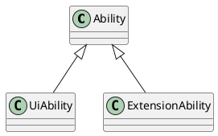

Swiper 顶部滑动
LazyForEach //模板化数据
WaterFlow //瀑布流

## Stage模型

### 应用包结构

- 原生支持分布式:支持Ability实现跨端迁移和多端协同
  - 一个任务对应一个Ablility
- 管控规则融入应用模型
- 支持多设备多窗口

### 应用包结构

- APP: 上架包:包含HAP,HSP
- HAP: 应用安装运行的基本单元
  - Entry: 入口
  - Feature: 特性模块
- HSP: 动态共享包 :运行时复用
  - 运行时按需加载
- HAR: 静态共享包 :编译态复用
  - 二方库:公司内部依赖
  - 三方库

## 应用组件

- Extension : 鸿蒙特性

## startAbility

显式 , 隐式

## 后台任务管理

- 进程状态: 前后台
- 后台存活时间需要申请任务类型申请:定时
